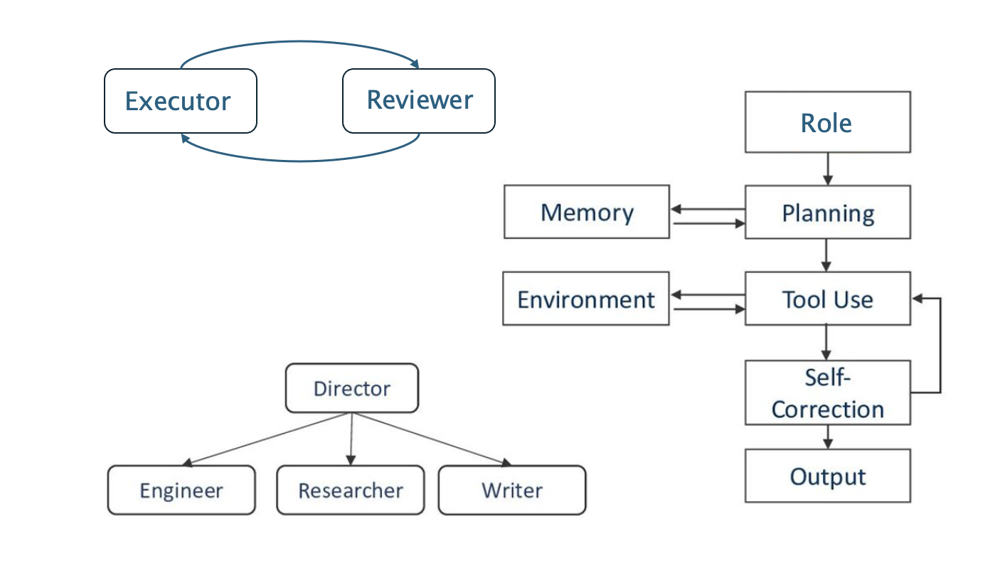

# AI Agents Papers

This repository curates the latest research papers on the applications and architectural technologies of AI agents. We perform weekly Arxiv searches using specific keywords and pick only those that are particularly interesting. Rather than striving for comprehensiveness, we add papers when they introduce a distinctively new approach or novel concept that stands out from existing methods.

## AI Agent
An AI Agent is an autonomous system powered by large language models that can perceive its environment, reason through complex tasks, and use tools to take actions in pursuit of specific goals. It combines reasoning, planning, memory, and tool-use capabilities to operate independently or as part of a multi-agent system.

<figure style="text-align: center;">
    
    <figcaption style="text-align: center;">AI Agent Workflows</figcaption>
</figure>

## Paper Categories
🔥: Recommended papers  
📖: Survey papers  
⚖️: Benchmark papers
- **Agent Capabilities**
  - [Environment](capability-papers/environment.md)
  - [Ideation](capability-papers/ideation.md)
  - [Planning](capability-papers/planning.md)
  - [Reasoning](capability-papers/reasoning.md)
  - [Profile](capability-papers/profile.md)
  - [Perception](capability-papers/perception.md)
  - [Tool Use & Skills](capability-papers/tool-use.md)
  - [Self-Correction](capability-papers/self-correction.md)
  - [Search](capability-papers/search.md)
  - [Memory](capability-papers/memory.md)
  - [Self-Evolution](capability-papers/self-evolution.md/#self-evolution-self-improvement)
  - [Safety](capability-papers/safety.md)
  - [Agent Tuning](capability-papers/learning.md)
  - [Agent Evaluation](capability-papers/evaluation.md)
- **AI Agents Architecture**
  - [Single-Agent](agent-frameworks/agent-framework.md#single-agents)
  - [Multi-Agent](agent-frameworks/agent-framework.md#multi-agents)
  - [Agent-Ops](agent-frameworks/agent-framework.md#agent-ops--ux)
- **AI Agents Applications**
  - [Embodied Agents](application-papers/embodied-agents.md)
  - [Digital Agents](application-papers/digital-agents.md)
    - [GUI Agents](application-papers/digital-agents.md/#computer-controlled-app-based-agents)
    - [Web Agents](application-papers/digital-agents.md/#web-based-agents)
    - [Mobile Agents](application-papers/digital-agents.md/#mobile-based-agents)
  - [Software Agents](application-papers/software-agents.md)
  - [Data Agents](application-papers/data-agents.md)
  - [Research Agents](application-papers/research-agents.md)
  - [API Agents](application-papers/api-agents.md)
  - [Deep Research Agents](application-papers/deep-research-agents.md)
  - [Agentic AI Systems](application-papers/agentic-ai-system.md)
  - [Enterprise Agents](application-papers/enterprise-agents.md)
  - [Financial Agents](application-papers/finance-agents.md)
  - [Multi-Agents](application-papers/multi-agent.md)
    - [MAD](application-papers/multi-agent.md#mad)
    - [Problem Solving](application-papers/multi-agent.md#problem-solving)
    - [World Simulation](application-papers/multi-agent.md#world-simulation)
- **GenAI Agents Presentations**
  - [Tutorial & Lecture](lectures/tutorial-lecture.md)

## References
- [LLM Agents Papers](https://github.com/zjunlp/LLMAgentPapers)
- [Awesome LLM-Powered Agent](https://github.com/hyp1231/awesome-llm-powered-agent/)
 - [Awesome LLM agents](https://github.com/kaushikb11/awesome-llm-agents)

# May Highligits

## Harness
* **"ReFlect: An Effective Harness System for Complex Long-Horizon LLM Reasoning"** [[paper](https://arxiv.org/abs/2605.05737)]
* **"PriorZero: Bridging Language Priors and World Models for Decision Making"** [[paper](https://arxiv.org/abs/2605.12289)]
* **"AI Harness Engineering: A Runtime Substrate for Foundation-Model Software Agents"** [[paper](https://arxiv.org/abs/2605.13357)]
* **"Harnessing Agentic Evolution"** [[paper](https://arxiv.org/abs/2605.13821)]
* ⚖️ **"Auditing Agent Harness Safety"** [[paper](https://arxiv.org/abs/2605.14271)]
* 🔥 **"Is Grep All You Need? How Agent Harnesses Reshape Agentic Search"** [[paper](https://arxiv.org/abs/2605.15184)]
* **"Harnessing LLM Agents with Skill Programs"** [[paper](https://arxiv.org/abs/2605.17734)]
* **"Code as Agent Harness"** [[paper](https://arxiv.org/abs/2605.18747)]
* **"A Methodology for Selecting and Composing Runtime Architecture Patterns for Production LLM Agents"** [[paper](https://arxiv.org/abs/2605.20173)]
* **"Harnesses for Inference-Time Alignment over Execution Trajectories"** [[paper](https://arxiv.org/abs/2605.21516)]
* **"Adapting the Interface, Not the Model: Runtime Harness Adaptation for Deterministic LLM Agents"** [[paper](https://arxiv.org/abs/2605.22166)]
* **"Polar: Agentic RL on Any Harness at Scale"** [[paper](https://arxiv.org/abs/2605.24220)]
* **"Meta-Engineering Harnesses for AI-Native Software Production"** [[paper](https://arxiv.org/abs/2605.25665)]
* **"From Model Scaling to System Scaling: Scaling the Harness in Agentic AI"** [[paper](https://arxiv.org/abs/2605.26112)]
* **"Your Agents Are Aging Too: Agent Lifespan Engineering for Deployed Systems"** [[paper](https://arxiv.org/abs/2605.26302)]
* **"SIA: Self Improving AI with Harness & Weight Updates"** [[paper](https://arxiv.org/abs/2605.27276)]
* 📖 **"Agent Harness Engineering: A Survey"** [[paper](https://openreview.net/forum?id=3hXEPbG0dh)]
* **"Interactive Evaluation Requires a Design Science"**
* **"HarnessAPI: A Skill-First Framework for Unified Streaming APIs and MCP Tools"** [[paper](https://arxiv.org/abs/2605.22733)]
* ⚖️ **"Harness-Bench: Measuring Harness Effects across Models in Realistic Agent Workflows"** [[paper](https://arxiv.org/abs/2605.27922v1)]

## Skills
* **"HEAVYSKILL: Heavy Thinking as the Inner Skill in Agentic Harness"** [[paper](https://arxiv.org/abs/2605.02396)]
* **"SkillScope: Toward Fine-Grained Least-Privilege Enforcement for Agent Skills"** [[paper](https://arxiv.org/abs/2605.05868)]
* **"SkillOS: Learning Skill Curation for Self-Evolving Agents"** [[paper](https://arxiv.org/abs/2605.06614)]
* 📖 **"A Comprehensive Survey on Agent Skills: Taxonomy, Techniques, and Applications"** [[paper](https://arxiv.org/abs/2605.07358)]
* **"Counterfactual Trace Auditing of LLM Agent Skills"** [[paper](https://arxiv.org/abs/2605.11946)]
* **"SkillFlow: Flow-Driven Recursive Skill Evolution for Agentic Orchestration"** [[paper](https://arxiv.org/abs/2605.14089)]
* **"SkillsVote: Lifecycle Governance of Agent Skills from Collection, Recommendation to Evolution"** [[paper](https://arxiv.org/abs/2605.18401)]
* ⚖️ **"SkillGenBench: Benchmarking Skill Generation Pipelines for LLM Agents"** [[paper](https://arxiv.org/abs/2605.18693)]
* **"SkillOpt: Executive Strategy for Self-Evolving Agent Skills"** [[paper](https://arxiv.org/abs/2605.23904)]
* **"MUSE-Autoskill: Self-Evolving Agents via Skill Creation, Memory, Management, and Evaluation"** [[paper](https://arxiv.org/abs/2605.27366)]
* **"Proteus: A Self-Evolving Red Team for Agent Skill Ecosystems"** [[paper](https://arxiv.org/abs/2605.11891)]
* **"Toward User Comprehension Supports for LLM Agent Skill Specifications"** [[paper](https://arxiv.org/abs/2605.19362v1)]
* **"You Live More Than Once: Towards Hierarchical Skill Meta-Evolving"** [[paper](https://arxiv.org/abs/2605.28390v1)]
* **"SkillGrad: Optimizing Agent Skills Like Gradient Descent"** [[paper](https://arxiv.org/abs/2605.27760)]
* **"CODESKILL: Learning Self-Evolving Skills for Coding Agents"** [[paper](https://arxiv.org/abs/2605.25430)]

## Survey
* 📖 **"Generate, Filter, Control, Replay: A Comprehensive Survey of Rollout Strategies for LLM Reinforcement Learning"** [[paper](https://arxiv.org/abs/2605.02913)]
* 📖 **"A Comprehensive Survey on Agent Skills: Taxonomy, Techniques, and Applications"** [[paper](https://arxiv.org/abs/2605.07358)]
* 📖 **"Beyond Individual Intelligence: Surveying Collaboration, Failure Attribution, and Self-Evolution in LLM-based Multi-Agent Systems"** [[paper](https://arxiv.org/abs/2605.14892)]
* 📖 **"Planning in the LLM Era: Building for Reliability and Efficiency"** [[paper](https://arxiv.org/abs/2605.21902)]
* 📖 **"Agent Harness Engineering: A Survey"** [[paper](https://openreview.net/forum?id=3hXEPbG0dh)]

# April Highlights

## Self-Evolving Agents
* **"CORAL: Towards Autonomous Multi-Agent Evolution for Open-Ended Discovery"** [[paper](https://arxiv.org/abs/2604.01658)]
* **"EvoSkills: Self-Evolving Agent Skills via Co-Evolutionary Verification"** [[paper](https://arxiv.org/abs/2604.01687)]
* **"SkillX: Automatically Constructing Skill Knowledge Bases for Agents"** [[paper](https://arxiv.org/abs/2604.04804)]
* **"SkillClaw: Let Skills Evolve Collectively with Agentic Evolver"** [[paper](https://arxiv.org/abs/2604.08377)]
* ⚖️ **"SEA-Eval: A Benchmark for Evaluating Self-Evolving Agents Beyond Episodic Assessment"** [[paper](https://arxiv.org/abs/2604.08988)]
* **"Self-Evolving LLM Memory Extraction Across Heterogeneous Tasks"** [[paper](https://arxiv.org/abs/2604.11610)]
* ⚖️ **"Frontier-Eng: Benchmarking Self-Evolving Agents on Real-World Engineering Tasks with Generative Optimization"** [[paper](https://arxiv.org/abs/2604.12290)]
* **"EVOSPARK: Endogenous Interactive Agent Societies for Unified Long-Horizon Narrative Evolution"** [[paper](https://arxiv.org/abs/2604.12776)]
* **"Discovering Novel LLM Experts via Task-Capability Convolution"** [[paper](https://arxiv.org/abs/2604.14969)]
* **"PolicyBank: Evolving Policy Understanding for LLM Agents"** [[paper](https://arxiv.org/abs/2604.15505)]
* **"BILEVEL OPTIMIZATION OF AGENT SKILLS VIA MONTE CARLO TREE SEARCH"** [[paper](https://arxiv.org/abs/2604.15709)]
* ⚖️ **"HORIZONBENCH: Long-Horizon Personalization with Evolving Preferences"** [[paper](https://arxiv.org/abs/2604.17283)]
* **"Training LLM Agents for Spontaneous, Reward-Free Self-Evolution via World Knowledge Exploration"** [[paper](https://arxiv.org/abs/2604.18131)]
* **"Agent-World: Scaling Real-World Environment Synthesis for Evolving General Agent Intelligence"** [[paper](https://arxiv.org/abs/2604.18292)]
* **"A Self-Evolving Framework for Efficient Terminal Agents via Observational Context Compression"** [[paper](https://arxiv.org/abs/2604.19572)]
* **"Prism: An Evolutionary Memory Substrate for Multi-Agent Open-Ended Discovery"** [[paper](https://arxiv.org/abs/2604.19795)]
* **"EVOAGENT: AN EVOLVABLE AGENT FRAMEWORK WITH SKILL LEARNING AND MULTI-AGENT DELEGATION"** [[paper](https://arxiv.org/abs/2604.20133)]
* **"Co-Evolving LLM Decision and Skill Bank Agents for Long-Horizon Tasks"** [[paper](https://arxiv.org/abs/2604.20987)]
* **"AEL: Agent Evolving Learning for Open-Ended Environments"** [[paper](https://arxiv.org/abs/2604.21725)]

## Skills
* **"SKILL0: In-Context Agentic Reinforcement Learning for Skill Internalization"** [[paper](https://arxiv.org/abs/2604.02268)]
* **"EvoSkills: Self-Evolving Agent Skills via Co-Evolutionary Verification"** [[paper](https://arxiv.org/abs/2604.01687)]
* **"How Well Do Agentic Skills Work in the Wild: Benchmarking LLM Skill Usage in Realistic Settings"** [[paper](https://arxiv.org/abs/2604.04323)]
* **"SkillX: Automatically Constructing Skill Knowledge Bases for Agents"** [[paper](https://arxiv.org/abs/2604.04804)]
* **"SkillClaw: Let Skills Evolve Collectively with Agentic Evolver"** [[paper](https://arxiv.org/abs/2604.08377)]
* **"Red Skills or Blue Skills? A Dive Into Skills Published on ClawHub"** [[paper](https://arxiv.org/abs/2604.13064)]
* **"BILEVEL OPTIMIZATION OF AGENT SKILLS VIA MONTE CARLO TREE SEARCH"** [[paper](https://arxiv.org/abs/2604.15709)]
* **"Experience Compression Spectrum: Unifying Memory, Skills, and Rules in LLM Agents"** [[paper](https://arxiv.org/abs/2604.15877)]
* ⚖️ **"SKILLFLOW: Benchmarking Lifelong Skill Discovery and Evolution for Autonomous Agents"** [[paper](https://arxiv.org/abs/2604.17308)]
* ⚖️ **"SkillLearnBench: Benchmarking Continual Learning Methods for Agent Skill Generation on Real-World Tasks"** [[paper](https://arxiv.org/abs/2604.20087)]
* **"EVOAGENT: AN EVOLVABLE AGENT FRAMEWORK WITH SKILL LEARNING AND MULTI-AGENT DELEGATION"** [[paper](https://arxiv.org/abs/2604.20133)]
* **"Co-Evolving LLM Decision and Skill Bank Agents for Long-Horizon Tasks"** [[paper](https://arxiv.org/abs/2604.20987)]
* **"From Skill Text to Skill Structure: The Scheduling-Structural-Logical Representation for Agent Skills"** [[paper](https://arxiv.org/abs/2604.24026)]
* **"Skill Retrieval Augmentation for Agentic AI"** [[paper](https://arxiv.org/abs/2604.24594)]

# March Highlights

## Research Agents
* **"Agentic Scientific Simulation: Execution-Grounded Model Construction and Reconstruction"** [[paper](https://arxiv.org/abs/2603.00214)]
* **"DeepXiv-SDK: An Agentic Data Interface for Scientific Literature"** [[paper](https://arxiv.org/abs/2603.00084)]
* **"EvoScientist: Towards Multi-Agent Evolving AI Scientists for End-to-End Scientific Discovery"** [[paper](https://arxiv.org/abs/2603.08127)]
* **"HLER: Human-in-the-Loop Economic Research via Multi-Agent Pipelines for Empirical Discovery"** [[paper](https://arxiv.org/abs/2603.07444)]
* **"Auto Researching, not hyperparameter tuning: Convergence Analysis of 10,000 LLM-Guided ML Experiments"** [[paper](https://arxiv.org/abs/2603.15916)]
* **"AwesomeLit: Towards Hypothesis Generation with Agent-Supported Literature Research"** [[paper](https://arxiv.org/abs/2603.22648)]
* **"VILLA: Versatile Information Retrieval From Scientific Literature Using Large LAnguage Models"** [[paper](https://arxiv.org/abs/2603.23849)]
* **"Can AI Scientist Agents Learn from Lab-in-the-Loop Feedback? Evidence from Iterative Perturbation Discovery"** [[paper](https://arxiv.org/abs/2603.26177)]
* ⚖️ **"SciVisAgentBench: A Benchmark for Evaluating Scientific Data Analysis and Visualization Agents"** [[paper](https://arxiv.org/abs/2603.29139)]
* **"FlowPIE: Test-Time Scientific Idea Evolution with Flow-Guided Literature Exploration"** [[paper](https://arxiv.org/abs/2603.29557)]
* **"A Visionary Look at Vibe Researching"** [[paper](https://arxiv.org/abs/2604.00945)]

## Human-AI
* **"ViviDoc: Generating Interactive Documents through Human-Agent Collaboration"** [[paper](https://arxiv.org/abs/2603.01912)]
* **"An Empirical Study of Interaction Smells in Multi-Turn Human-LLM Collaborative Code Generation"** [[paper](https://arxiv.org/abs/2603.09701)]
* **"InterDeepResearch: Enabling Human-Agent Collaborative Information Seeking through Interactive Deep Research"** [[paper](https://arxiv.org/abs/2603.12608)]
* **"Invisible Failures in Human–AI Interactions"** [[paper](https://arxiv.org/abs/2603.15423)]
* **"Argumentative Human-AI Decision-Making: Toward AI Agents That Reason With Us, Not For Us"** [[paper](https://arxiv.org/abs/2603.15946)]
* **"Agentic AI and the next intelligence explosion"** [[paper](https://arxiv.org/abs/2603.20639)]
* **"Ask or Assume? Uncertainty-Aware Clarification-Seeking in Coding Agents"** [[paper](https://arxiv.org/abs/2603.26233)]
* **"Human-Data Interaction, Exploration, and Visualization in the AI Era: Challenges and Opportunities"** [[paper](https://arxiv.org/abs/2603.05542)]

## Agent
* **"Building Effective AI Coding Agents for the Terminal: Scaffolding, Harness, Context Engineering, and Lessons Learned"** [[paper](https://arxiv.org/abs/2603.05344)]
* **"AutoAgent: Evolving Cognition and Elastic Memory Orchestration for Adaptive Agents"** [[paper](https://arxiv.org/abs/2603.09716)]
* **"OpenClaw-RL: Train Any Agent Simply by Talking"** [[paper](https://arxiv.org/abs/2603.10165)]
* **"MetaClaw: Just Talk -- An Agent That Meta-Learns and Evolves in the Wild"** [[paper](https://arxiv.org/abs/2603.17187)]
* 📖 **"The Evolution of Tool Use in LLM Agents: From Single-Tool Call to Multi-Tool Orchestration"** [[paper](https://arxiv.org/abs/2603.22862)]

### Self-Evolving Agents
* **"EvoSkill: Automated Skill Discovery for Multi-Agent Systems"** [[paper](https://arxiv.org/abs/2603.02766)]
* **"Evolving Deception: When Agents Evolve, Deception Wins"** [[paper](https://arxiv.org/abs/2603.05872)]
* **"EvoScientist: Towards Multi-Agent Evolving AI Scientists for End-to-End Scientific Discovery"** [[paper](https://arxiv.org/abs/2603.08127)]
* **"AutoAgent: Evolving Cognition and Elastic Memory Orchestration for Adaptive Agents"** [[paper](https://arxiv.org/abs/2603.09716)]
* **"Trajectory-Informed Memory Generation for Self-Improving Agent Systems"** [[paper](https://arxiv.org/abs/2603.10600)]
* **"MetaClaw: Just Talk -- An Agent That Meta-Learns and Evolves in the Wild"** [[paper](https://arxiv.org/abs/2603.17187)]
* **"AgentFactory: A Self-Evolving Framework Through Executable Subagent Accumulation and Reuse"** [[paper](https://arxiv.org/abs/2603.18000)]
* **"HyperAgents"** [[paper](https://arxiv.org/abs/2603.19461)]
* **"Self-Evolving Multi-Agent Framework for Efficient Decision Making in Real-Time Strategy Scenarios"** [[paper](https://arxiv.org/abs/2603.23875)]
* **"Experiential Reflective Learning for Self-Improving LLM Agents"** [[paper](https://arxiv.org/abs/2603.24639)]
* **"ASI-Evolve: AI Accelerates AI"** [[paper](https://arxiv.org/abs/2603.29640)]

## Feb/28 Highlights
- [Deep research Trends Report (JA)](newsletters/feb_2026/deep_research.md)
- [Ideation Trends Report (JA)](newsletters/feb_2026/ideation_trends.md)
- [Prediction Trends Report (JA)](newsletters/feb_2026/prediction_trends.md)
- [Skills Trends Report (JA)](newsletters/feb_2026/skills.md)

## Human-AI
* **"From Human-Human Collaboration to Human-Agent Collaboration: A Vision, Design Philosophy, and an Empirical Framework for Achieving Successful Partnerships Between Humans and LLM Agents"** [[paper](https://arxiv.org/abs/2602.05987)]
* **"Intelligent AI Delegation"** [[paper](https://arxiv.org/abs/2602.11865)]
* **"The Next Paradigm Is User-Centric Agent, Not Platform-Centric Service"** [[paper](https://arxiv.org/abs/2602.15682)]

## Skills
* **"SKILLRL: Evolving Agents via Recursive Skill-Augmented Reinforcement Learning"** [[paper](https://arxiv.org/abs/2602.08234)]
* **"Agent Skills: A Data-Driven Analysis of Claude Skills for Extending Large Language Model Functionality"** [[paper](https://arxiv.org/abs/2602.08004)]
* 📖 **"Agent Skills for Large Language Models: Architecture, Acquisition, Security, and the Path Forward"** [[paper](https://arxiv.org/abs/2602.12430)]
* ⚖️ **"SkillsBench: Benchmarking How Well Agent Skills Work Across Diverse Tasks"** [[paper](https://arxiv.org/abs/2602.12670)]
* 📖 **"SoK: Agentic Skills — Beyond Tool Use in LLM Agents"** [[paper](https://arxiv.org/abs/2602.20867)]

### Self-Evolving Agents
* **"Self-Consolidation for Self-Evolving Agents"** [[paper](https://arxiv.org/abs/2602.01966)]
* **"Live-Evo: Online Evolution of Agentic Memory from Continuous Feedback"** [[paper](https://arxiv.org/abs/2602.02369)]
* **"MemSkill: Learning and Evolving Memory Skills for Self-Evolving Agents"** [[paper](https://arxiv.org/abs/2602.02474)]
* ⚖️ **"AGENTRX: Diagnosing AI Agent Failures from Execution Trajectories"** [[paper](https://arxiv.org/abs/2602.02475)]
* **"Empirical-MCTS: Continuous Agent Evolution via Dual-Experience Monte Carlo Tree Search"** [[paper](https://arxiv.org/abs/2602.04248)]
* **"AdaptEvolve: Improving Efficiency of Evolutionary AI Agents through Adaptive Model Selection"** [[paper](https://arxiv.org/abs/2602.11931)]
* **"AORCHESTRA: Automating Sub-Agent Creation for Agentic Orchestration"** [[paper](https://arxiv.org/abs/2602.03786)]
* **"Evolutionary System Prompt Learning can Facilitate Reinforcement Learning for LLMs"** [[paper](https://arxiv.org/abs/2602.14697)]
* ⚖️ **"VeRO: An Evaluation Harness for Agents to Optimize Agents"** [[paper](https://arxiv.org/abs/2602.22480)]

## Scientific Discovery
* ⚖️ **"FIRE-Bench: Evaluating Agents on the Rediscovery of Scientific Insights"** [[paper](https://arxiv.org/abs/2602.02905)]
* **"DeltaEvolve: Accelerating Scientific Discovery through Momentum-Driven Evolution"** [[paper](https://arxiv.org/abs/2602.02919)]
* **"Accelerating Scientific Research with Gemini: Case Studies and Common Techniques"** [[paper](https://arxiv.org/abs/2602.03837)]
* 📖 **"Towards a Science of Collective AI: LLM-based Multi-Agent Systems Need a Transition from Blind Trial-and-Error to Rigorous Science"** [[paper](https://arxiv.org/abs/2602.05289)]
* ⚖️ **"AIRS-Bench: a Suite of Tasks for Frontier AI Research Science Agents"** [[paper](https://arxiv.org/abs/2602.06855)]
* **"IV Co-Scientist: Multi-Agent LLM Framework for Causal Instrumental Variable Discovery"** [[paper](https://arxiv.org/abs/2602.07943)]
* **"DeepInnovator: Triggering the Innovative Capabilities of LLMs"** [[paper](https://arxiv.org/abs/2602.18920)]
* **"Grounding LLMs in Scientific Discovery via Embodied Actions"** [[paper](https://arxiv.org/abs/2602.20639)]

## Jan/30 Highlights

- [Self-Evolution Trends Report (JA)](newsletters/jan_2026/self_evolution_trends.md)
- [Memory Trends Report (JA)](newsletters/jan_2026/memory_trends.md)

### Agentic Reasoning
* 📖 **"Agentic Reasoning for Large Language Models"** [[paper](https://arxiv.org/abs/2601.12538v1)]
* 📖 **"Toward Efficient Agents: Memory, Tool learning, and Planning"** [[paper](https://arxiv.org/abs/2601.14192v1)]

### Self-Evolving Agents
* **"JENIUS AGENT: Towards Experience-Driven Accuracy Optimization in Real-World Scenarios"** [[paper](https://arxiv.org/abs/2601.01857)]
* **"EvoRoute: Experience-Driven Self-Routing LLM Agent Systems"** [[paper](https://arxiv.org/abs/2601.02695)]
* **"MEMRL: Self-Evolving Agents via Runtime Reinforcement Learning on Episodic Memory"** [[paper](https://arxiv.org/abs/2601.03192)]
* **"PACEvolve: Enabling Long-Horizon Progress-Aware Consistent Evolution"** [[paper](https://arxiv.org/abs/2601.10657v1)]
* **"Beyond Static Tools: Test-Time Tool Evolution for Scientific Reasoning"** [[paper](https://arxiv.org/abs/2601.07641v1)]
* **"WISE-Flow: Workflow-Induced Structured Experience for Self-Evolving Conversational Service Agents"** [[paper](https://arxiv.org/abs/2601.08158v1)]
* **"To Retrieve or To Think? An Agentic Approach for Context Evolution"** [[paper](https://arxiv.org/abs/2601.08747v2)]
* **"Controlled Self-Evolution for Algorithmic Code Optimization"** [[paper](https://arxiv.org/abs/2601.07348v4)]
* **"Learn Like Humans: Use Meta-cognitive Reflection for Efficient Self-Improvement"** [[paper](https://arxiv.org/abs/2601.11974v1)]
* 📖 **"From Storage to Experience: A Survey on the Evolution of LLM Agent Memory Mechanisms"** [[paper](https://www.preprints.org/manuscript/202601.0618)]
* **"Inference-Time Scaling of Verification: Self-Evolving Deep Research Agents via Test-Time Rubric-Guided Verification"** [[paper](https://arxiv.org/abs/2601.15808)]
* **"Optimizing Agentic Workflows using Meta-tools"** [[paper](https://arxiv.org/abs/2601.22037v1)]
* **"Yunjue Agent Tech Report: A Fully Reproducible, Zero-Start In-Situ Self-Evolving Agent System for Open-Ended Tasks"** [[paper](https://arxiv.org/abs/2601.18226)]
* **"Large Language Model Agents Are Not Always Faithful Self-Evolvers"** [[paper](https://arxiv.org/abs/2601.22436)]

### Memory
* **"Agentic Memory: Learning Unified Long-Term and Short-Term Memory Management for Large Language Model Agents"** [[paper](https://arxiv.org/abs/2601.01885)]
* **"SimpleMem: Efficient Lifelong Memory for LLM Agents"** [[paper](https://arxiv.org/abs/2601.02553)]
* **"MEMRL: Self-Evolving Agents via Runtime Reinforcement Learning on Episodic Memory"** [[paper](https://arxiv.org/abs/2601.03192)]
* **"Memory Matters More: Event-Centric Memory as a Logic Map for Agent Searching and Reasoning"** [[paper](https://www.arxiv.org/abs/2601.04726)]
* **"Controllable Memory Usage: Balancing Anchoring and Innovation in Long-Term Human-Agent Interaction"** [[paper](https://arxiv.org/abs/2601.05107)]
* **"Inside Out: Evolving User-Centric Core Memory Trees for Long-Term Personalized Dialogue Systems"** [[paper](https://arxiv.org/abs/2601.05171)]
* **"MineNPC-Task: Task Suite for Memory-Aware Minecraft Agents"** [[paper](https://arxiv.org/abs/2601.05215)]
* **"PACEvolve: Enabling Long-Horizon Progress-Aware Consistent Evolution"** [[paper](https://arxiv.org/abs/2601.10657v1)]
* **"The AI Hippocampus: How Far are We From Human Memory?"** [[paper](https://arxiv.org/abs/2601.09113v1)]
* **"MemoBrain: Executive Memory as an Agentic Brain for Reasoning"** [[paper](https://arxiv.org/abs/2601.08079v1)]
* **"AtomMem : Learnable Dynamic Agentic Memory with Atomic Memory Operation"** [[paper](https://arxiv.org/abs/2601.08323v1)]
* **"Fine-Mem: Fine-Grained Feedback Alignment for Long-Horizon Memory Management"** [[paper](https://arxiv.org/abs/2601.08435v1)]
* **"Structured Episodic Event Memory"** [[paper](https://arxiv.org/abs/2601.06411v1)]
* **"Active Context Compression: Autonomous Memory Management in LLM Agents"**[[paper](https://arxiv.org/abs/2601.07190v1)]
* 📖 **"From Storage to Experience: A Survey on the Evolution of LLM Agent Memory Mechanisms"** [[paper](https://www.preprints.org/manuscript/202601.0618)]
* **"AutoRefine: From Trajectories to Reusable Expertise for Continual LLM Agent Refinement"** [[paper](https://arxiv.org/abs/2601.22758)]

### Creative Task
* **"Progressive Ideation using an Agentic AI Framework for Human-AI Co-Creation"** [[paper](https://arxiv.org/abs/2601.00475)]
* **"OpenNovelty: An LLM-powered Agentic System for Verifiable Scholarly Novelty Assessment"** [[paper](https://www.arxiv.org/abs/2601.01576)]
* **"Sci-Reasoning: A Dataset Decoding AI Innovation Patterns"** [[paper](https://arxiv.org/abs/2601.04577v1)]
* **"SuS: Strategy-aware Surprise for Intrinsic Exploration"** [[paper](https://arxiv.org/abs/2601.10349v1)]
* **"Proof of Time: A Benchmark for Evaluating Scientific Idea Judgments"** [[paper](https://arxiv.org/abs/2601.07606v1)]
* **"LLM Review: Enhancing Creative Writing via Blind Peer Review Feedback"** [[paper](https://arxiv.org/abs/2601.08003v1)]
* **"Agentic AI and Machine Learning for Accelerated Materials Discovery and Applications"** [[paper](https://arxiv.org/abs/2601.09027)]
* **"Who Owns Creativity and Who Does the Work? Trade-offs in LLM-Supported Research Ideation"** [[paper](https://arxiv.org/abs/2601.12152v1)]
* **"Improved Bug Localization with AI Agents Leveraging Hypothesis and Dynamic Cognition"** [[paper](https://arxiv.org/abs/2601.12522v1)]
* **"Rethinking the AI Scientist: Interactive Multi-Agent Workflows for Scientific Discovery"** [[paper](https://www.arxiv.org/abs/2601.12542)]
* **"Learning to Discover at Test Time"** [[paper](https://arxiv.org/abs/2601.16175)]
* **"Insight Agents: An LLM-Based Multi-Agent System for Data Insights"** [[paper](https://arxiv.org/abs/2601.20048)]
* **"Probing the Future of Meta-Analysis: Eliciting Design Principles via an Agentic Research IDE"** [[paper](https://arxiv.org/abs/2601.18239)]
* **"Generating Literature-Driven Scientific Theories at Scale"** [[paper](https://arxiv.org/abs/2601.16282)]

## Coding Agents
* **"Improved Bug Localization with AI Agents Leveraging Hypothesis and Dynamic Cognition"** [[paper](https://arxiv.org/abs/2601.12522v1)]
* **"LLM-in-Sandbox Elicits General Agentic Intelligence"** [[paper](https://arxiv.org/abs/2601.16206v1)]
* **"SERA: Soft-Verified Efficient Repository Agents"** [[paper](https://arxiv.org/abs/2601.20789v1)]
* **"Who Writes the Docs in SE 3.0? Agent vs. Human Documentation Pull Requests"** [[paper](https://arxiv.org/abs/2601.20171)]
* **"How do Agents Refactor: An Empirical Study"** [[paper](https://arxiv.org/abs/2601.20160)]
* **"Beyond Bug Fixes: An Empirical Investigation of Post-Merge Code Quality Issues in Agent-Generated Pull Requests"** [[paper](https://arxiv.org/abs/2601.20109)]
* **"Are We All Using Agents the Same Way? An Empirical Study of Core and Peripheral Developers’ Use of Coding Agents"** [[paper](https://arxiv.org/abs/2601.20106)]
## Dec/25 Highlights (Updated 30 Dec)

### Self-Evolving Agents
* **"Strategic Self-Improvement for Competitive Agents in AI Labour Markets"** [[paper](https://arxiv.org/abs/2512.04988v1)]
* **"Guided Self-Evolving LLMs with Minimal Human Supervision"** [[paper](https://arxiv.org/abs/2512.02472v1)]
* **"Evolving Excellence: Automated Optimization of LLM-based Agents"** [[paper](https://arxiv.org/abs/2512.09108v1)]
* **"Remember Me, Refine Me: A Dynamic Procedural Memory Framework for Experience-Driven Agent Evolution"** [[paper](https://arxiv.org/abs/2512.10696)]
* **"Beyond Training: Enabling Self-Evolution of Agents with MOBIMEM"** [[paper](https://arxiv.org/abs/2512.15784v1)]
* **"SCOPE: Prompt Evolution for Enhancing Agent Effectiveness"** [[paper](https://arxiv.org/abs/2512.15374v1)]
* **"Reinforcement Learning for Self-Improving Agent with Skill Library"** [[paper](https://arxiv.org/abs/2512.17102v1)]
* **"MemEvolve: Meta-Evolution of Agent Memory Systems"** [[paper](https://arxiv.org/abs/2512.18746v1)]

### Hot Topics
* 📖 **"Memory in the Age of AI Agents: A Survey Forms, Functions and Dynamics"** [[paper](https://arxiv.org/abs/2512.13564v1)]
* 📖 **"Adaptation of Agentic AI: A Survey of Post-Training, Memory, and Skills"** [[paper](https://arxiv.org/abs/2512.16301v1)]
* 📖 **"Deep Research: A Systematic Survey"** [[paper](https://arxiv.org/abs/2512.02038v1)]
* 🔥 **"Measuring Agents in Production"** [[paper](https://arxiv.org/abs/2512.04123v1)]
* 🔥 **"Towards a Science of Scaling Agent Systems"** [[paper](https://arxiv.org/abs/2512.08296v1)]
* ⚖️ **"Evaluating Large Language Models in Scientific Discovery"** [[paper](https://arxiv.org/abs/2512.15567v1)]
* 🔥 **"How Far Are We from Genuinely Useful Deep Research Agents?"** [[paper](https://arxiv.org/abs/2512.01948v1)]
* **"Can Agentic AI Match the Performance of Human Data Scientists?"** [[paper](https://arxiv.org/abs/2512.20959v1)]

## 2025 Highlights 
04/25 ~ 12/25 [[link](lectures/2025_trend.md)]