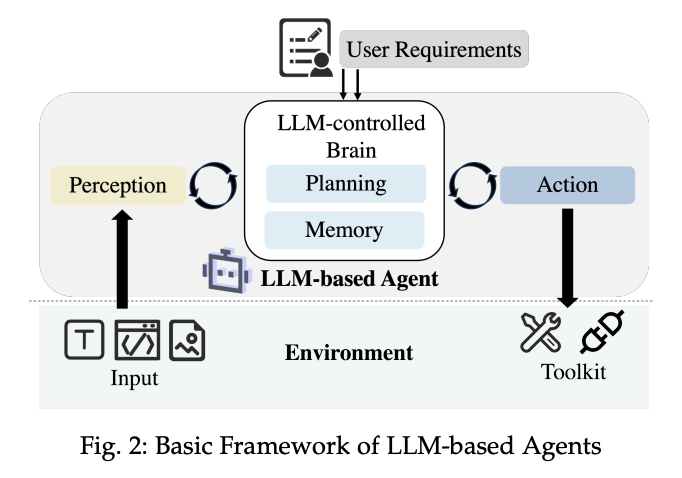

# Agent Frameworks

<figure style="text-align: center;">
    
    <figcaption style="text-align: center;">引用：https://arxiv.org/abs/2409.02977</figcaption>
</figure>

## Single-Agent
* [Mar 2023] **"Hugginggpt: Solving ai tasks with chat-gpt and its friends in huggingface"** [[paper](https://arxiv.org/abs/2303.17580)]
* [Apr 2023] **"OpenAGI: When llm meets domain experts"** [[paper](https://arxiv.org/abs/2304.04370)]
* 📖 [Aug 2023] **"A Survey on Large Language Model based Autonomous Agents"** [[paper](https://arxiv.org/abs/2308.11432)]
* [Sep 2023] **"Agents: An Open-source Framework for Autonomous Language Agents"** [[paper](https://arxiv.org/abs/2309.07870)]
* [Sep 2023] **"AutoAgents: A Framework for Automatic Agent Generation"** [[paper](https://arxiv.org/abs/2309.17288)]
* 📖 [Sep 2023] **"An In-depth Survey of Large Language Model-based Artificial Intelligence Agents"** [[paper](https://arxiv.org/abs/2309.14365)]
* 📖 [Sep 2023] **"The Rise and Potential of Large Language Model Based Agents: A Survey"** [[paper](https://arxiv.org/abs/2309.07864)]
* [Sep 2023] **"Cognitive Architectures for Language Agents"** [[paper](https://arxiv.org/abs/2309.02427)]
* [Oct 2023] **"OpenAgents: An Open Platform for Language Agents in the Wild"** [[paper](https://arxiv.org/abs/2310.10634)]
* [Nov 2023] **"TaskWeaver: A Code-First Agent Framework"** [[paper](https://arxiv.org/abs/2311.17541)]
* 🔥 📖 [Nov 2023] **"Levels of AGI for Operationalizing Progress on the Path to AGI"** [[paper](https://arxiv.org/abs/2311.02462)]
* 🔥 📖 [Dec 2023] **"Practices for Governing Agentic AI Systems"** [[paper](https://openai.com/index/practices-for-governing-agentic-ai-systems/)]
* 📖 [Jan 2024] **"Exploring Large Language Model based Intelligent Agents: Definitions, Methods, and Prospects"** [[paper](https://arxiv.org/abs/2401.03428)]
* [Feb 2024] **"PreAct: Predicting Future in ReAct Enhances Agent’s Planning Ability"** [[paper](https://arxiv.org/abs/2402.11534)]
* [Apr 2024] **"Aligning LLM Agents by Learning Latent Preference from User Edits"** [[paper](https://arxiv.org/abs/2404.15269)]
* [Apr 2024] **"AgentKit: Flow Engineering with Graphs, not Coding"** [[paper](https://arxiv.org/abs/2404.11483)]
* [Apr 2024] **"AI2Apps: A Visual IDE for Building LLM-based AI Agent Applications"** [[paper](https://arxiv.org/abs/2404.04902)]
* 🔥 📖 [Apr 2024] **"AI Agent Architectures for Reasoning, Planning, and Tool Calling: A Survey"** [[paper](https://arxiv.org/abs/2404.11584)]
* [May 2024] **"AGILE: A Novel Framework of LLM Agents"** [[paper](https://arxiv.org/abs/2405.14751)]
* 📖 [May 2024] **Agent Design Pattern Catalogue: A Collection of Architectural Patterns for Foundation Model based Agents"** [[paper](https://arxiv.org/abs/2405.10467)]
* 📖 [May 2024] **How Far Are We From AGI?"** [[paper](https://arxiv.org/abs/2405.10313)]
* [Jun 2024] **"Open-Endedness is Essential for Artificial Superhuman Intelligence"** [[paper](https://arxiv.org/abs/2406.04268)]
* 📖 [Jun 2024] **"Position: Foundation Agents as the Paradigm Shift for Decision Making"** [[paper](https://arxiv.org/abs/2405.17009)]
* 📖 [Jun 2024] **"The Prompt Report: A Systematic Survey of Prompting Techniques"** [[paper](https://arxiv.org/abs/2406.06608)]
* 📖 [Jun 2024] **"LLMs Meet Multimodal Generation and Editing: A Survey"** [[paper](https://arxiv.org/abs/2405.19334)]
* [Jul 2024] **"Transforming Agency. On the mode of existence of Large Language Models"** [[paper](https://arxiv.org/abs/2407.10735)]
* 📖 [Jul 2024] **"Survey on Large Language Model-Enhanced Reinforcement Learning: Concept, Taxonomy, and Methods"** [[paper](https://arxiv.org/abs/2404.00282)]
* 📖 [Jul 2024] **"Converging Paradigms: The Synergy of Symbolic and Connectionist AI in LLM-Empowered Autonomous Agents"** [[paper](https://arxiv.org/abs/2407.08516)]
* [Aug 2024] **"Automated Design of Agentic Systems"** [[paper](https://arxiv.org/abs/2408.08435)]
* [Aug 2024] **"Coalitions of Large Language Models Increase the Robustness of AI Agents"** [[paper](https://arxiv.org/abs/2408.01380)]
* 📖 [Aug 2024] **"Building Machines that Learn and Think with People"** [[paper](https://arxiv.org/abs/2408.03943)]
* [Sep 2024] **"xLAM: A Family of Large Action Models to Empower AI Agent Systems"** [[paper](https://arxiv.org/abs/2409.03215)]
* [Sep 2024] **"Cognitive Kernel: An Open-source Agent System towards Generalist Autopilots"** [[paper](https://arxiv.org/abs/2409.10277)]
* [Oct 2024] **"PRACT: Optimizing Principled Reasoning and Acting of LLM Agent"** [[paper](https://arxiv.org/abs/2410.18528)]
* [Oct 2024] **"AgentSquare: Automatic LLM Agent Search in Modular Design Space"** [[paper](https://arxiv.org/abs/2410.06153)]
* [Oct 2024] **"AFlow: Automating Agentic Workflow Generation"** [[paper](https://arxiv.org/abs/2410.10762)]
* [Oct 2024] **"Gödel Agent: A Self-Referential Agent Framework for Recursive Self-Improvement"** [[paper](https://arxiv.org/abs/2410.04444)]
* [Oct 2024] **"Agents Thinking Fast and Slow: A Talker-Reasoner Architecture"** [[paper](https://arxiv.org/abs/2410.08328)]
* [Oct 2024] **"MOSS: Enabling Code-Driven Evolution and Context Management for AI Agents"** [[paper](https://arxiv.org/abs/2409.16120)]
* [Oct 2024] **"Asynchronous Tool Usage for Real-Time Agents"** [[paper](https://arxiv.org/abs/2410.21620)]
* [Oct 2024] **"VipAct: Visual-Perception Enhancement via Specialized VLM Agent Collaboration and Tool-use"** [[paper](https://arxiv.org/abs/2410.16400)]
* 📖 [Oct 2024] **"A survey on LLM‑based multi‑agent systems: workflow, infrastructure, and challenges"** [[paper](https://link.springer.com/article/10.1007/s44336-024-00009-2)]
* [Nov 2024] **"Infant Agent: A Tool-Integrated, Logic-Driven Agent with Cost-Effective API Usage"** [[paper](https://arxiv.org/abs/2411.01114)]
* [Nov 2024] **"Metacognition for Unknown Situations and Environments (MUSE)"** [[paper](https://arxiv.org/abs/2411.13537)]
* [Nov 2024] **"Aligning Generalisation Between Humans and Machines"** [[paper](https://arxiv.org/abs/2411.15626)]
* [Dec 2024] **"Practical Considerations for Agentic LLM Systems"** [[paper](https://arxiv.org/abs/2412.04093)]
* [Jan 2025] **"Enhancing LLM Reasoning with Multi-Path Collaborative Reactive and Reflection agents"** [[paper](https://arxiv.org/abs/2501.00430)]
* [Jan 2025] **"Agentic Systems: A Guide to Transforming Industries with Vertical AI Agents"** [[paper](https://arxiv.org/abs/2501.00881)]
* [Jan 2025] **"Large language models for artificial general intelligence (AGI): A survey of foundational principles and approaches"** [[paper](https://arxiv.org/abs/2501.03151)]
* [Jan 2025] **"PoAct: Policy and Action Dual-Control Agent for Generalized Applications"** [[paper](https://arxiv.org/abs/2501.07054)]
* [Jan 2025] **"A Multimodal Social Agent"** [[paper](https://arxiv.org/abs/2501.06189)]
* [Jan 2025] **"SOP-Agent: Empower General Purpose AI Agent with Domain-Specific SOPs"** [[paper](https://arxiv.org/abs/2501.09316)]
* [Feb 2025] **"EvoFlow: Evolving Diverse Agentic Workflows On The Fly"** [[paper](https://arxiv.org/abs/2502.07373)]
* [Feb 2025] **"EvoAgent: Agent Autonomous Evolution with Continual World Model for Long-Horizon Tasks"** [[paper](https://arxiv.org/abs/2502.05907)]
* [Feb 2025] **"Agentic Reasoning: Reasoning LLMs with Tools for the Deep Research"** [[paper](https://arxiv.org/abs/2502.04644)]
* [Feb 2025] **"FLOWAGENT: Achieving Compliance and Flexibility for Workflow Agents"** [[paper](https://arxiv.org/abs/2502.14345)]
* [Feb 2025] **"AutoAgent: A Fully-Automated and Zero-Code Framework for LLM Agents"** [[paper](https://arxiv.org/abs/2502.05957)]
* [Mar 2025] **"API Agents vs. GUI Agents: Divergence and Convergence"** [[paper](https://arxiv.org/abs/2503.11069)]
* [Mar 2025] **"The Art of Tool Interface Design"** [[paper](https://arxiv.org/abs/2503.21036)]
* 📖 [Mar 2025] **"Large Language Model Agent: A Survey on Methodology, Applications and Challenges"** [[paper](https://arxiv.org/abs/2503.21460)]
* [Mar 2025] **"PLAN-AND-ACT: Improving Planning of Agents for Long-Horizon Tasks"** [[paper](https://arxiv.org/abs/2503.09572)]
* 🔥 📖 [Mar 2025] **"A Survey of Frontiers in LLM Reasoning: Inference Scaling, Learning to Reason, and Agentic Systems"** [[paper](https://openreview.net/forum?id=SlsZZ25InC)]
* 🔥 📖 [Mar 2025] **"Agentic Large Language Models, a survey"** [[paper](https://www.arxiv.org/abs/2503.23037)]
* [Apr 2025] **"Weak-for-Strong:Training Weak Meta-Agent to Harness Strong Executors"** [[paper](https://arxiv.org/abs/2504.04785)]
* 🔥 📖 [Apr 2025] **"Advances and Challenges in Foundation Agents: From Brain-Inspired Intelligence to Evolutionary, Collaborative, and Safe Systems"** [[paper](https://arxiv.org/abs/2504.01990)]
* [Apr 2025] **"Toward Super Agent System with Hybrid AI Router"** [[paper](https://arxiv.org/abs/2504.10519)]
* [Apr 2025] **"Orchestrating Agents and Data for Enterprise: A Blueprint Architecture for Compound AI"** [[paper](https://arxiv.org/abs/2504.08148)]
* 📖 [Apr 2025] **"From LLM Reasoning to Autonomous AI Agents: A Comprehensive Review"** [[paper](https://arxiv.org/abs/2504.19678)]
* 📖 [Apr 2025] **"Generative to Agentic AI: Survey, Conceptualization, and Challenges"** [[paper](https://arxiv.org/abs/2504.18875)]
* 📖 [May 2025] **"AI Agents vs. Agentic AI: A Conceptual Taxonomy, Applications and Challenges"** [[paper](https://arxiv.org/abs/2505.10468v1)]
* 📖 [Jun 2025] **"Compound AI Systems Optimization: A Survey of Methods, Challenges, and Future Directions"** [[paper](https://www.arxiv.org/abs/2506.08234)]
* 📖 [Jun 2025] **"Graphs Meet AI Agents: Taxonomy, Progress, and Future Opportunities"** [[paper](https://arxiv.org/abs/2506.18019)]
* [Jun 2025] **"OAgents: An Empirical Study of Building Effective Agents"** [[paper](https://www.arxiv.org/abs/2506.15741)]
* 📖 [Jul 2025] **"A Survey of Context Engineering for Large Language Models"** [[paper](https://arxiv.org/abs/2507.13334)]
* [Jul 2025] **"SIMURA: Towards General Goal-Oriented Agent via Simulative Reasoning Architecture with LLM-Based World Model"** [[paper](https://arxiv.org/abs/2507.23773)]
* [Aug 2025] **"Sculptor: Empowering LLMs with Cognitive Agency via Active Context Management"** [[paper](https://arxiv.org/abs/2508.04664)]
* [Aug 2025] **"Agent Lightning: Train ANY AI Agents with Reinforcement Learning"** [[paper](https://arxiv.org/abs/2508.03680)]
* 📖 [Aug 2025] **"LLM-based Agentic Reasoning Frameworks: A Survey from Methods to Scenarios"** [[paper](https://arxiv.org/abs/2508.17692)]
* 📖 [Sep 2025] **"Generalizability of Large Language Model-Based Agents: A Comprehensive Survey"** [[paper](https://arxiv.org/abs/2509.16330)]
* [Sep 2025] **"What Do LLM Agents Do When Left Alone? Evidence of Spontaneous Meta-Cognitive Patterns"** [[paper](https://arxiv.org/abs/2509.21224)]
* [Sep 2025] **"Where LLM Agents Fail and How They Can Learn From Failures"** [[paper](https://arxiv.org/abs/2509.25370)]
* [Oct 2025] **"Inefficiencies of Meta Agents for Agent Design"** [[paper](https://arxiv.org/abs/2510.06711)]
* 📖 [Oct 2025] **"Beyond Pipelines: A Survey of the Paradigm Shift toward Model-Native Agentic AI"** [[paper](https://arxiv.org/abs/2510.16720)]
* [Oct 2025] **"From Craft to Constitution: A Governance-First Paradigm for Principled Agent Engineering"** [[paper](https://www.arxiv.org/abs/2510.13857)]
* [Oct 2025] **"DeepAgent: A General Reasoning Agent with Scalable Toolsets"** [[paper](https://arxiv.org/abs/2510.21618)]
* [Oct 2025] **"The FM Agent"** [[paper](https://arxiv.org/abs/2510.26144v1)]
* 📖 [Oct 2025] **"Context Engineering 2.0: The Context of Context Engineering"** [[paper](https://arxiv.org/abs/2510.26493v1)]
* [Nov 2025] **"Improving Language Agents through BREW"** [[paper](https://arxiv.org/abs/2511.20297v1)]
* [Nov 2025] **"Solving Context Window Overflow in AI Agents"** [[paper](https://www.arxiv.org/abs/2511.22729)]
* 📖 [Nov 2025] **"From Code Foundation Models to Agents and Applications: A Practical Guide to Code Intelligence"** [[paper](https://arxiv.org/abs/2511.18538v1)]
* [Dec 2025] **"An Empirical Study of Agent Developer Practices in AI Agent Frameworks"** [[paper](https://arxiv.org/abs/2512.01939v1)]

## Multi-Agent
* [Mar 2023] **"CAMEL: Communicative Agents for "Mind" Exploration of Large Language Model Society"** [[paper](https://arxiv.org/abs/2303.17760)]
* [Aug 2023] **"AgentVerse: Facilitating Multi-Agent Collaboration and Exploring Emergent Behaviors"** [[paper](https://arxiv.org/abs/2308.10848)]
* [Aug 2023] **"MetaGPT: Meta Programming for A Multi-Agent Collaborative Framework"** [[paper](https://arxiv.org/abs/2308.00352)]
* [Aug 2023] **"AutoGen: Enabling Next-Gen LLM Applications via Multi-Agent Conversation"** [[paper](https://arxiv.org/abs/2308.08155)]
* ⚖️ [Aug 2023] **"BOLAA: Benchmarking and Orchestrating LLM-augmented Autonomous Agents"** [[paper](https://arxiv.org/abs/2308.05960)]
* [Jul 2024] **"BMW Agents - A Framework For Task Automation Through Multi-Agent Collaboration"** [[paper](https://arxiv.org/abs/2406.20041)]
* [Aug 2024] **"MegaAgent: A Practical Framework for Autonomous Cooperation in Large-Scale LLM Agent Systems"** [[paper](https://arxiv.org/abs/2408.09955)]
* [Nov 2024] **"Magentic-One: A Generalist Multi-Agent System for Solving Complex Tasks"** [[paper](https://arxiv.org/abs/2411.04468)]
* [Feb 2025] **"Multi-agent Architecture Search via Agentic Supernet"** [[paper](https://arxiv.org/abs/2502.04180)]
* [Feb 2025] **"Multi-Agent Design: Optimizing Agents with Better Prompts and Topologies"** [[paper](https://arxiv.org/abs/2502.02533)]
* [Mar 2025] **"WorkTeam: Constructing Workflows from Natural Language with Multi-Agents"** [[paper](https://arxiv.org/abs/2503.22473)]
* [Apr 2025] **"AgentNet: Decentralized Evolutionary Coordination for LLM-based Multi-Agent Systems"** [[paper](https://arxiv.org/abs/2504.00587)]
* [Apr 2025] **"FlowReasoner: Reinforcing Query-Level Meta-Agents"** [[paper](https://arxiv.org/abs/2504.15257)]
* [May 2025] **"Multi-Agent Collaboration via Evolving Orchestration"** [[paper](https://www.arxiv.org/abs/2505.19591)]
* [Jun 2025] **"AgentOrchestra: A Hierarchical Multi-Agent Framework for General-Purpose Task Solving"** [[paper](https://www.arxiv.org/abs/2506.12508)]
* [Jun 2025] **"SwarmAgentic: Towards Fully Automated Agentic System Generation via Swarm Intelligence"** [[paper](https://arxiv.org/abs/2506.15672)]
* [Jun 2025] **"JoyAgents-R1: Joint Evolution Dynamics for Versatile Multi-LLM Agents with Reinforcement Learning"** [[paper](https://arxiv.org/abs/2506.19846)]
* [Jul 2025] **"Optimizing Sequential Multi-Step Tasks with Parallel LLM Agents"** [[paper](https://arxiv.org/abs/2507.08944)]
* [Jul 2025] **"Aime: Towards Fully-Autonomous Multi-Agent Framework"** [[paper](https://arxiv.org/abs/2507.11988)]
* [Jul 2025] **"EvoAgentX: An Automated Framework for Evolving Agentic Workflows"** [[paper](http://arxiv.org/abs/2507.03616)]
* [Jul 2025] **"Exploring Advanced LLM Multi-Agent Systems Based on Blackboard Architecture"** [[paper](https://arxiv.org/abs/2507.01701)]
* [Jul 2025] **"Synergizing Logical Reasoning, Knowledge Management and Collaboration in Multi-Agent LLM System"** [[paper](https://arxiv.org/abs/2507.02170)]
* [Jul 2025] **"MetaAgent: Automatically Constructing Multi-Agent Systems Based on Finite State Machines"** [[paper](https://arxiv.org/abs/2507.22606)]
* [Aug 2025] **"Analyzing Information Sharing and Coordination in Multi-Agent Planning"** [[paper](https://arxiv.org/abs/2508.12981)]
* [Sep 2025] **"Difficulty-Aware Agent Orchestration in LLM-Powered Workflows"** [[paper](https://arxiv.org/abs/2509.11079)]
* [Sep 2025] **"Agentic Lybic: Multi-Agent Execution System with Tiered Reasoning and Orchestration"** [[paper](https://arxiv.org/abs/2509.11067)]
* [Sep 2025] **"Federation of Agents: A Semantics-Aware Communication Fabric for Large-Scale Agentic AI"** [[paper](https://arxiv.org/abs/2509.20175)]
* [Sep 2025] **"Orchestrator: Active Inference for Multi-Agent Systems in Long-Horizon Tasks"** [[paper](https://arxiv.org/abs/2509.05651)]
* [Oct 2025] **"MAS²: Self-Generative, Self-Configuring, Self-Rectifying Multi-Agent Systems"** [[paper](https://arxiv.org/abs/2509.24323)]
* [Oct 2025] **"LLM-based Multi-Agent Blackboard System for Information Discovery in Data Science"** [[paper](https://arxiv.org/abs/2510.01285)]
* [Oct 2025] **"TUMIX: Multi-Agent Test-Time Scaling with Tool-Use Mixture"** [[paper](https://arxiv.org/abs/2510.01279)]
* [Oct 2025] **"A Multi-Agent Framework for Stateful Inference-Time Search"** [[paper](https://arxiv.org/abs/2510.07147)]
* [Oct 2025] **"Fetch.ai: An Architecture for Modern Multi-Agent Systems"** [[paper](https://www.arxiv.org/abs/2510.18699)]
* [Oct 2025] **"The Era of Agentic Organization: Learning to Organize with Language Models"** [[paper](https://arxiv.org/abs/2510.26658)]
* [Nov 2025] **"Latent Collaboration in Multi-Agent Systems"** [[paper](https://arxiv.org/abs/2511.20639v1)]
* [Dec 2025] **"Learning to Orchestrate Agents in Natural Language with the Conductor"** [[paper](https://arxiv.org/abs/2512.04388v1)]

## Agent Ops & UX & Business
* [Feb 2024] **"Towards better Human-Agent Alignment: Assessing Task Utility in LLM-Powered Applications"** [[paper](https://arxiv.org/abs/2402.09015)]
* [Apr 2024] **Deconstructing Human-AI Collaboration: Agency, Interaction, and Adaptation"** [[paper](https://arxiv.org/abs/2404.12056)]
* [May 2024] **Human-Centered LLM-Agent User Interface: A Position Paper"** [[paper](https://arxiv.org/abs/2405.13050)]
* [May 2024] **"Assessing and Verifying Task Utility in LLM-Powered Applications"** [[paper](https://arxiv.org/abs/2405.02178)]
* 🔥 [Nov 2024] **"A Taxonomy of AgentOps for Enabling Observability of Foundation Model based Agents"** [[paper](https://arxiv.org/abs/2411.05285)]
* [Nov 2024] **"An Evaluation-Driven Approach to Designing LLM Agents: Process and Architecture"** [[paper](https://www.arxiv.org/abs/2411.13768)]
* 🔥 [Dec 2024] **"Challenges in Human-Agent Communication"** [[paper](https://www.microsoft.com/en-us/research/publication/human-agent-interaction-challenges/)]
* [Dec 2024] **"Specifications: The missing link to making the development of LLM systems an engineering discipline"** [[paper](https://arxiv.org/abs/2412.05299)]
* [Dec 2024] **"Agents Are Not Enough"** [[paper](https://arxiv.org/html/2412.16241v1)]
* [Jan 2025] **"Authenticated Delegation and Authorized AI Agents"** [[paper](https://www.arxiv.org/abs/2501.09674)]
* [Jan 2025] **"AI Governance through Markets"** [[paper](https://arxiv.org/abs/2501.17755)]
* [Feb 2025] **"Agency Is Frame-Dependent"** [[paper](https://arxiv.org/abs/2502.04403)]
* 📖 [Apr 2025] **"A Survey of AI Agent Protocols"** [[paper](https://arxiv.org/abs/2504.16736)]
* 📖 [May 2025] **"A Survey on Large Language Model based Human-Agent Systems"** [[paper](https://arxiv.org/abs/2505.00753)]
* [May 2025] **"Towards Artificial Intelligence Research Assistant for Expert-Involved Learning"** [[paper](https://arxiv.org/abs/2505.04638)]
* [May 2025] **"The Real Barrier to LLM Agent Usability is Agentic ROI"** [[paper](https://www.arxiv.org/abs/2505.17767)]
* [May 2025] **"Agent-Environment Alignment via Automated Interface Generation"** [[paper](https://arxiv.org/abs/2505.21055)]
* [Jun 2025] **"A Call for Collaborative Intelligence: Why Human-Agent Systems Should Precede AI Autonomy"** [[paper](https://arxiv.org/abs/2506.09420)]
* 🔥[Jun 2025] **"Future of Work with AI Agents: Auditing Automation and Augmentation Potential across the U.S. Workforce"** [[paper](https://arxiv.org/abs/2506.06576)]
* [Jun 2025] **"Because we have LLMs, we Can and Should Pursue Agentic Interpretability"** [[paper](https://www.arxiv.org/abs/2506.12152)]
* [Jun 2025] **"Agentic AI and Multiagentic: Are We Reinventing the Wheel?"** [[paper](https://arxiv.org/abs/2506.01463)]
* [Jun 2025] **"From Conversation to Orchestration: HCI Challenges and Opportunities in Interactive Multi-Agentic Systems"** [[paper](https://arxiv.org/abs/2506.20091)]
* [Jun 2025] **"Beyond Autocomplete: Designing CopilotLens Towards Transparent and Explainable AI Coding Agents"** [[paper](https://arxiv.org/abs/2506.20062)]
* [Jun 2025] **"HADA: Human-AI Agent Decision Alignment Architecture"** [[paper](https://arxiv.org/abs/2506.04253)]
* [Jun 2025] **"LLM Agents Are the Antidote to Walled Gardens"** [[paper](https://arxiv.org/abs/2506.23978)]
* [Jul 2025] **"ProactiveVA: Proactive Visual Analytics with LLM-Based UI Agent"** [[paper](https://www.arxiv.org/abs/2507.18165)]
* 📖 [Aug 2025] **"A Survey on Agentic Service Ecosystems: Measurement, Analysis, and Optimization"** [[paper](https://arxiv.org/abs/2508.07343)]
* 📖 [Aug 2025] **"A Survey on AgentOps: Categorization, Challenges, and Future Directions"** [[paper](https://www.arxiv.org/abs/2508.02121)]
* [Aug 2025] **"Illuminating LLM Coding Agents: Visual Analytics for Deeper Understanding and Enhancement"** [[paper](https://arxiv.org/abs/2508.12555)]
* [Aug 2025] **"AgentScope 1.0: A Developer-Centric Framework for Building Agentic Applications"** [[paper](https://arxiv.org/abs/2508.16279)]
* [Aug 2025] **"Rethinking Testing for LLM Applications: Characteristics, Challenges, and a Lightweight Interaction Protocol"** [[paper](https://arxiv.org/abs/2508.20737)]
* [Aug 2025] **"Aegis: Taxonomy and Optimizations for Overcoming Agent-Environment Failures in LLM Agents"** [[paper](https://arxiv.org/abs/2508.19504)]
* [Aug 2025] **"AI Compute Architecture and Evolution Trends"** [[paper](https://arxiv.org/abs/2508.21394)]
* [Sep 2025] **"AgenTracer: Who Is Inducing Failure in the LLM Agentic Systems?"** [[paper](https://arxiv.org/abs/2509.03312)]
* [Sep 2025] **"Triadic Fusion of Cognitive, Functional, and Causal Dimensions for Explainable LLMs: The TAXAL Framework"** [[paper](https://www.arxiv.org/abs/2509.05199)]
* [Sep 2025] **"TalkToAgent: A Human-centric Explanation of Reinforcement Learning Agents with Large Language Models"** [[paper](https://arxiv.org/abs/2509.04809)]
* [Sep 2025] **"AgentCompass: Towards Reliable Evaluation of Agentic Workflows in Production"** [[paper](https://arxiv.org/abs/2509.14647)]
* [Sep 2025] **"Virtual Agent Economies"** [[paper](https://arxiv.org/abs/2509.10147)]
* [Sep 2025] **"From Digital Distrust to Codified Honesty: Experimental Evidence on Generative AI in Credence Goods Markets"** [[paper](https://arxiv.org/abs/2509.06069)]
* [Sep 2025] **"Perspectra: Choosing Your Experts Enhances Critical Thinking in Multi-Agent Research Ideation"** [[paper](https://arxiv.org/abs/2509.20553)]
* [Sep 2025] **"Agentic Services Computing"** [[paper](https://arxiv.org/abs/2509.24380)]
* [Oct 2025] **"Agent-in-the-Loop: A Data Flywheel for Continuous Improvement in LLM-based Customer Support"** [[paper](https://arxiv.org/abs/2510.06674)]
* [Oct 2025] **"What Limits Agentic Systems Efficiency?"** [[paper](https://www.arxiv.org/abs/2510.16276)]
* [Oct 2025] **"Magentic Marketplace: An Open-Source Environment for Studying Agentic Markets"** [[paper](https://arxiv.org/abs/2510.25779)]
* [Nov 2025] **"Detecting Silent Failures in Multi-Agentic AI Trajectories"** [[paper](https://arxiv.org/abs/2511.04032v1)]
* [Dec 2025] **"AgentBay: A Hybrid Interaction Sandbox for Seamless Human-AI Intervention in Agentic Systems"** [[paper](https://arxiv.org/abs/2512.04367v1)]
* [Dec 2025] **"HAI-Eval: Measuring Human-AI Synergy in Collaborative Coding"** [[paper](https://arxiv.org/abs/2512.04111v1)]