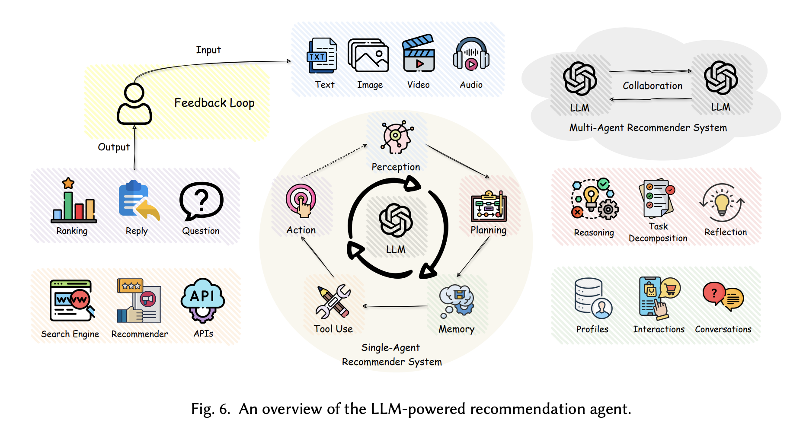
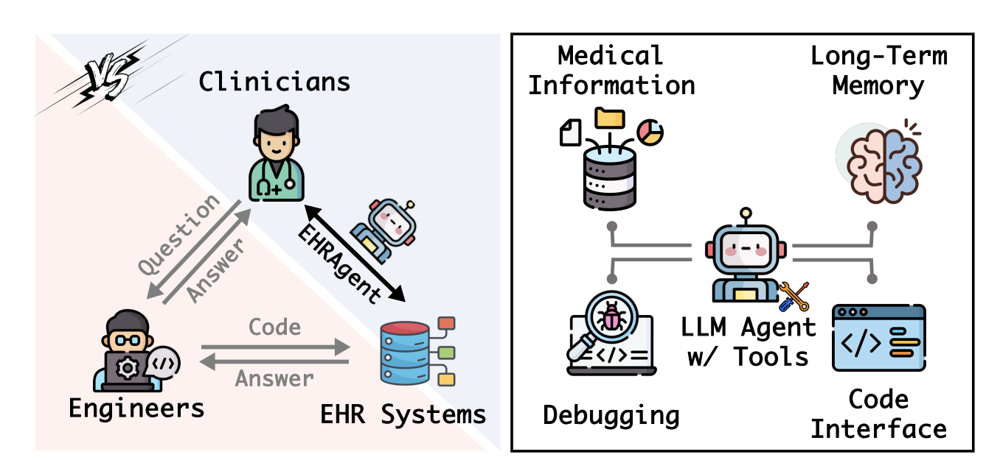
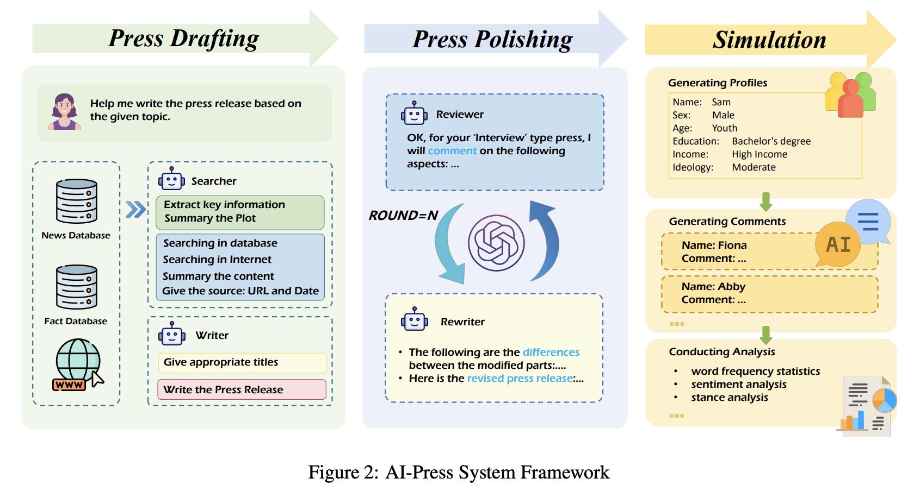

## Agentic AI Systems
Agents in various tasks such as education, healthcare, and the press.
<figure style="text-align: center;">
    
    <figcaption style="text-align: center;">Recommendation Agent (引用：https://arxiv.org/abs/2407.10081)</figcaption>
</figure>
<figure style="text-align: center;">
    
    <figcaption style="text-align: center;">EHR Agent (引用：https://arxiv.org/abs/2401.07128)</figcaption>
</figure>
<figure style="text-align: center;">
    
    <figcaption style="text-align: center;">Press Agent (引用：https://arxiv.org/abs/2410.07561)</figcaption>
</figure>

#### Papers
* [Jan 2024] **"EHRAgent: Code Empowers Large Language Models for Few-shot Complex Tabular Reasoning on Electronic Health Records"** [[paper](https://arxiv.org/abs/2401.07128)]
* [Feb 2024] **"A Human-Inspired Reading Agent with Gist Memory of Very Long Contexts"** [[paper](https://arxiv.org/abs/2402.09727)]
* 🔥 📖 [Feb 2024] **"Personal LLM Agents: Insights and Survey about the Capability, Efficiency and Security"** [[paper](https://arxiv.org/abs/2401.05459)]
* [Apr 2024] **"ClinicalAgent: Clinical Trial Multi-Agent System with Large Language Model-based Reasoning"** [[paper](https://arxiv.org/abs/2404.14777)]
* [May 2024] **"Eliciting Problem Specifications via Large Language Models"** [[paper](https://arxiv.org/abs/2405.12147)]
* [Jul 2024] **"Revolutionizing Bridge Operation and Maintenance with LLM-based Agents: An Overview of Applications and Insights"** [[paper](https://arxiv.org/abs/2407.10064)]
* [Jul 2024] **"AgentInstruct: Toward Generative Teaching with Agentic Flows"** [[paper](https://arxiv.org/abs/2407.03502)]
* [Jul 2024] **"MMedAgent: Learning to Use Medical Tools with Multi-modal Agent"** [[paper](https://arxiv.org/abs/2407.02483)]
* [Jul 2024] **"Coding Reliable LLM-based Integrated Task and Knowledge Agents with GenieWorksheets"** [[paper](https://arxiv.org/abs/2407.05674)]
* 📖 [Jul 2024] **"A Review of Large Language Models and Autonomous Agents in Chemistry"** [[paper](https://arxiv.org/abs/2407.01603)]
* 📖 [Jul 2024] **"All Roads Lead to Rome: Unveiling the Trajectory of Recommender Systems Across the LLM Era"** [[paper](https://arxiv.org/abs/2407.10081)]
* [Aug 2024] **"LongWriter: Unleashing 10,000+ Word Generation from Long Context LLMs"** [[paper](https://arxiv.org/abs/2408.07055)]
* [Aug 2024] **"Perceive, Reflect, and Plan: Designing LLM Agent for Goal-Directed City Navigation without Instructions"** [[paper](https://arxiv.org/abs/2408.04168)]
* [Oct 2024] **"DataEnvGym: Data Generation Agents in Teacher Environments with Student Feedback"** [[paper](https://arxiv.org/abs/2410.06215)]
* [Oct 2024] **"AI-Press: A Multi-Agent News Generating and Feedback Simulation System Powered by Large Language Models"** [[paper](https://arxiv.org/abs/2410.07561)]
* [Oct 2024] **"Mentigo: An Intelligent Agent for Mentoring Students in the Creative Problem Solving Process"** [[paper](https://arxiv.org/abs/2409.14228)]
* [Oct 2024] **"Agents' Room: Narrative Generation through Multi-step Collaboration"** [[paper](https://arxiv.org/abs/2410.02603)]
* [Nov 2024] **"Enhancing Cluster Resilience: LLM-agent Based Autonomous Intelligent Cluster Diagnosis System and Evaluation Framework"** [[paper](https://arxiv.org/abs/2411.05349)]
* [Nov 2024] **"Enhancing LLMs for Power System Simulations: A Feedback-driven Multi-agent Framework"** [[paper](https://arxiv.org/abs/2411.16707)]
* [Nov 2024] **"Towards Next-Generation Medical Agent: How o1 is Reshaping Decision-Making in Medical Scenarios"** [[paper](https://arxiv.org/abs/2411.14461)]
* [Dec 2024] **"Hacking CTFs with Plain Agents"** [[paper](https://arxiv.org/abs/2412.02776)]
* [Dec 2024] **"Enhancing LLMs for Impression Generation in Radiology Reports through a Multi-Agent System"** [[paper](https://arxiv.org/abs/2412.06828)]
* [Dec 2024] **"AutoPatent: A Multi-Agent Framework for Automatic Patent Generation"** [[paper](https://arxiv.org/abs/2412.09796)]
* [Dec 2024] **"LegalAgentBench: Evaluating LLM Agents in Legal Domain"** [[paper](https://arxiv.org/abs/2412.17259)]
* [Jan 2025] **"User Simulation in the Era of Generative AI: User Modeling, Synthetic Data Generation, and System Evaluation"** [[paper](https://arxiv.org/abs/2501.04410)]
* [Jan 2025] **"AIOpsLab: A Holistic Framework to Evaluate AI Agents for Enabling Autonomous Clouds"** [[paper](https://arxiv.org/abs/2501.06706)]
* [Jan 2025] **"Agent4Edu: Generating Learner Response Data by Generative Agents for Intelligent Education Systems"** [[paper](https://arxiv.org/abs/2501.10332)]
* 📖 [Feb 2025] **"A Survey on LLM-powered Agents for Recommender Systems"** [[paper](https://arxiv.org/abs/2502.10050)]
* 📖 [Mar 2025] **"LLM Agents for Education: Advances and Applications"** [[paper](https://arxiv.org/abs/2503.11733)]
* [Mar 2025] **"BannerAgency: Advertising Banner Design with Multimodal LLM Agents"** [[paper](https://www.arxiv.org/abs/2503.11060)]
* [Mar 2025] **"MAP : Multi-user Personalization with Collaborative LLM-powered Agents"**  [[paper](https://arxiv.org/abs/2503.12757)]
* [Apr 2025] **"GRAPHICBENCH: A Planning Benchmark for Graphic Design with Language Agents"** [[paper](https://arxiv.org/abs/2504.11571)]
* [Apr 2025] **"AgentA/B: Automated and Scalable Web A/B Testing with Interactive LLM Agents"** [[paper](https://arxiv.org/abs/2504.09723)]
* [Apr 2025] **"UXAgent: A System for Simulating Usability Testing of Web Design with LLM Agents"** [[paper](https://arxiv.org/abs/2504.09407)]
* [Apr 2025] **"OptimAI: Optimization from Natural Language Using LLM-Powered AI Agents"** [[paper](https://arxiv.org/abs/2504.16918)]
* 📖 [May 2025] **"Knowledge Augmented Complex Problem Solving with Large Language Models: A Survey"** [[paper](https://arxiv.org/abs/2505.03418)]
* [Jun 2025] **"Oversight Structures for Agentic AI in Public-Sector Organizations"** [[paper](https://www.arxiv.org/abs/2506.04836)]
* 📖 [Jun 2025] **"Application-Driven Value Alignment in Agentic AI Systems: Survey and Perspectives"** [[paper](https://arxiv.org/abs/2506.09656)]
* [Jun 2025] **"Intelligent Design 4.0: Paradigm Evolution Toward the Agentic AI Era"** [[paper](https://arxiv.org/abs/2506.09755)]
* [Jun 2025] **"Improved LLM Agents for Financial Document Question Answering"** [[paper](https://www.arxiv.org/abs/2506.08726)]
* ⚖️ [Jun 2025] **"ALE-Bench: A Benchmark for Long-Horizon Objective-Driven Algorithm Engineering"** [[paper](https://arxiv.org/abs/2506.09050)]
* [Jun 2025] **"Decide less, communicate more: On the construct validity of end-to-end fact-checking in medicine"** [[paper](https://www.arxiv.org/abs/2506.20876)]
* [Jun 2025] **"SV-LLM: An Agentic Approach for SoC Security Verification using Large Language Models"** [[paper](https://arxiv.org/abs/2506.20415)]
* [Jul 2025] **"CRMAgent: A Multi-Agent LLM System for E-Commerce CRM Message Template Generation"** [[paper](https://arxiv.org/abs/2507.08325)]
* 📖 [Jul 2025] **"A Survey of Large Language Models in Discipline-specific Research: Challenges, Methods and Opportunities"** [[paper](https://arxiv.org/abs/2507.08425)]
* [Jul 2025] **"SIMAGENTS: Bridging Literature and the Universe Via A Multi-Agent Large Language Model System"** [[paper](https://www.arxiv.org/abs/2507.08958)]
* [Jul 2025] **"STRUCTSENSE: A Task-Agnostic Agentic Framework for Structured Information Extraction with Human-In-The-Loop Evaluation and Benchmarking"** [[paper](https://arxiv.org/abs/2507.03674)]
* [Jul 2025] **"Agent Exchange: Shaping the Future of AI Agent Economics"** [[paper](https://arxiv.org/abs/2507.03904)]
* ⚖️ [Jul 2025] **"Ready Jurist One: Benchmarking Language Agents for Legal Intelligence in Dynamic Environments"** [[paper](https://arxiv.org/abs/2507.04037)]
* [Jul 2025] **"Agentic Retrieval of Topics and Insights from Earnings Calls"** [[paper](https://arxiv.org/abs/2507.07906)]
* [Jul 2025] **"Large Language Model Powered Intelligent Urban Agents: Concepts, Capabilities, and Applications"** [[paper](https://arxiv.org/abs/2507.00914)]
* [Jul 2025] **"Evaluating LLM Agent Collusion in Double Auctions"** [[paper](https://arxiv.org/abs/2507.01413)]
* [Jul 2025] **"Emotionally Intelligent Task-oriented Dialogue Systems: Architecture, Representation, and Optimisation"** [[paper](https://arxiv.org/abs/2507.01594)]
* [Jul 2025] **"The Future is Agentic: Definitions, Perspectives, and Open Challenges of Multi-Agent Recommender Systems"** [[paper](https://arxiv.org/abs/2507.02097)]
* [Jul 2025] **"OMS: On-the-fly, Multi-Objective, Self-Reflective Ad Keyword Generation via LLM Agent"** [[paper](https://arxiv.org/abs/2507.02353)]
* [Jul 2025] **"Redefining Elderly Care with Agentic AI: Challenges and Opportunities"** [[paper](https://arxiv.org/abs/2507.14912)]
* [Jul 2025] **"Enabling Self-Improving Agents to Learn at Test Time With Human-In-The-Loop Guidance"** [[paper](https://www.arxiv.org/abs/2507.17131)]
* [Jul 2025] **"Towards a rigorous evaluation of RAG systems: the challenge of due diligence"** [[paper](https://www.arxiv.org/abs/2507.21753)]
* [Jul 2025] **"MK2 at PBIG Competition: A Prompt Generation Solution"** [[paper](https://arxiv.org/abs/2507.08335)]
**"MindFlow+: A Self-Evolving Agent for E-Commerce Customer Service"** [[paper](https://arxiv.org/abs/2507.18884)]
* [Aug 2025] **"Evaluating Large Language Models as Expert Annotators"** [[paper](https://arxiv.org/abs/2508.07827)]
* ⚖️ [Aug 2025] **"ShoppingBench: A Real-World Intent-Grounded Shopping Benchmark for LLM-based Agents"** [[paper](https://www.arxiv.org/abs/2508.04266)]
* [Aug 2025] **"WINELL: Wikipedia Never-Ending Updating with LLM Agents"** [[paper](https://arxiv.org/abs/2508.03728)]
* [Aug 2025] **"Toward Verifiable Misinformation Detection: A Multi-Tool LLM Agent Framework"** [[paper](https://www.arxiv.org/abs/2508.03092)]
* [Aug 2025] **"HealthFlow: A Self-Evolving AI Agent with Meta Planning for Autonomous Healthcare Research"** [[paper](https://arxiv.org/abs/2508.02621)]
* [Aug 2025] **"The Collaboration Paradox: Why Generative AI Requires Both Strategic Intelligence and Operational Stability in Supply Chain Management"** [[paper](https://www.arxiv.org/abs/2508.13942)]
* ⚖️ [Aug 2025] **"AIM-Bench: Evaluating Decision-making Biases of Agentic LLM as Inventory Manager"** [[paper](https://arxiv.org/abs/2508.11416)]
* [Aug 2025] **"AlphaAgents: Large Language Model based Multi-Agents for Equity Portfolio Constructions"** [[paper](https://arxiv.org/abs/2508.11152)]
* [Aug 2025] **"Towards Reliable Multi-Agent Systems for Marketing Applications via Reflection, Memory, and Planning"** [[paper](https://arxiv.org/abs/2508.11120)]
* [Aug 2025] **"LLM-Based Agents for Competitive Landscape Mapping in Drug Asset Due Diligence"** [[paper](https://arxiv.org/abs/2508.16571)]
* [Aug 2025] **"GLARE: Agentic Reasoning for Legal Judgment Prediction"** [[paper](https://arxiv.org/abs/2508.16383)]
* [Aug 2025] **"The Anatomy of a Personal Health Agent"** [[paper](https://www.arxiv.org/abs/2508.20148)]
* [Sep 2025] **"FaMA: LLM-Empowered Agentic Assistant for Consumer-to-Consumer Marketplace"** [[paper](https://arxiv.org/abs/2509.03890)]
* [Sep 2025] **"Leveraging LLM-Based Agents for Intelligent Supply Chain Planning"** [[paper](https://arxiv.org/abs/2509.03890)]
* [Sep 2025] **"NEWSAGENT: Benchmarking Multimodal Agents as Journalists with Real-World Newswriting Tasks"** [[paper](https://arxiv.org/abs/2509.00446)]
* [Sep 2025] **"Co-Investigator AI: The Rise of Agentic AI for Smarter, Trustworthy AML Compliance Narratives"** [[paper](https://arxiv.org/abs/2509.08380)]
* 📖 [Sep 2025] **"A Systematic Survey on Large Language Models for Evolutionary Optimization: From Modeling to Solving"** [[paper](https://arxiv.org/abs/2509.08269)]
* [Sep 2025] **"An Agentic Toolkit for Adaptive Information Extraction from Regulatory Documents"** [[paper](https://arxiv.org/abs/2509.11773)]
* 📖 [Sep 2025] **"A Survey of Reasoning and Agentic Systems in Time Series with Large Language Models"** [[paper](https://arxiv.org/abs/2509.11575)]
* 📖 [Sep 2025] **"LLMs4All: A Review on Large Language Models for Research and Applications in Academic Disciplines"** [[paper](https://arxiv.org/abs/2509.19580)]
* [Sep 2025] **"Interactive Recommendation Agent with Active User Commands"** [[paper](https://arxiv.org/abs/2509.21317)]
* ⚖️ [Sep 2025] **"VCBench: Benchmarking LLMs in Venture Capital"** [[paper](https://arxiv.org/abs/2509.14448)]
* [Oct 2025] **"A Tale of LLMs and Induced Small Proxies: Scalable Agents for Knowledge Mining"** [[paper](https://arxiv.org/abs/2510.01427)]
* [Oct 2025] **"CORTEX: Collaborative LLM Agents for High-Stakes Alert Triage"** [[paper](https://arxiv.org/abs/2510.00311)]
* [Oct 2025] **"A cybersecurity AI agent selection and decision support framework"** [[paper](https://arxiv.org/abs/2510.01751)]
* [Oct 2025] **"Agentic Reasoning and Refinement through Semantic Interaction"** [[paper](https://arxiv.org/abs/2510.02157)]
* [Oct 2025] **"Agent Bain vs. Agent McKinsey: A New Text-to-SQL Benchmark for the Business Domain"** [[paper](https://arxiv.org/abs/2510.07309)]
* [Oct 2025] **"Agentic Generative AI for Media Content Discovery at the National Football League"** [[paper](https://arxiv.org/abs/2510.07297)]
* [Oct 2025] **"Artificially intelligent agents in the social and behavioral sciences: A history and outlook"** [[paper](https://arxiv.org/abs/2510.05743)]
* [Oct 2025] **"Agentic Systems in Radiology: Design, Applications, Evaluation, and Challenges"** [[paper](https://arxiv.org/abs/2510.09404)]
* [Oct 2025] **"Automating Structural Engineering Workflows with Large Language Model Agents"** [[paper](https://arxiv.org/abs/2510.11004)]
* 📖 [Oct 2025] **"Document Intelligence in the Era of Large Language Models: A Survey"** [[paper](https://arxiv.org/abs/2510.13366)]
* [Oct 2025] **"Human-Agent Collaborative Paper-to-Page Crafting for Under $0.1"** [[paper](https://arxiv.org/abs/2510.19600)]
* [Oct 2025] **"An Agentic Framework with LLMs for Solving Complex Vehicle Routing Problems"** [[paper](https://www.arxiv.org/abs/2510.16701)]
* [Oct 2025] **"Glia: A Human-Inspired AI for Automated Systems Design and Optimization"** [[paper](https://arxiv.org/abs/2510.27176v3)]
* [Nov 2025] **"From LLMs to Agents: A Comparative Evaluation of LLMs and LLM-based Agents in Security Patch Detection"** [[paper](https://arxiv.org/abs/2511.08060v1)]
* [Nov 2025] **"AIA Forecaster: Technical Report"** [[paper](https://arxiv.org/abs/2511.07678v1)]
* [Nov 2025] **"AlphaCast: A Human Wisdom-LLM Intelligence Co-Reasoning Framework for Interactive Time Series Forecasting"** [[paper](https://arxiv.org/abs/2511.08947v1)]
* ⚖️ [Dec 2025] **"GovBench: Benchmarking LLM Agents for Real-World Data Governance Workflows"** [[paper](https://arxiv.org/abs/2512.04416v1)]
* ⚖️ [Dec 2025] **"Does It Tie Out? Towards Autonomous Legal Agents in　Venture Capital"** [[paper](https://arxiv.org/abs/2512.18658v1)]
* 📖 [Dec 2025] **"Event Extraction in Large Language Model: A Holistic Survey of Method, Modality, and Future"** [[paper](https://arxiv.org/abs/2512.19537v1)]
* [Dec 2025] **"FinAgent: An Agentic AI Framework Integrating Personal Finance and Nutrition Planning"** [[paper](https://arxiv.org/abs/2512.20991v1)]
* [Dec 2025] **"LLM-as-a-Prophet: Understanding Predictive Intelligence with Prophet Arena"** [[paper](https://arxiv.org/abs/2510.17638v2)]
* [Dec 2025] **"SoMe: A Realistic Benchmark for LLM-based Social Media Agents"** [[paper](https://arxiv.org/abs/2512.14720)]
* [Dec 2025] **"An Comparative Analysis about KYC on a Recommendation System Toward Agentic Recommendation System"** [[paper](https://arxiv.org/abs/2512.23961v1)]
* [Jan 2026] **"Digital Twin AI: Opportunities and Challenges from Large Language Models to World Models"** [[paper](https://arxiv.org/abs/2601.01321)]
* [Jan 2026] **"Agentic AI in Remote Sensing: Foundations, Taxonomy, and Emerging Systems"** [[paper](https://arxiv.org/abs/2601.01891)]
* [Jan 2026] **"Crisis-Bench: Benchmarking Strategic Ambiguity and Reputation　Management in Large Language Models"** [[paper](https://arxiv.org/abs/2601.05570v1)]
* [Jan 2026] **"Automating Supply Chain Disruption Monitoring via an Agentic AI Approach"** [[paper](https://arxiv.org/abs/2601.09680v1)]
* [Jan 2026] **"Evaluating Implicit Regulatory Compliance in LLM Tool Invocation via Logic-Guided Synthesis"** [[paper](https://arxiv.org/abs/2601.08196v1)]
* 📖 [Jan 2026] **"LLM Agents in Law: Taxonomy, Applications, and Challenges"** [[paper](https://arxiv.org/abs/2601.06216v1)]
* [Jan 2026] **"FutureX-Pro: Extending Future Prediction to High-Value Vertical Domains"** [[paper](https://arxiv.org/abs/2601.12259v1)]