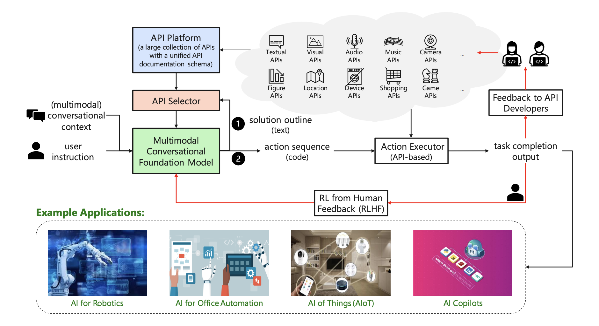

## API Agents
* Enable users to operate specialized software via simple voice or text instructions
* Treat any software that supports REST APIs or Python SDKs as an agent’s tool
* Handle complex applications, including 3D modeling in manufacturing or chemistry
* Incorporate “Agentic Process Automation,” an evolution of RPA for routine workflows

<figure style="text-align: center;">
    
    <figcaption style="text-align: center;">引用：https://arxiv.org/abs/2303.16434</figcaption>
</figure>

#### Papers
* [Mar 2023] **"Taskmatrix.ai: Completing tasks by connecting foundation models with millions of apis"** [[paper](https://arxiv.org/abs/2303.16434)]
* [Apr 2023] **"Api-bank: A benchmark for tool-augmented llms"** [[paper](https://arxiv.org/abs/2304.08244)]
* [May 2023] **"Gorilla: Large language model connected with massive apis"** [[paper](https://arxiv.org/abs/2305.15334)]
* ⚖️ [Oct 2023] **"MetaTool Benchmark for Large Language Models: Deciding Whether to Use Tools and Which to Use"** [[paper](https://arxiv.org/abs/2310.03128)]
* [Mar 2024] **"SceneCraft: An LLM Agent for Synthesizing 3D Scene as Blender Code"** [[paper](https://arxiv.org/abs/2403.01248)]
* [May 2024] **"A Unified Industrial Large Knowledge Model Framework in Smart Manufacturing"** [[paper](https://arxiv.org/abs/2312.14428)]
* [May 2024] **"Automating the Enterprise with Foundation Models"** [[paper](https://arxiv.org/abs/2405.03710)]
* [Jun 2024] **"A Large Language Model-based multi-agent manufacturing system for intelligent shopfloor"** [[paper](https://arxiv.org/abs/2405.16887)]
* [Jul 2024] **"AutoFlow: Automated Workflow Generation for Large Language Model Agents"** [[paper](https://arxiv.org/abs/2407.12821)]
* [Aug 2024] **"Text2BIM: Generating Building Models Using a Large Language Model-based Multi-Agent Framework"** [[paper](https://arxiv.org/abs/2408.08054)]
* [Aug 2024] **"MetaOpenFOAM: an LLM-based multi-agent framework for CFD"** [[paper](https://arxiv.org/abs/2407.21320)]
* [Sep 2024] **"Turn Every Application into an Agent: Towards Efficient Human-Agent-Computer Interaction with API-First LLM-Based Agents"** [[paper](https://arxiv.org/pdf/2409.17140)]
* [Oct 2024] **"Control Industrial Automation System with Large Language Models"** [[paper](https://arxiv.org/abs/2409.18009)]
* [Oct 2024] **"Agents4PLC: Automating Closed-loop PLC Code Generation and Verification in Industrial Control Systems using LLM-based Agents"** [[paper](https://arxiv.org/abs/2410.14209)]
* [Oct 2024] **"SceneGenAgent: Precise Industrial Scene Generation with Coding Agent"** [[paper](https://arxiv.org/abs/2410.21909)]
* [Oct 2024] **"ControlAgent: Automating Control System Design via Novel Integration of LLM Agents and Domain Expertise"** [[paper](https://arxiv.org/abs/2410.19811)]
* [Nov 2024] **"Autonomous Industrial Control using an Agentic Framework with Large Language Models"** [[paper](https://arxiv.org/abs/2411.05904)]
* [Nov 2024] **"Tooling or Not Tooling? The Impact of Tools on Language Agents for Chemistry Problem Solving"**[[paper](https://arxiv.org/abs/2411.07228v1)]
* 🔥 [Nov 2024] **"WorkflowLLM: Enhancing Workflow Orchestration Capability of Large Language Models"** [[paper](https://arxiv.org/abs/2411.05451)]
* [Jan 2025] **"LLM-Agents Driven Automated Simulation Testing and Analysis of small Uncrewed Aerial Systems"** [[paper](https://arxiv.org/abs/2501.11864)]