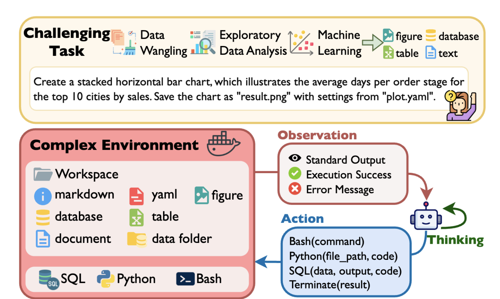

## Data Agents
* Automate everything from data processing and aggregation to analysis and insight extraction
* Summarize findings into comprehensive reports, and can even handle full ML engineering tasks
* Generate code and leverage a variety of machine learning and data analysis libraries
<figure style="text-align: center;">
    
    <figcaption style="text-align: center;">引用：https://arxiv.org/abs/2410.07331</figcaption>
</figure>

#### Papers
* [May 2023] **"ChatGPT as your Personal Data Scientist"** [[paper](https://arxiv.org/abs/2305.13657)]
* [May 2023] **"AutoML-GPT: Automatic Machine Learning with GPT"** [[paper](https://arxiv.org/abs/2305.02499)]
* [Jun 2023] **"Data-Copilot: Bridging Billions of Data and Humans with Autonomous Workflow"** [[paper](https://arxiv.org/abs/2306.07209)]
* ⚖️ [Oct 2023] **"MLAgentBench: Evaluating Language Agents on Machine Learning Experimentation"** [[paper](https://arxiv.org/abs/2310.03302)]
* ⚖️ [Nov 2023] **"ML-Bench: Evaluating Large Language Models and Agents for Machine Learning Tasks on Repository-Level Code"** [[paper](https://arxiv.org/abs/2311.09835)]
* ⚖️ [Jan 2024] **"InfiAgent-DABench: Evaluating Agents on Data Analysis Tasks"** [[paper](https://arxiv.org/abs/2401.05507)]
* [Feb 2024] **"Data Interpreter: An LLM Agent for Data Science"** [[paper](https://arxiv.org/abs/2402.18679)]
* [Feb 2024] **"MatPlotAgent: Method and Evaluation for LLM-Based Agentic Scientific Data Visualization"** [[paper]https://arxiv.org/abs/2402.11453)]
* [Feb 2024] **"DS-Agent: Automated Data Science by Empowering Large Language Models with Case-Based Reasoning"** [[paper](https://arxiv.org/abs/2402.17453)]
* [Mar 2024] **"SheetAgent: Towards a Generalist Agent for Spreadsheet Reasoning and Manipulation via Large Language Models"** [[paper](https://arxiv.org/abs/2403.03636)]
* [Apr 2024] **"A Multimodal Automated Interpretability Agent"** [[paper](https://arxiv.org/abs/2404.14394)]
* [Jul 2024] **"LAMBDA: A Large Model Based Data Agent"** [[paper](https://arxiv.org/abs/2407.17535)]
* [Jul 2024] **"MIRAI: Evaluating LLM Agents for Event Forecasting"** [[paper](https://arxiv.org/abs/2407.01231)]
* ⚖️ [Jul 2024] **"Spider2-V: How Far Are Multimodal Agents From Automating Data Science and Engineering Workflows?"** [[paper](https://arxiv.org/abs/2407.10956)]
* ⚖️ [Jul 2024] **"InsightBench: Evaluating Business Analytics Agents Through Multi-Step Insight Generation"** [[paper](https://arxiv.org/abs/2407.06423)]
* [Aug 2024] **"Agentic Retrieval-Augmented Generation for Time Series Analysis"** [[paper](https://arxiv.org/abs/2408.14484)]
* [Aug 2024] **"From Data to Story: Towards Automatic Animated Data Video Creation with LLM-based Multi-Agent Systems"** [[paper](https://arxiv.org/abs/2408.03876)]
* ⚖️ [Aug 2024] **"BLADE: Benchmarking Language Model Agents for Data-Driven Science"** [[paper](https://arxiv.org/abs/2408.09667)]
* [Sep 2024] **"Using Generative Agents to Create Tip Sheets for Investigative Data Reporting"** [[paper](https://arxiv.org/abs/2409.07286)]
* ⚖️ [Sep 2024] **"DSBench: How Far Are Data Science Agents to Becoming Data Science Experts?"** [[paper](https://arxiv.org/abs/2409.07703)]
* 🔥 [Sep 2024] **"Data Analysis in the Era of Generative AI"** [[paper](https://arxiv.org/abs/2409.18475)]
* [Oct 2024] **"AutoML-Agent: A Multi-Agent LLM Framework for Full-Pipeline AutoML"** [[paper](https://arxiv.org/abs/2410.02958)]
* [Oct 2024] **"An LLM Agent for Automatic Geospatial Data Analysis"** [[paper](https://arxiv.org/abs/2410.18792)]
* [Oct 2024] **"AutoKaggle: A Multi-Agent Framework for Autonomous Data Science Competitions"** [[paper](https://arxiv.org/abs/2410.20424)]
* [Oct 2024] **"From Facts to Insights: A Study on the Generation and Evaluation of Analytical Reports for Deciphering Earnings Calls"** [[paper](https://arxiv.org/abs/2410.01039)]
* ⚖️ [Oct 2024] **"MLE-bench: Evaluating Machine Learning Agents on Machine Learning Engineering"** [[paper](https://arxiv.org/abs/2410.07095)]
* ⚖️ [Oct 2024] **"DA-Code: Agent Data Science Code Generation Benchmark for Large Language Models"** [[paper](https://arxiv.org/abs/2410.07331)]
* [Oct 2024] **"SELA: Tree-Search Enhanced LLM Agents for Automated Machine Learning"** [[paper](https://arxiv.org/abs/2410.17238)]
* ⚖️ [Nov 2024] **"Spider 2.0: Evaluating Language Models on Real-World Enterprise Text-to-SQL Workflows"** [[paper](https://arxiv.org/abs/2411.07763)]
* [Dec 2024] **"DataLab: A Unified Platform for LLM-Powered Business Intelligence"** [[paper](https://arxiv.org/abs/2412.02205)]
* [Dec 2024] **"AutoDCWorkflow: LLM-based Data Cleaning Workflow Auto-Generation and Benchmark"** [[paper](https://arxiv.org/abs/2412.06724)]
* [Dec 2024] **"Towards Agentic Schema Refinement"** [[paper](https://arxiv.org/abs/2412.07786)]
* 📖 [Dec 2024] **A Survey on Large Language Model-based Agents for Statistics and Data Science** [[paper](https://arxiv.org/abs/2412.14222)]
* [Jan 2025] **"MDSF: Context-Aware Multi-Dimensional Data Storytelling Framework based on Large language Model"** [[paper](https://arxiv.org/abs/2501.01014)]
* [Jan 2025] **"Towards Human-Guided, Data-Centric LLM Co-Pilots"** [[paper](https://arxiv.org/abs/2501.10321)]
* [Jan 2025] **"Jupybara: Operationalizing a Design Space for Actionable Data Analysis and Storytelling with LLMs"** [[paper](https://arxiv.org/abs/2501.16661)]
* [Feb 2025] **"METAL: A Multi-Agent Framework for Chart Generation with Test-Time Scaling"** [[paper](https://arxiv.org/abs/2502.17651)]
* [Feb 2025] **"AIDE: AI-Driven Exploration in the Space of Code"** [[paper](https://arxiv.org/abs/2502.13138)]
* [Mar 2025] **"OR-LLM-Agent: Automating Modeling and Solving of Operations Research Optimization Problem with Reasoning Large Language Model"** [[paper](https://arxiv.org/abs/2503.10009)]
* [Mar 2025] **"Exploring LLM Agents for Cleaning Tabular Machine Learning Datasets"** [[paper](https://arxiv.org/abs/2503.06664)]
* [Mar 2025] **"DatawiseAgent: A Notebook-Centric LLM Agent Framework for Automated Data Science"** [[paper](https://arxiv.org/abs/2503.07044)]
* [Mar 2025] **"DAgent: A Relational Database-Driven Data Analysis Report Generation Agent"** [[paper](https://arxiv.org/abs/2503.13269)]
* [Mar 2025] **"SchemaAgent: A Multi-Agents Framework for Generating Relational Database Schema"** [[paper](https://arxiv.org/abs/2503.23886)]
* [Apr 2025] **"AGENTADA: Skill-Adaptive Data Analytics for Tailored Insight Discovery"** [[paper](https://arxiv.org/abs/2504.07421)]