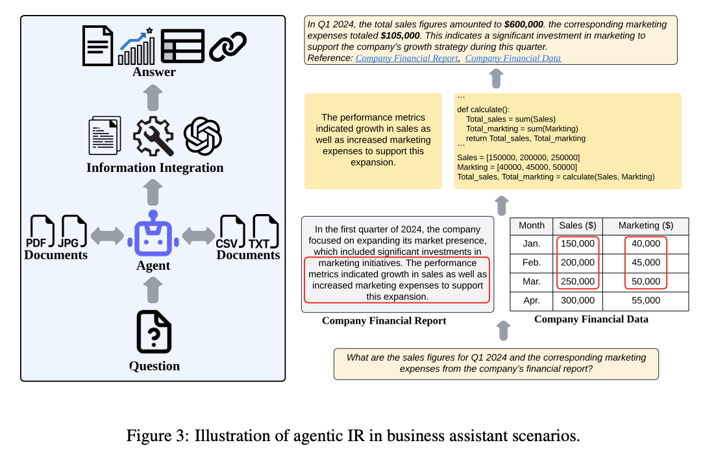

## Agentic RAG
* Agentic RAG enhances traditional RAG by incorporating multi-agent collaboration, dynamic decision-making, and iterative reasoning.
* It is ideal for complex workflows, integrating tools and APIs, and maintaining context across multi-step tasks.
<figure style="text-align: center;">
    
    <figcaption style="text-align: center;">引用：https://arxiv.org/abs/2410.09713</figcaption>
</figure>

#### Papers
* [Feb 2024] **"Nissist: An Incident Mitigation Copilot based on Troubleshooting Guides"** [[paper](https://arxiv.org/abs/2402.17531)]
* [Mar 2024] **"Exploring LLM-based Agents for Root Cause Analysis"** [[paper](https://arxiv.org/abs/2403.04123)]
* [Apr 2024] **"ChatShop: Interactive Information Seeking with Language Agents"** [[paper](https://arxiv.org/abs/2404.09911)]
* 📖 [May 2024] **"A Survey on Retrieval-Augmented Text Generation for Large Language Models"** [[paper](https://arxiv.org/abs/2404.10981)]
* 📖 [May 2024] **"When to Retrieve: Teaching LLMs to Utilize Information Retrieval Effectively"** [[paper](https://arxiv.org/abs/2404.19705)]
* [Jul 2024] **"ProductAgent: Benchmarking Conversational Product Search Agent with Asking Clarification Questions"** [[paper](https://arxiv.org/abs/2407.00942)]
* [Jul 2024] **"MindSearch: Mimicking Human Minds Elicits Deep AI Searcher"** [[paper](https://arxiv.org/abs/2407.20183)]
* [Jul 2024] **"BRIGHT: A Realistic and Challenging Benchmark for Reasoning-Intensive Retrieval"** [[paper](https://arxiv.org/abs/2407.12883)]
* [Jul 2024] **"Retrieve, Summarize, Plan: Advancing Multi-hop Question Answering with an Iterative Approach"** [[paper](https://arxiv.org/abs/2407.13101)]
* [Jul 2024] **"Sibyl: Simple yet Effective Agent Framework for Complex Real-world Reasoning"** [[paper](https://arxiv.org/abs/2407.10718)]
* [Aug 2024] **"OpenResearcher: Unleashing AI for Accelerated Scientific Research"** [[paper](https://arxiv.org/abs/2408.06941)]
* [Aug 2024] **"Into the Unknown Unknowns: Engaged Human Learning Through Participation in Language Model Agent Conversations"** [[paper](https://arxiv.org/abs/2408.15232)]
* [Aug 2024] **"Analysis of Plan-based Retrieval for Grounded Text Generation"** [[paper](https://arxiv.org/abs/2408.10490)]
* [Aug 2024] **"REAPER: Reasoning based Retrieval Planning for Complex RAG Systems"** [[paper](https://arxiv.org/abs/2407.18553)]
* [Aug 2024] **"MindSearch: Mimicking Human Minds Elicits Deep AI Searcher"** [[paper](https://arxiv.org/abs/2407.20183)]
* [Sep 2024] **"AgentRE: An Agent-Based Framework for Navigating Complex Information Landscapes in Relation Extraction"** [[paper](https://arxiv.org/abs/2409.01854)]
* ⚖️ [Sep 2024] **"RAD-Bench: Evaluating Large Language Models’ Capabilities in Retrieval Augmented Dialogues"** [[paper](https://arxiv.org/abs/2409.12558)]
* 🔥 [Oct 2024] **"Agentic Information Retrieval"** [[paper](https://arxiv.org/abs/2410.09713)]
* 📖 [Oct 2024] **"Retrieval Augmented Generation (RAG) and Beyond: A Comprehensive Survey on How to Make your LLMs use External Data More Wisely"** [[paper](https://arxiv.org/abs/2409.14924)]
* [Nov 2024] **"Boosting the Potential of Large Language Models with an Intelligent Information Assistant"** [[paper](https://arxiv.org/abs/2411.06805)]
* [Nov 2024] **"Auto-RAG: Autonomous Retrieval-Augmented Generation for Large Language Models"** [[paper](https://arxiv.org/abs/2411.19443)]
* [Dec 2024] **"Future of Information Retrieval Research in the Age of Generative AI"** [[paper](https://arxiv.org/abs/2412.02043)]
* [Dec 2024] **"A Collaborative Multi-Agent Approach to Retrieval-Augmented Generation Across Diverse Data"** [[paper](https://arxiv.org/abs/2412.05838)]
* [Jan 2025] **"Search-o1: Agentic Search-Enhanced Large Reasoning Models"** [[paper](https://arxiv.org/abs/2501.05366)]
* 📖 [Jan 2025] **"Agentic Retrieval-Augmented Generation: A Survey on Agentic RAG"** [[paper](https://arxiv.org/abs/2501.09136)]
* [Jan 2025] **"OmniThink: Expanding Knowledge Boundaries in Machine Writing through Thinking"** [[paper](https://arxiv.org/abs/2501.09751)]
* [Jan 2025] **"PaSa: An LLM Agent for Comprehensive Academic Paper Search"** [[paper](https://arxiv.org/abs/2501.10120)]
* [Mar 2025] **"MDocAgent: A Multi-Modal Multi-Agent Framework for Document Understanding"** [[paper](https://arxiv.org/abs/2503.13964)]
* [Mar 2025] **"Open Deep Search: Democratizing Search with Open-source Reasoning Agents"** [[paper](https://arxiv.org/abs/2503.20201)]
* 📖 [Mar 2025] **"Retrieval Augmented Generation and Understanding in Vision: A Survey and New Outlook"** [[paper](https://arxiv.org/abs/2503.18016)]
* [May 2025] **"Process vs. Outcome Reward: Which is Better for Agentic RAG Reinforcement Learning"** [[paper](https://arxiv.org/abs/2505.14069)]
* ⚖️ [Jun 2025] **"DeepResearch Bench: A Comprehensive Benchmark for Deep Research Agents"** [[paper](https://arxiv.org/abs/2506.11763)]
* 📖 [Jun 2025] **"From Web Search towards Agentic Deep Research: Incentivizing Search with Reasoning Agents"** [[paper](https://www.arxiv.org/abs/2506.18959)]
* [Jun 2025] **"Mind2Web 2: Evaluating Agentic Search with Agent-as-a-Judge"** [[paper](https://arxiv.org/abs/2506.21506)]
* [Jun 2025] **"MMSearch-R1: Incentivizing LMMs to Search"** [[paper](https://arxiv.org/abs/2506.20670)]
* 📖 [Jun 2025] **"Deep Research Agents: A Systematic Examination And Roadmap"** [[paper](https://arxiv.org/abs/2506.18096)]
* [Jun 2025] **"Towards Robust Fact-Checking: A Multi-Agent System with Advanced Evidence Retrieval"** [[paper](https://www.arxiv.org/abs/2506.17878)]
* 📖 [Jun 2025] **"Towards AI Search Paradigm"** [[paper](https://arxiv.org/abs/2506.17188)]
* ⚖️ [Jun 2025] **"Benchmarking Deep Search over Heterogeneous Enterprise Data"** [[paper](https://arxiv.org/abs/2506.23139)]
* 📖 [Jun 2025] **"Towards Agentic RAG with Deep Reasoning: A Survey of RAG-Reasoning Systems in LLMs"** [[paper](https://arxiv.org/abs/2506.10408v1)]
* [Jul 2025] **"Deep Researcher with Test-Time Diffusion"** [[paper](https://www.arxiv.org/abs/2507.16075)]
* [Jul 2025] **"Interaction as Intelligence: Deep Research With Human-AI Partnership"** [[paper](https://arxiv.org/abs/2507.15759)]
* [Jul 2025] **"DeepSieve: Information Sieving via LLM-as-a-Knowledge-Router"** [[paper](https://arxiv.org/abs/2507.22050)]
* [Jul 2025] **"Artificial Intelligence In Patent And Market Intelligence: A New Paradigm For Technology Scouting"** [[paper](https://arxiv.org/abs/2507.20322)]
* [Aug 2025] **"SSRL: Self-Search Reinforcement Learning"** [[paper](https://arxiv.org/abs/2508.10874v1)]
* ⚖️ [Aug 2025] **"WideSearch: Benchmarking Agentic Broad Info-Seeking"** [[paper](https://arxiv.org/abs/2508.07999)]
* [Aug 2025] **"TURA: Tool-Augmented Unified Retrieval Agent for AI Search"** [[paper](https://www.arxiv.org/abs/2508.04604)]
* 📖 [Aug 2025] **"Deep Research: A Survey of Autonomous Research Agents"** [[paper](https://arxiv.org/abs/2508.12752)]
* ⚖️ [Aug 2025] **"ReportBench: Evaluating Deep Research Agents via Academic Survey Tasks"** [[paper](https://www.arxiv.org/abs/2508.15804)]
* [Sep 2025] **"Open Data Synthesis for Deep Research"** [[paper](https://arxiv.org/abs/2509.00375)]
* [Sep 2025] **"Universal Deep Research: Bring Your Own Model and Strategy"** [[paper](https://arxiv.org/abs/2509.00244)]
* 📖 [Sep 2025] **"Reinforcement Learning Foundations for Deep Research Systems: A Survey"** [[paper](https://arxiv.org/abs/2509.06733)]
* [Sep 2025] **"SFR-DeepResearch: Towards Effective Reinforcement Learning for Autonomously Reasoning Single Agents"** [[paper](https://arxiv.org/abs/2509.06283)]
* [Sep 2025] **"DeepTRACE: Auditing Deep Research AI Systems for Tracking Reliability Across Citations and Evidence"** [[paper](https://arxiv.org/abs/2509.04499)]
* [Sep 2025] **"MedResearcher-R1: Expert-Level Medical Deep Researcher via A Knowledge-Informed Trajectory Synthesis Framework"** [[paper](https://arxiv.org/abs/2508.14880)]
* [Sep 2025] **"Agentic AutoSurvey: Let LLMs Survey LLMs"** [[paper](https://arxiv.org/abs/2509.18661)]
* [Sep 2025] **"InfoAgent: Advancing Autonomous Information-Seeking Agents"** [[paper](https://arxiv.org/abs/2509.25189)]
* ⚖️ [Sep 2025] **"Towards Personalized Deep Research: Benchmarks and Evaluations"** [[paper](https://arxiv.org/abs/2509.25106)]
* ⚖️ [Oct 2025] **"DRBench: A Realistic Benchmark for Enterprise Deep Research"** [[paper](https://arxiv.org/abs/2510.00172)]
* ⚖️ [Oct 2025] **"A Rigorous Benchmark with Multidimensional Evaluation for Deep Research Agents: From Answers to Reports"** [[paper](https://arxiv.org/abs/2510.02190)]
* ⚖️ [Oct 2025] **"InfoMosaic-Bench: Evaluating Multi-Source Information Seeking in Tool-Augmented Agents"** [[paper](https://arxiv.org/abs/2510.02271)]
* [Oct 2025] **"FlowSearch: Advancing Deep Research with Dynamic Structured Knowledge Flow"** [[paper](https://arxiv.org/abs/2510.08521)]
* [Oct 2025] **"Understanding DeepResearch via Reports"** [[paper](https://arxiv.org/abs/2510.07861)]
* [Oct 2025] **"DEEPPLANNER: Scaling Planning Capability for Deep Research Agents via Advantage Shaping"** [[paper](https://arxiv.org/abs/2510.12979)]
* [Oct 2025] **"Search Self-play: Pushing the Frontier of Agent Capability without Supervision"** [[paper](https://arxiv.org/abs/2510.18821)]
* [Oct 2025] **"Model-Document Protocol for AI Search"** [[paper](https://www.arxiv.org/abs/2510.25160)]
* ⚖️ [Nov 2025] **"RESEARCHRUBRICS: A Benchmark of Prompts and Rubrics For Evaluating Deep Research Agents"** [[paper](https://arxiv.org/abs/2511.07685v1)]
* [Nov 2025] **"General Agentic Memory Via Deep Research"** [[paper](https://arxiv.org/abs/2511.18423v1)]
* 📖 [Dec 2025] **"Deep Research: A Systematic Survey"** [[paper](https://arxiv.org/abs/2512.02038v1)]
* 🔥 [Dec 2025] **"How Far Are We from Genuinely Useful Deep Research Agents?"** [[paper](https://arxiv.org/abs/2512.01948v1)]
* [Dec 2025] **"Step-DeepResearch Technical Report"** [[paper](https://arxiv.org/abs/2512.20491v1)]
* [Jan 2026] **"DeepSynth-Eval: Objectively Evaluating Information Consolidation in Deep Survey Writing"** [[paper](https://arxiv.org/abs/2601.03540)]
* [Jan 2026] **"Mind2Report: A Cognitive Deep Research Agent for Expert-Level Commercial Report Synthesis"** [[paper](https://www.arxiv.org/abs/2601.04879)]
* [Jan 2026] **"SmartSearch: Process Reward-Guided Query Refinement for Search Agents"** [[paper](https://www.arxiv.org/abs/2601.04888)]
* [Jan 2026] **"DocDancer: Towards Agentic Document-Grounded Information Seeking"** [[paper](https://arxiv.org/abs/2601.05163)]
* ⚖️ [Jan 2026] **"DeepResearchEval: An Automated Framework for Deep Research Task Construction and Agentic Evaluation"** [[paper](https://arxiv.org/abs/2601.09688v1)]
* ⚖️ [Jan 2026] **"DeepResearch Bench II: Diagnosing Deep Research Agents via Rubrics from Expert Report"** [[paper](https://arxiv.org/abs/2601.08536v1)]
* ⚖️ [Jan 2026] **"Can Deep Research Agents Find and Organize? Evaluating the Synthesis Gap with Expert Taxonomies"** [[paper](https://arxiv.org/abs/2601.12369v1)]
* [Jan 2026] **"Inference-Time Scaling of Verification: Self-Evolving Deep Research Agents via Test-Time Rubric-Guided Verification"** [[paper](https://arxiv.org/abs/2601.15808)]
* 📖 [Jan 2026] **"Taxonomy of the Retrieval System Framework: Pitfalls and Paradigms"** [[paper](https://arxiv.org/abs/2601.20131)]
* [Jan 2026] **"Yunque DeepResearch: A Hierarchical, Modular, and Robust Framework for Agentic Deep Research"** [[paper](https://arxiv.org/abs/2601.19578)]
* [Jan 2026] **"Self-Manager: Parallel Agent Loop for Long-form Deep Research"** [[paper](https://arxiv.org/abs/2601.17879)]
* [Feb 2026] **"Beyond RAG for Agent Memory: Retrieval by Decoupling and Aggregation"** [[paper](https://arxiv.org/abs/2602.02007)]
* [Feb 2026] **"A-RAG: Scaling Agentic Retrieval-Augmented Generation via Hierarchical Retrieval Interfaces"** [[paper](https://arxiv.org/abs/2602.03442)]
* [Feb 2026] **"RE-TRAC: REcursive TRAjectory Compression for Deep Search Agents"** [[paper](https://arxiv.org/abs/2602.02486)]
* [Feb 2026] **"WIDESEEK-R1: Exploring Width Scaling for Broad Information Seeking via Multi-Agent Reinforcement Learning"** [[paper](https://arxiv.org/abs/2602.04634)]