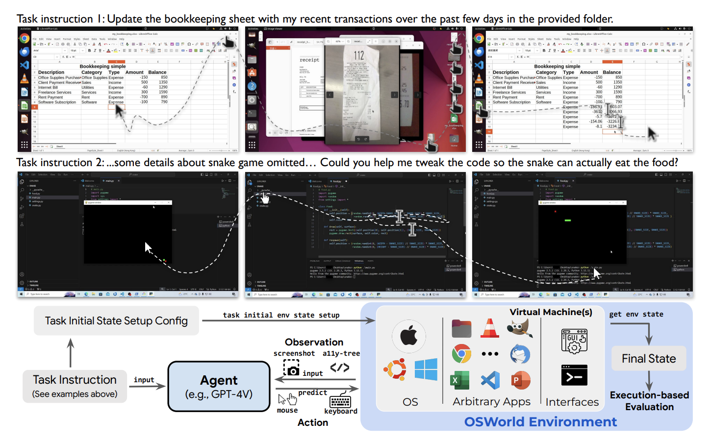

## Digital Agents
* Aim to automate tasks ranging from web browser usage to app and computer operations
* Tool selection depends on the level of control: from basic mouse-and-keyboard emulation to specialized features like search or browser navigation
<figure style="text-align: center;">
    
    <figcaption style="text-align: center;">引用：https://arxiv.org/abs/2404.07972</figcaption>
</figure>

### GUI Agents
* [Nov 2023] **"ProAgent: From Robotic Process Automation to Agentic Process Automation"** [[paper](https://arxiv.org/abs/2311.10751)]
* [Feb 2024] **"Ufo: A UI-Focused Agent for Windows OS Interaction."** [[paper](https://arxiv.org/abs/2402.07939)]
* [Feb 2024] **"Os-copilot: Towards Generalist Computer Agents with Self-Improvement."** [[paper](https://arxiv.org/abs/2402.07456)]
* [Mar 2024] **"Cradle: Empowering Foundation Agents Towards General Computer Control"** [[paper](https://arxiv.org/abs/2403.03186)]
* 🔥 ⚖️ [Apr 2024] **"OSWorld: Benchmarking Multimodal Agents for Open-Ended Tasks in Real Computer"** [[paper](https://arxiv.org/abs/2404.07972)]
* ⚖️ [Jul 2024] **"OfficeBench: Benchmarking Language Agents across Multiple Applications for Office Automation"** [[paper](https://arxiv.org/abs/2407.19056)]
* [Aug 2024] **"OmniParser for Pure Vision Based GUI Agent"** [[paper](https://arxiv.org/abs/2408.00203)]
* ⚖️ [Aug 2024] **"CRAB: Cross-environment Agent Benchmark for Multimodal Language Model Agents"** [[paper](https://arxiv.org/abs/2407.01511)]
* [Sep 2024] **"Turn Every Application into an Agent: Towards Efficient Human-Agent-Computer Interaction with API-First LLM-Based Agents"** [[paper](https://arxiv.org/pdf/2409.17140)]
* ⚖️ [Sep 2024] **"Windows Agent Arena: Evaluating Multi-Modal OS Agents at Scale"** [[paper](https://arxiv.org/abs/2409.08264)]
* [Oct 2024] **"OSCAR: Operating System Control via State-Aware Reasoning and Re-Planning"** [[paper](https://arxiv.org/abs/2410.18963)]
* [Oct 2024] **"OS-ATLAS: A Foundation Action Model for Generalist GUI Agents"** [[paper](https://arxiv.org/abs/2410.23218)]
* ⚖️ [Nov 2024] **"CRMArena: Understanding the Capacity of LLM Agents to Perform Professional CRM Tasks in Realistic Environments"** [[paper](https://arxiv.org/abs/2411.02305)]
* 📖 [Nov 2024] **"GUI Agents with Foundation Models: A Comprehensive Survey"** [[paper](https://arxiv.org/abs/2411.04890v1)]
* [Nov 2024] **"The Dawn of GUI Agent: A Preliminary Case Study with Claude 3.5 Computer Use"** [[paper](https://arxiv.org/abs/2411.10323)]
* [Nov 2024] **"ShowUI: One Vision-Language-Action Model for GUI Visual Agent"** [[paper](https://arxiv.org/abs/2411.17465)]
* 🔥 📖 [Nov 2024] **"Large Language Model-Brained GUI Agents: A Survey"** [[paper](https://arxiv.org/abs/2411.18279)]
* 📖 [DNov 2024] **"Generalist Virtual Agents: A Survey on Autonomous Agents Across Digital Platforms"** [[paper](https://arxiv.org/abs/2411.10943)]
* [Dec 2024] **"Aguvis: Unified Pure Vision Agents for Autonomous GUI Interaction"** [[paper](https://arxiv.org/abs/2412.04454)]
* [Dec 2024] **"OS-Genesis: Automating GUI Agent Trajectory Construction via Reverse Task Synthesis"** [[paper](https://arxiv.org/abs/2412.19723)]
* [Jan 2025] **"InfiGUIAgent: A Multimodal Generalist GUI Agent with Native Reasoning and Reflection"** [[paper](https://arxiv.org/abs/2501.04575)]
* [Jan 2025] **"UI-TARS: Pioneering Automated GUI Interaction with Native Agents"** [[paper](https://arxiv.org/abs/2501.12326)]
* 📖 [Jan 2025] **"AI Agents for Computer Use: A Review of Instruction-based Computer Control, GUI Automation, and Operator Assistants"** [[paper](https://arxiv.org/abs/2501.16150)]
* 📖 [Mar 2025] **"Towards Trustworthy GUI Agents: A Survey"** [[paper](https://arxiv.org/abs/2503.23434)]
* [Apr 2025] **"Agent S2: A Compositional Generalist-Specialist Framework for Computer Use Agents"** [[paper](https://arxiv.org/abs/2504.00906)]

### Web Agents
* ⚖️ [Jul 2022] **"WebShop: Towards Scalable Real-World Web Interaction with Grounded Language Agents"** [[paper](https://arxiv.org/abs/2207.01206)]
* [Jun 2023] **"Mind2Web: Towards a Generalist Agent for the Web"** [[paper](https://arxiv.org/abs/2306.06070)]
* ⚖️ [Jul 2023] **"WebArena: A Realistic Web Environment for Building Autonomous Agents"** [[paper](https://arxiv.org/abs/2307.13854)]
* [Jul 2023] **"A real-world webagent with planning, long context understanding, and program synthesis"** [[paper](https://arxiv.org/abs/2307.12856)]
* [Dec 2023] **"Cogagent: A visual language model for gui agents"** [[paper](https://arxiv.org/abs/2312.08914)]
* [Jan 2024] **"Gpt-4v (ision) is a Generalist Web Agent, If Grounded."** [[paper](https://arxiv.org/abs/2401.01614)]
* [Jan 2024] **"SeeClick: Harnessing GUI Grounding for Advanced Visual GUI Agents"** [[paper](https://arxiv.org/abs/2401.10935)]
* ⚖️ [Jan 2024] **"VisualWebArena: Evaluating Multimodal Agents on Realistic Visual Web Tasks"** [[paper](https://arxiv.org/abs/2401.13649)]
* ⚖️ [Feb 2024] **"WebLINX: Real-World Website Navigation with Multi-Turn Dialogue"** [[paper](https://arxiv.org/abs/2402.05930)]
* ⚖️ [Mar 2024] **"WorkArena: How Capable Are Web Agents at Solving Common Knowledge Work Tasks?"** [[paper](https://arxiv.org/abs/2403.07718)]
* [Apr 2024] **"Autonomous Evaluation and Refinement of Digital Agents"** [[paper](https://arxiv.org/abs/2404.06474)]
* ⚖️ [Apr 2024] **"MMInA: Benchmarking Multihop Multimodal Internet Agents"** [[paper](https://arxiv.org/abs/2404.09992)]
* [May 2024] **"Latent State Estimation Helps UI Agents to Reason"** [[paper](https://arxiv.org/abs/2405.11120)]
* [May 2024] **"Unveiling Disparities in Web Task Handling Between Human and Web Agent"** [[paper](https://arxiv.org/abs/2405.04497)]
* [May 2024] **"Large Language Models Can Self-Improve At Web Agent Tasks"** [[paper](https://arxiv.org/abs/2405.20309)]
* [Jun 2024] **"CAAP: Context-Aware Action Planning Prompting to Solve Computer Tasks with Front-End UI Only"** [[paper](https://arxiv.org/abs/2406.06947)]
* 🔥 [Jul 2024] **"Tree Search for Language Model Agents"** [[paper](https://arxiv.org/abs/2407.01476)]
* [Jul 2024] **"Internet of Agents: Weaving a Web of Heterogeneous Agents for Collaborative Intelligence"** [[paper](https://arxiv.org/abs/2407.07061)]
* [Jul 2024] **"Agent-E: From Autonomous Web Navigation to Foundational Design Principles in Agentic Systems"** [[paper](https://arxiv.org/abs/2407.13032)]
* ⚖️ [Jul 2024] **"AssistantBench: Can Web Agents Solve Realistic and Time-Consuming Tasks?"** [[paper](https://arxiv.org/abs/2407.15711)]
* ⚖️ [Jul 2024] "**WorkArena++: Towards Compositional Planning and Reasoning-based Common Knowledge Work Tasks**" [[paper](https://arxiv.org/abs/2407.05291)]
* [Aug 2024] **"Agent Q: Advanced Reasoning and Learning for Autonomous AI Agents"** [[paper](https://arxiv.org/abs/2408.07199)]
* [Oct 2024] **"Navigating the Digital World as Humans Do: Universal Visual Grounding for GUI Agents"** [[paper](https://arxiv.org/abs/2410.05243)]
* [Oct 2024] **"Agent S: An Open Agentic Framework That Uses Computers Like a Human"** [[paper](https://arxiv.org/abs/2410.08164)]
* [Oct 2024] **"AGENTOCCAM: A Simple Yet Strong Baseline for LLM-Based Web Agents"** [[paper](https://arxiv.org/abs/2410.13825)]
* [Oct 2024] **"OpenWebVoyager: Building Multimodal Web Agents via Iterative Real-World Exploration, Feedback and Optimization"** [[paper](https://arxiv.org/abs/2410.17238)]
* [Oct 2024] **"Beyond Browsing: API-Based Web Agents"** [[paper](https://arxiv.org/abs/2410.16464)]
* [Dec 2024] **"The BrowserGym Ecosystem for Web Agent Research"** [[paper](https://arxiv.org/abs/2412.05467)]
* [Dec 2024] **"PAFFA: Premeditated Actions For Fast Agents"** [[paper](https://arxiv.org/abs/2412.07958)]
* [Dec 2024] **"AgentTrek: Agent Trajectory Synthesis via Guiding Replay with Web Tutorials"** [[paper](https://arxiv.org/abs/2412.09605)]
* [Apr 2025] **"Are Autonomous Web Agents Good Testers?"** [[paper](https://arxiv.org/abs/2504.01495)]
* [Apr 2025] **"BrowseComp: A Simple Yet Challenging Benchmark for Browsing Agents"** [[paper](https://arxiv.org/abs/2504.12516)]
* [Apr 2025] **"REAL: Benchmarking Autonomous Agents on Deterministic Simulations of Real Websites"** [[paper](https://arxiv.org/abs/2504.11543)]

### Mobile Agents
* [Aug 2023] **"AutoDroid: LLM-powered Task Automation in Android"** [[paper](https://arxiv.org/abs/2308.15272)]
* [Nov 2023] **"Gpt-4v in wonderland: Large multimodal models for zero-shot smartphone gui navigation"** [[paper](https://arxiv.org/abs/2311.07562)]
* [Dec 2023] **"AppAgent: Multimodal Agents as Smartphone Users"** [[paper](https://arxiv.org/abs/2312.13771)]
* [Jan 2024] **"Mobile-Agent: Autonomous Multi-Modal Mobile Device Agent with Visual Perception"** [[paper](https://arxiv.org/abs/2401.16158)]
* ⚖️ [Jul 2024] **"AppWorld: A Controllable World of Apps and People for Benchmarking Interactive Coding Agents"** [[paper](https://arxiv.org/abs/2407.18901)]
* ⚖️ [Oct 2024] **"SPA-Bench: A Comprehensive Benchmark for SmartPhone Agent Evaluation"** [[paper](https://arxiv.org/abs/2410.15164)]
* 🔥 📖 [Nov 2024] **"Foundations and Recent Trends in Multimodal Mobile Agents: A Survey"** [[paper](https://arxiv.org/abs/2411.02006)]
* ⚖️ [Dec 2024] **"A3: Android Agent Arena for Mobile GUI Agents"** [[paper](https://arxiv.org/abs/2501.01149)]
* [Jan 2025] **"Mobile-Agent-E: Self-Evolving Mobile Assistant for Complex Tasks"** [[paper](https://arxiv.org/abs/2501.11733)]
* [Mar 2025] **"Agent-Initiated Interaction in Phone UI Automation"** [[paper](https://arxiv.org/abs/2503.19537)]