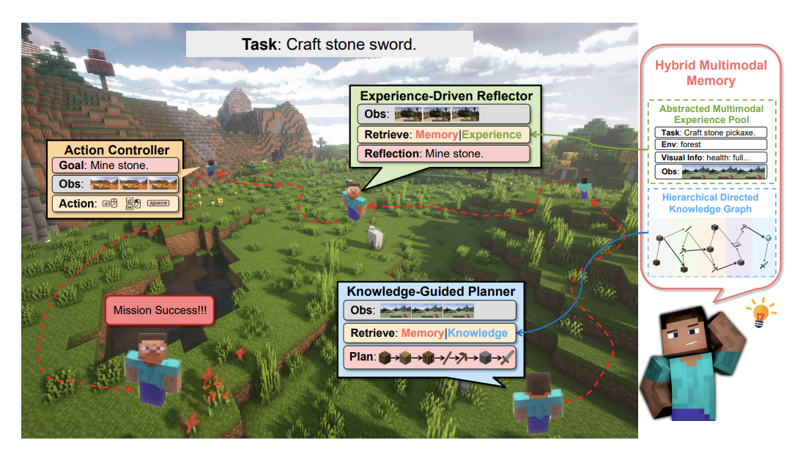

## Embodied Agents
* Feature a physical embodiment, like Minecraft characters or household robots, operating within an environment
* Require robustness in unfamiliar settings and the ability to complete long-term tasks
* Emphasize meticulous planning, tool/skill creation, and effective memory utilization

<figure style="text-align: center;">
    
    <figcaption style="text-align: center;">引用：https://arxiv.org/abs/2408.03615</figcaption>
</figure>

#### Papers
* ⚖️ [Aug 2020] **"ALFWorld: Aligning Text and Embodied Environments for Interactive Learning"** [[paper](https://arxiv.org/abs/2010.03768)]
* [Jun 2022] **"Minedojo: Building open-ended embodied agents with internet-scale knowledge"** [[paper](https://arxiv.org/abs/2206.08853)]
* [Feb 2023] **"Describe, Explain, Plan and Select: Interactive Planning with LLMs Enables Open-World Multi-Task Agents"** [[paper](https://arxiv.org/abs/2302.01560)]
* [May 2023] **"Voyager: An open-ended embodied agent with large language models"** [[paper](https://arxiv.org/abs/2305.16291)]
* [May 2023] **"Ghost in the Minecraft: Generally Capable Agents for Open-World Environments via Large Language Models with Text-based Knowledge and Memory"** [[paper](https://arxiv.org/abs/2305.17144)]
* [Jun 2023] **"STEVE-1: A Generative Model for Text-to-Behavior in Minecraft"** [[paper](https://arxiv.org/abs/2306.00937)]
* [Jul 2023] **"Building Cooperative Embodied Agents Modularly with Large Language Models"** [[paper](https://arxiv.org/abs/2307.02485)]
* [Oct 2023] **"Steve-Eye: Equipping LLM-based Embodied Agents with Visual Perception in Open Worlds"** [[paper](https://arxiv.org/abs/2310.13255)]
* [Nov 2023] **"JARVIS-1: Open-World Multi-task Agents with Memory-Augmented Multimodal Language Models"** [[paper](https://arxiv.org/abs/2311.05997)]
* [Nov 2023] **"An Embodied Generalist Agent in 3D World"** [[paper](https://arxiv.org/abs/2311.12871)]
* [Dec 2023] **"Mp5: A multi-modal open-ended embodied system in minecraft via active perception"** [[paper](https://arxiv.org/abs/2312.07472)]
* ⚖️ [Dec 2023] **"EgoPlan-Bench: Benchmarking Multimodal Large Language Models for Human-Level Planning"** [[paper](https://arxiv.org/abs/2312.06722)]
* 📖 [Jan 2024] **"Agent AI: Surveying the Horizons of Multimodal Interaction"** [[paper](https://arxiv.org/abs/2401.03568)]
* [Feb 2024] **"S-Agents: Self-Organizing Agents in Open-Ended Environments"** [[paper](https://arxiv.org/abs/2402.04578)]
* [Feb 2024] **"Large Language Models as Minecraft Agents"** [[paper](https://arxiv.org/abs/2402.08392)]
* 📖 [Feb 2024] **"A call for embodied AI"** [[paper](https://arxiv.org/abs/2402.03824)]
* 📖 [Feb 2024] **"An Interactive Agent Foundation Model"** [[paper](https://arxiv.org/abs/2402.05929)]
* [Mar 2024] **"Scaling Instructable Agents Across Many Simulated Worlds"** [[paper](https://arxiv.org/abs/2404.10179)]
* [Mar 2024] **"Hierarchical Auto-Organizing System for Open-Ended Multi-Agent Navigation"** [[paper](https://arxiv.org/abs/2403.08282)]
* [Mar 2024] **"EnvGen: Generating and Adapting Environments via LLMs for Training Embodied Agents"** [[paper](https://arxiv.org/abs/2403.12014)]
* 📖 [Mar 2024] **"A Survey on Game Playing Agents and Large Models: Methods, Applications, and Challenges"** [[paper](https://arxiv.org/abs/2403.10249)]
* 📖 [Apr 2024]**"A Survey on Large Language Model-Based Game Agents"** [[paper](https://arxiv.org/abs/2404.02039)]
* 📖 [Jun 2024] **"A Survey on Vision-Language-Action Models for Embodied AI"** [[paper](https://arxiv.org/abs/2405.14093)]
* [Jul 2024] **"ODYSSEY: Empowering Agents with Open-World Skills"** [[paper](https://arxiv.org/abs/2407.15325)]
* [Jul 2024] **"GRUtopia: Dream General Robots in a City at Scale"** [[paper](https://arxiv.org/abs/2407.10943)]
* 🔥 📖 [Jul 2024]  **"Vision-and-Language Navigation Today and Tomorrow: A Survey in the Era of Foundation Models"** [[paper](https://arxiv.org/abs/2407.07035)]
* [Aug 2024] **"Optimus-1: Hybrid Multimodal Memory Empowered Agents Excel in Long-Horizon Tasks"** [[paper](https://arxiv.org/abs/2408.03615)]
* [Aug 2024] **"EmBARDiment: an Embodied AI Agent for Productivity in XR"** [[paper](https://arxiv.org/abs/2408.08158)]
* [Aug 2024] **"EAIRiskBench: Towards Evaluating Physical Risk Awareness for Task Planning of Foundation Model-based Embodied AI Agents"** [[paper](https://arxiv.org/abs/2408.04449)]
* [Oct 2024] **"Mars: Situated Inductive Reasoning in an Open-World Environment"** [[paper](https://arxiv.org/abs/2410.08126)]
* [Oct 2024] **"MLLM as Retriever: Interactively Learning Multimodal Retrieval for Embodied Agents"** [[paper](https://arxiv.org/abs/2410.03450)]
* ⚖️ [Oct 2024] **"PARTNR: A Benchmark for Planning and Reasoning in Embodied Multi-agent Tasks"** [[paper](https://arxiv.org/abs/2411.00081)]
* [Nov 2024] **"Mr.Steve: Instruction-Following Agents in Minecraft with What-Where-When Memory"** [[paper](https://arxiv.org/abs/2411.06736)]
* [Nov 2024] **"CaPo: Cooperative Plan Optimization for Efficient Embodied Multi-Agent Cooperation"** [[paper](https://arxiv.org/abs/2411.04679v1)]
* [Nov 2024] **"MindForge: Empowering Embodied Agents with Theory of Mind for Lifelong Collaborative Learning"** [[paper](https://arxiv.org/abs/2411.12977)]
* ⚖️ [Nov 2024] **"BALROG: Benchmarking Agentic LLM and VLM Reasoning On Games"** [[paper](https://arxiv.org/abs/2411.13543)]
* [Dec 2024] **"Navigation World Models"** [[paper](https://arxiv.org/abs/2412.03572)]
* [Dec 2024] **"From Multimodal LLMs to Generalist Embodied Agents: Methods and Lessons"** [[paper](https://arxiv.org/abs/2412.08442)]
* ⚖️ [Dec 2024] **"Agent-SafetyBench: Evaluating the Safety of LLM Agents"** [[paper](https://arxiv.org/abs/2412.14470)]
* ⚖️ [Jan 2025] **"EmbodiedEval: Evaluate Multimodal LLMs as Embodied Agents"** [[paper](https://arxiv.org/abs/2501.11858)]
* [Jan 2025] **"Improving Vision-Language-Action Model with Online Reinforcement Learning"** [[paper](https://www.arxiv.org/abs/2501.16664)]
* [Feb 2025] **"Magma: A Foundation Model for Multimodal AI Agents"** [[paper](https://www.arxiv.org/abs/2502.13130)][[project](https://microsoft.github.io/Magma/)]
* [Feb 2025] **"Pokemon Red via Reinforcement Learning"** [[paper](https://arxiv.org/abs/2502.19920)]
* 📖 [May 2025] **"Multi-agent Embodied AI: Advances and Future Directions"** [[paper](https://arxiv.org/abs/2505.05108v1)]
* [May 2025] **"Measuring General Intelligence with Generated Games"** [[paper](https://arxiv.org/abs/2505.07215)]
* [Jun 2025] **"Ella: Embodied Social Agents with Lifelong Memory"** [[paper](https://arxiv.org/abs/2506.24019)]
* 📖 [Aug 2025] Vision-Language-Action Models for Robotics: A Review Towards Real-World Applications [[paper](https://vla-survey.github.io/data/paper.pdf)]
* [Aug 2025] **Seeing, Listening, Remembering, and Reasoning: A Multimodal Agent with Long-Term Memory** [[paper](https://www.arxiv.org/abs/2508.09736)]
* [Aug 2025] **"MolmoAct: Action Reasoning Models that can Reason in Space"** [[paper](https://arxiv.org/abs/2508.07917)]
* [Aug 2025] **"Toward Versatile Embodied Agents"** [[paper](https://arxiv.org/abs/2508.07033)]
* [Aug 2025] **"Sotopia-RL: Reward Design for Social Intelligence"** [[paper](https://www.arxiv.org/abs/2508.03905)]