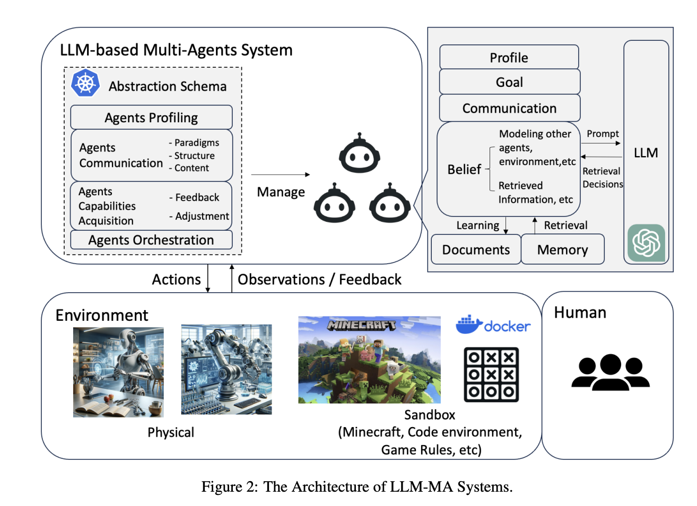

## Multi-Agents
* Involves collaboration among multiple agents for task completion and simulation

<figure style="text-align: center;">
    
    <figcaption style="text-align: center;">引用：https://arxiv.org/abs/2402.01680</figcaption>
</figure>

#### Papers
* 📖 [Jun 2024] **"Towards Rationality in Language and Multimodal Agents: A Survey"** [[paper](https://arxiv.org/abs/2406.00252)]
* 📖 [Feb 2024] **"LLM Multi-Agent Systems: Challenges and Open Problems"** [[paper](https://arxiv.org/abs/2402.03578)]
* 🔥 📖 [Feb 2024] **"Large Language Model based Multi-Agents: A Survey of Progress and Challenges"** [[paper](https://arxiv.org/abs/2402.01680)]
* 📖 [Dec 2024] **A Survey on Multi-Generative Agent System: Recent Advances and New Frontiers** [[paper](https://arxiv.org/abs/2412.17481)]
* 📖 [Jan 2025] **"Multi-Agent Collaboration Mechanisms: A Survey of LLMs"** [[paper](https://arxiv.org/abs/2501.06322)]
* 📖 [Feb 2025] **"Beyond Self-Talk: A Communication-Centric Survey of LLM-Based Multi-Agent Systems"** [[paper](https://arxiv.org/abs/2502.14321)]
* [Mar 2025] **"Why Do Multi-Agent LLM Systems Fail?"** [[paper](https://arxiv.org/abs/2503.13657)]
* 📖 [Mar 2025] **"A Comprehensive Survey on Multi-Agent Cooperative Decision-Making: Scenarios, Approaches, Challenges and Perspectives"** [[paper](https://arxiv.org/abs/2503.13415)]

### MAD（Multi-Agent Debate）
* [May 2023] **"Encouraging Divergent Thinking in Large Language Models through Multi-Agent Debate"** [[paper](https://arxiv.org/abs/2305.19118)]
* [Nov 2023] **"Should we be going MAD? A Look at Multi-Agent Debate Strategies for LLMs"** [[paper](https://arxiv.org/abs/2311.17371)]
* [Nov 2023] **"MedAgents: Large Language Models as Collaborators for Zero-shot Medical Reasoning"** [[paper](https://arxiv.org/abs/2311.10537)]
* [Feb 2024] **"Rethinking the Bounds of LLM Reasoning: Are Multi-Agent Discussions the Key?"** [[paper](https://arxiv.org/abs/2402.18272)]
* [Apr 2024] **"360°REA: Towards A Reusable Experience Accumulation with 360° Assessment for Multi-Agent System"** [[paper](https://arxiv.org/abs/2404.05569)]
* [May 2024] **"LLM Discussion: Enhancing the Creativity of Large Language Models via Discussion Framework and Role-Play"** [[paper](https://arxiv.org/abs/2405.06373)]
* [Jul 2024] **"DebUnc: Mitigating Hallucinations in Large Language Model Agent Communication with Uncertainty Estimations"** [[paper](https://arxiv.org/abs/2407.06426)]
* [Aug 2024] **"Can LLMs Beat Humans in Debating? A Dynamic Multi-agent Framework for Competitive Debate"** [[paper](https://arxiv.org/abs/2408.04472)]
* [Oct 2024] **"Multi-Agent Large Language Models for Conversational Task-Solving"** [[paper](https://arxiv.org/abs/2410.22932)]
* [Nov 2024] **"DARD: A Multi-Agent Approach for Task-Oriented Dialog Systems"** [[paper](https://arxiv.org/abs/2411.00427)]
* [Jan 2025] **"ToM-agent: Large Language Models as Theory of Mind Aware Generative Agents with Counterfactual Reflection"** [[paper](https://arxiv.org/abs/2501.15355)]
* [Apr 2025] **"Two Heads are Better Than One: Test-time Scaling of Multi-agent Collaborative Reasoning"** [[paper](https://arxiv.org/abs/2504.09772)]

### Problem Solving
* [Mar 2023] **"CAMEL: Communicative Agents for "Mind" Exploration of Large Language Model Society"** [[paper](https://arxiv.org/abs/2303.17760)]
* [Jul 2023] **"ChatDev: Communicative Agents for Software Development"** [[paper](https://arxiv.org/abs/2307.07924)]
* [Jul 2023] **"Unleashing the Emergent Cognitive Synergy in Large Language Models: A Task-Solving Agent through Multi-Persona Self-Collaboration"** [[paper](https://arxiv.org/abs/2307.05300)]
* [Aug 2023] **"AgentVerse: Facilitating Multi-Agent Collaboration and Exploring Emergent Behaviors"** [[paper](https://arxiv.org/abs/2308.10848)]
* [Aug 2023] **"MetaGPT: Meta Programming for A Multi-Agent Collaborative Framework"** [[paper](https://arxiv.org/abs/2308.00352)]
* [Aug 2023] **"AutoGen: Enabling Next-Gen LLM Applications via Multi-Agent Conversation"** [[paper](https://arxiv.org/abs/2308.08155)]
* ⚖️ [Aug 2023] **"BOLAA: Benchmarking and Orchestrating LLM-augmented Autonomous Agents"** [[paper](https://arxiv.org/abs/2308.05960)]
* [Aug 2023] **"Proagent: Building proactive cooperative ai with large language models"** [[paper](https://arxiv.org/abs/2308.11339)]
* [Sep 2023] **"Corex: Pushing the Boundaries of Complex Reasoning through Multi-Model Collaboration"** [[paper](https://arxiv.org/abs/2310.00280)]
* [Sep 2023] **"MindAgent: Emergent Gaming Interaction"** [[paper](https://arxiv.org/abs/2309.09971)]
* [Oct 2023] **"MetaAgents: Simulating Interactions of Human Behaviors for LLM-based Task-oriented Coordination via Collaborative Generative Agents"** [[paper](https://arxiv.org/abs/2310.06500)]
* ⚖️ [Oct 2023] **"SOTOPIA: Interactive Evaluation for Social Intelligence in Language Agents"** [[paper](https://arxiv.org/abs/2310.11667)]
* [Nov 2023] **"Controlling Large Language Model-based Agents for Large-Scale Decision-Making: An Actor-Critic Approach"** [[paper](https://arxiv.org/abs/2311.13884)]
* [Feb 2024] **"Large Language Model-based Human-Agent Collaboration for Complex Task Solving"** [[paper](https://arxiv.org/abs/2402.12914)]
* [Apr 2024] **"Confidence Calibration and Rationalization for LLMs via Multi-Agent Deliberation"** [[paper](https://arxiv.org/abs/2404.09127)]
* [Apr 2024] **"AgentCoord: Visually Exploring Coordination Strategy for LLM-based Multi-Agent Collaboration"** [[paper](https://arxiv.org/abs/2404.11943)]
* [May 2024] **"MapCoder: Multi-Agent Code Generation for Competitive Problem Solving"** [[paper](https://arxiv.org/abs/2405.11403)]
* [May 2024] **"AgentClinic: A multimodal agent benchmark to evaluate AI in simulated clinical environments"** [[paper](https://arxiv.org/abs/2405.07960)]
* [Jun 2024] **"LLM-Based Cooperative Agents using Information Relevance and Plan Validation"** [[paper](https://arxiv.org/abs/2405.16751)]
* [Jun 2024] **"A Large Language Model-based multi-agent manufacturing system for intelligent shopfloor"** [[paper](https://arxiv.org/abs/2405.16887)]
* [Jun 2024] **"Scaling Large-Language-Model-based Multi-Agent Collaboration"** [[paper](https://arxiv.org/abs/2406.07155)]
* [Jun 2024] **"Autonomous Agents for Collaborative Task under Information Asymmetry"** [[paper](https://arxiv.org/abs/2406.14928)]
* [Jul 2024] **"BMW Agents - A Framework For Task Automation Through Multi-Agent Collaboration"** [[paper](https://arxiv.org/abs/2406.20041)]
* [Jul 2024] **"Hypothetical Minds: Scaffolding Theory of Mind for Multi-Agent Tasks with Large Language Models"** [[paper](https://arxiv.org/abs/2407.07086)]
* [Aug 2024] **"MegaAgent: A Practical Framework for Autonomous Cooperation in Large-Scale LLM Agent Systems"** [[paper](https://arxiv.org/abs/2408.09955)]
* [Sep 2024] **"Persuasion Games with Large Language Models"** [[paper](https://arxiv.org/abs/2408.15879)]
* [Sep 2024] **"AUTOGEN STUDIO: A No-Code Developer Tool for Building and Debugging Multi-Agent Systems"** [[paper](https://arxiv.org/abs/2408.15247)]
* [Sep 2024] **"Using Generative Agents to Create Tip Sheets for Investigative Data Reporting"** [[paper](https://arxiv.org/abs/2409.07286)]
* [Oct 2024] **"Multi-Agent Collaborative Data Selection for Efficient LLM Pretraining"** [[paper](https://arxiv.org/abs/2410.08102)]
* [Oct 2024] **"Minstrel: Structural Prompt Generation with Multi-Agents Coordination for Non-AI Experts"** [[paper](https://arxiv.org/abs/2409.13449)]
* [Oct 2024] **"RGD: Multi-LLM Based Agent Debugger via Refinement and Generation Guidance"** [[paper](https://arxiv.org/abs/2410.01242)]
* [Oct 2024] **"From Facts to Insights: A Study on the Generation and Evaluation of Analytical Reports for Deciphering Earnings Calls"** [[paper](https://arxiv.org/abs/2410.01039)]
* [Oct 2024] **"MorphAgent: Empowering Agents Through Self-Evolving Profiles and Decentralized Collaboration"** [[paper](https://arxiv.org/abs/2410.15048)]
* [Oct 2024] **"MARCO: Multi-Agent Real-time Chat Orchestration"** [[paper](https://arxiv.org/abs/2410.21784)]
* [Nov 2024] **"Magentic-One: A Generalist Multi-Agent System for Solving Complex Tasks"** [[paper](https://arxiv.org/abs/2411.04468)]
* [Dec 2024] **"GENMAC: Compositional Text-to-Video Generation with Multi-Agent Collaboration"** [[paper](https://arxiv.org/abs/2412.04440)]
* [Dec 2024] **ROMAS: A Role-Based Multi-Agent System for Database monitoring and Planning** [[paper](https://arxiv.org/abs/2412.13520)]
* [Dec 2024] **"Seeker: Towards Exception Safety Code Generation with Intermediate Language Agents Framework"** [[paper](https://arxiv.org/abs/2412.11713)]
* [Dec 2024] **"Efficient Multi-Agent Collaboration with Tool Use for Online Planning in Complex Table Question Answering"** [[paper](https://arxiv.org/abs/2412.20145)]
* [Dec 2024] **"OneKE: A Dockerized Schema-Guided LLM Agent-based Knowledge Extraction System"**  [[paper](https://arxiv.org/abs/2412.20005)]
* [Jan 2025] **"Multi-Agent Geospatial Copilots for Remote Sensing Workflows"** [[paper](https://arxiv.org/abs/2501.16254)]
* [Feb 2025] **"Position: Towards a Responsible LLM-empowered Multi-Agent Systems"** [[paper](https://arxiv.org/abs/2502.01714)]
* [Feb 2025] **"Flow-of-Action: SOP Enhanced LLM-Based Multi-Agent System for Root Cause Analysis"** [[paper](https://www.arxiv.org/abs/2502.08224)]
* 📖 [Apr 2025] **"Adaptive Human-Agent Teaming: A Review of Empirical Studies from the Process Dynamics Perspective"** [[paper](https://arxiv.org/abs/2504.10918)]
* [May 2025] **"Which Agent Causes Task Failures and When? On Automated Failure Attribution of LLM Multi-Agent Systems"** [[paper](https://www.arxiv.org/abs/2505.00212)]

### World Simulation
* [Apr 2023] **"Generative agents: Interactive simulacra of human behavior"** [[paper](https://arxiv.org/abs/2304.03442)]
* [Jun 2023] **"User Behavior Simulation with Large Language Model based Agents"** [[paper](https://arxiv.org/abs/2306.02552)]
* [Oct 2023] **"Humanoid Agents: Platform for Simulating Human-like Generative Agents"** [[paper](https://arxiv.org/abs/2310.05418)]
* [Oct 2023] **"On Generative Agents in Recommendation"** [[paper](https://arxiv.org/abs/2310.10108)]
* [Nov 2023] **"The Wisdom of Partisan Crowds: Comparing Collective Intelligence in Humans and LLM-based Agents"** [[paper](https://arxiv.org/abs/2311.09665)]
* [Feb 2024] **"Large Language Model for Participatory Urban Planning"** [[paper](https://arxiv.org/abs/2402.17161)]
* [Apr 2024] **"Automated Social Science: Language Models as Scientist and Subjects"** [[paper](https://arxiv.org/abs/2404.11794)]
* [Apr 2024] **"Cooperate or Collapse: Emergence of Sustainability Behaviors in a Society of LLM Agents"** [[paper](https://arxiv.org/abs/2404.16698)]
* [May 2024] **"Beyond Human Translation: Harnessing Multi-Agent Collaboration for Translating Ultra-Long Literary Texts"** [[paper](https://arxiv.org/abs/2405.11804)]
* [May 2024] **"Agent Hospital: A Simulacrum of Hospital with Evolvable Medical Agents"** [[paper](https://arxiv.org/abs/2405.02957)]
* [May 2024] **"AgentClinic: A Multimodal Agent Benchmark to Evaluate AI in Simulated Clinical Environments"** [[paper](https://arxiv.org/abs/2405.07960)]
* [May 2024] **"Facilitating Multi-Role and Multi-Behavior Collaboration of Large Language Models for Online Job Seeking and Recruiting"** [[paper](https://arxiv.org/abs/2405.18113)]
* [Jun 2024] **"LLM experiments with simulation: Large Language Model Multi-Agent System for Process Simulation Parametrization in Digital Twins"** [[paper](https://arxiv.org/abs/2405.18092)]
* [Jun 2024] **"HOLLMWOOD: Unleashing the Creativity of Large Language Models in Screenwriting via Role Playing"** [[paper](https://arxiv.org/abs/2406.11683)]
* [Aug 2024] **"MuMA-ToM: Multi-modal Multi-Agent Theory of Mind"** [[paper](https://arxiv.org/abs/2408.12574)]
* ⚖️ [Aug 2024] **"BattleAgentBench: A Benchmark for Evaluating Cooperation and Competition Capabilities of Language Models in Multi-Agent Systems"** [[paper](https://arxiv.org/abs/2408.15971)]
* [Sep 2024] **"MEDCO: Medical Education Copilots Based on A Multi-Agent Framework"** [[paper](https://arxiv.org/abs/2408.12496)]
* [Sep 2024] **"Focus Agent: LLM-Powered Virtual Focus Group"** [[paper](https://arxiv.org/abs/2409.01907)]
* [Oct 2024] **"GenSim: A General Social Simulation Platform with Large Language Model Based Agents"** [[paper](https://arxiv.org/abs/2410.04360)]
* [Nov 2024] **"Project Sid: Many-agent simulations toward AI civilization"** [[paper](https://arxiv.org/abs/2411.00114)]
* [Nov 2024] **"OASIS: Open Agents Social Interaction Simulations on One Million Agents"** [[paper](https://arxiv.org/abs/2411.11581)]
* 📖 [Dec 2024] **"A Survey on Large Language Model-Based Social Agents in Game-Theoretic Scenarios"** [[paper](https://arxiv.org/abs/2412.03920)]
* 📖 [Dec 2024] **"From Individual to Society: A Survey on Social Simulation Driven by Large Language Model-based Agents"** [[paper](https://arxiv.org/abs/2412.03563)]
* [Dec 2024] **"LMAgent: A Large-scale Multimodal Agents Society for Multi-user Simulation"** [[paper](https://arxiv.org/abs/2412.09237)]
* [Feb 2025] **"AgentSociety: Large-Scale Simulation of LLM-Driven Generative Agents Advances Understanding of Human Behaviors and Society"** [[paper](https://www.arxiv.org/abs/2502.08691)]
* [Apr 2025] **"SocioVerse: A World Model for Social Simulation Powered by LLM Agents and A Pool of 10 Million Real-World Users"** [[paper](https://arxiv.org/abs/2504.10157)]
* [Apr 2025] **"SOTOPIA-S4: a user-friendly system for flexible, customizable, and large-scale social simulation"** [[paper](https://www.arxiv.org/abs/2504.16122)]