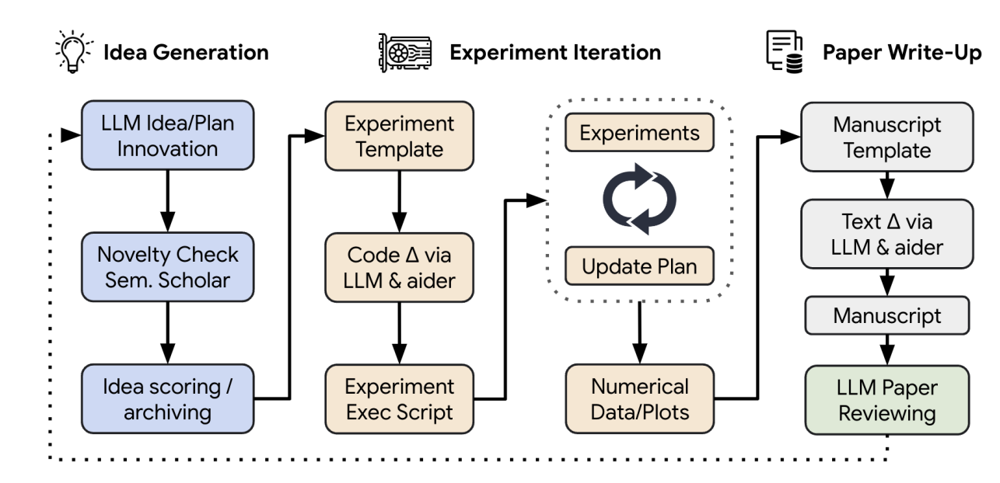

## Research Agents
* Aim to automate the entire research workflow
* Cover everything from literature reviews and idea generation to experiment design, analysis, paper writing, and even peer review

<figure style="text-align: center;">
    
    <figcaption style="text-align: center;">引用：https://arxiv.org/abs/2408.06292</figcaption>
</figure>

#### Papers
* [Dec 2023] **"Mathematical discoveries from program search with large language models"** [[paper](https://www.nature.com/articles/s41586-023-06924-6)]
* [Jan 2024] **"LLaMP: Large Language Model Made Powerful for High-Fidelity Materials Knowledge Retrieval and Distillation"** [[paper](https://arxiv.org/abs/2401.17244)]
* [Feb 2024] **"Toward a Team of AI-Made Scientists for Scientific Discovery from Gene Expression Data"** [[paper](https://arxiv.org/abs/2402.12391)]
* [Feb 2024] **"Prioritizing Safeguarding Over Autonomy: Risks of LLM Agents for Science"** [[paper](https://arxiv.org/abs/2402.04247)]
* [Apr 2024] **"CRISPR-GPT: An LLM Agent for Automated Design of Gene-Editing Experiments"** [[paper](https://arxiv.org/abs/2404.18021)]
* ⚖️ [Apr 2024] **"Towards Data-Centric Automatic R&D"** [[paper](https://arxiv.org/abs/2404.11276)]
* [Apr 2024] **"ResearchAgent: Iterative Research Idea Generation over Scientific Literature with Large Language Models"** [[paper](https://arxiv.org/abs/2404.07738)]
* [May 2024] **"Autonomous LLM-driven research from data to human-verifiable research papers"** [[paper](https://arxiv.org/abs/2404.17605)]
* [Jun 2024] **"LLMs Assist NLP Researchers: Critique Paper (Meta-)Reviewing"** [[paper](https://arxiv.org/abs/2406.16253)]
* [Jul 2024] **"AgentInstruct: Toward Generative Teaching with Agentic Flows"** [[paper](https://arxiv.org/abs/2407.03502)]
* [Jul 2024] **"Collaborative Evolving Strategy for Automatic Data-Centric Development"** [[paper](https://arxiv.org/abs/2407.18690)]
* 🔥 [Aug 2024] **"The AI Scientist: Towards Fully Automated Open-Ended Scientific Discovery"** [[paper](https://arxiv.org/abs/2408.06292)]
* [Aug 2024] **"MLR-Copilot: Autonomous Machine Learning Research Based on Large Language Model Agents"** [[paper](https://arxiv.org/abs/2408.14033)]
* [Sep 2024] **"Can LLMs Generate Novel Research Ideas? A Large-Scale Human Study with 100+ NLP Researchers"** [[paper](https://arxiv.org/abs/2409.04109)]
* [Sep 2024] **"SciAgents: Automating Scientific Discovery through Multi-Agent Intelligent Graph Reasoning"** [[paper](https://arxiv.org/abs/2409.05556)]
* [Oct 2024] **"dZiner: Rational Inverse Design of Materials with AI Agent"** [[paper](https://arxiv.org/abs/2410.03963)]
* [Oct 2024] **"Two Heads Are Better Than One: A Multi-Agent System Has the Potential to Improve Scientific Idea Generation"** [[paper](https://arxiv.org/abs/2410.09403)]
* [Oct 2024] **"Chain of Ideas: Revolutionizing Research in Novel Idea Development with LLM Agents"** [[paper](https://arxiv.org/abs/2410.13185)]
* ⚖️ [Oct 2024] **"ScienceAgentBench: Toward Rigorous Assessment of Language Agents for Data-Driven Scientific Discovery"** [[paper](https://arxiv.org/abs/2410.05080)]
* ⚖️ [Oct 2024] **"AAAR-1.0: Assessing AI's Potential to Assist Research"** [[paper](https://arxiv.org/abs/2410.22394)]
* [Nov 2024] **"GIS Copilot: Towards an Autonomous GIS Agent for Spatial Analysis"** [[paper](https://arxiv.org/abs/2411.03205)]
* [Nov 2024] **"The Virtual Lab: AI Agents Design New SARS-CoV-2 Nanobodies with Experimental Validation"** [[paper](https://www.biorxiv.org/content/10.1101/2024.11.11.623004v1)]
* [Nov 2024] **"DrugAgent: Automating AI-aided Drug Discovery Programming through LLM Multi-Agent Collaboration"** [[paper](https://arxiv.org/abs/2411.15692)]
* [Jan 2025] **"DOLPHIN: Closed-loop Open-ended Auto-research through Thinking, Practice, and Feedback"** [[paper](https://arxiv.org/abs/2501.03916)]
* [Jan 2025] **"Agent Laboratory: Using LLM Agents as Research Assistants"** [[paper](https://arxiv.org/abs/2501.04227)]
* 📖 [Jan 2025] **"LLM4SR: A Survey on Large Language Models for Scientific Research"** [[paper](https://arxiv.org/abs/2501.04306)]
* [Jan 2025] **"PaSa: An LLM Agent for Comprehensive Academic Paper Search"** [[paper](https://arxiv.org/abs/2501.10120)]
* [Feb 2025] **"Towards an AI co-scientist"** [[paper](https://research.google/blog/accelerating-scientific-breakthroughs-with-an-ai-co-scientist/)]
* [Feb 2025] **"Safety is Essential for Responsible Open-Ended Systems"** [[paper](https://arxiv.org/abs/2502.04512)]
* [Mar 2025] **"ReviewAgents: Bridging the Gap Between Human and AI-Generated Paper Reviews"** [[paper](https://arxiv.org/abs/2503.08506)]
* [Mar 2025] **"CODESCIENTIST: End-to-End Semi-Automated Scientific Discovery with Code-based Experimentation"** [[paper](https://arxiv.org/abs/2503.22708)],[[project](https://allenai.org/blog/codescientist)]
* 📖 [Mar 2025] **"Towards Scientific Intelligence: A Survey of LLM-based Scientific Agents"** [[paper](https://arxiv.org/abs/2503.24047)]
* [Mar 2025] **"AgentRxiv: Towards Collaborative Autonomous Research"** [[paper](https://arxiv.org/abs/2503.18102)]
* [Apr 2025] **"PaperBench: Evaluating AI’s Ability to Replicate AI Research"** [[paper](https://arxiv.org/abs/2504.01848)]
* [Apr 2025] **"The AI Scientist-v2: Workshop-Level Automated Scientific Discovery via Agentic Tree Search"** [[paper](https://arxiv.org/abs/2504.08066)]
* [Apr 2025] **"Paper2Code: Automating Code Generation from Scientific Papers in Machine Learning"** [[paper](https://arxiv.org/abs/2504.17192)]
* [May 2025] **"34 Examples of LLM Applications in Materials Science and Chemistry: Towards Automation, Assistants, Agents, and Accelerated Scientific Discovery"** [[paper](https://arxiv.org/abs/2505.03049)]
* [May 2025] **"PiFlow: Principle-aware Scientific Discovery with Multi-Agent Collaboration"** [[paper](https://arxiv.org/abs/2505.15047)]
* [May 2025] **"R&D-Agent: Automating Data-Driven AI Solution Building Through LLM-Powered Automated Research, Development, and Evolution"** [[paper](https://arxiv.org/abs/2505.14738)]
* 📖 [May 2025] **"From Automation to Autonomy: A Survey on Large Language Models in Scientific Discovery"** [[paper](https://arxiv.org/abs/2505.13259)]
* 🔥 📖 [May 2025] **"From Reasoning to Learning: A Survey on Hypothesis Discovery and Rule Learning with Large Language Models"** [[paper](https://arxiv.org/abs/2505.21935)]
* ⚖️ [May 2025] **"MLR-Bench: Evaluating AI Agents on Open-Ended Machine Learning Research"** [[paper](https://arxiv.org/abs/2505.19955)]
* [May 2025] **"AI-Researcher: Autonomous Scientific Innovation"** [[paper](https://arxiv.org/abs/2505.18705)]
* [May 2025] **"Improving Research Idea Generation Through Data: An Empirical Investigation in Social Science"** [[paper](https://arxiv.org/abs/2505.21396)]
* [Jun 2025] **"AI Scientists Fail Without Strong Implementation Capability"** [[paper](https://arxiv.org/abs/2506.01372)]
* ⚖️ [Jun 2025] **"Table-Text Alignment: Explaining Claim Verification Against Tables in Scientific Papers"** [[paper](https://arxiv.org/abs/2506.10486)]
* ⚖️ [Jun 2025] **"SCIVER: Evaluating Foundation Models for Multimodal Scientific Claim Verification"** [[paper](https://arxiv.org/abs/2506.15569)]
* [Jun 2025] **"SciSage: A Multi-Agent Framework for High-Quality Scientific Survey Generation"** [[paper](https://arxiv.org/abs/2506.12689)]
* ⚖️ [Jun 2025] **"LMR-BENCH: Evaluating LLM Agent’s Ability on Reproducing Language Modeling Research"** [[paper](https://arxiv.org/abs/2506.17335)]
* [Jun 2025] **"REXBENCH: Can coding agents autonomously implement AI research extensions?"** [[paper](https://arxiv.org/abs/2506.22598)]
* [Jul 2025] **"Exploring Design of Multi-Agent LLM Dialogues for Research Ideation"** [[paper](https://arxiv.org/abs/2507.08350)]
* 📖 [Jul 2025] **"The Evolving Role of Large Language Models in Scientific Innovation: Evaluator, Collaborator, and Scientist"** [[paper](https://www.arxiv.org/abs/2507.11810)]
* [Jul 2025] **"AI Research Agents for Machine Learning: Search, Exploration, and Generalization in MLE-bench"** [[paper](https://arxiv.org/abs/2507.02554)]
* [Jul 2025] **"Open Source Planning & Control System with Language Agents for Autonomous Scientific Discovery"** [[paper](https://arxiv.org/abs/2507.07257)]
* [Jul 2025] **"Open-ended Scientific Discovery via Bayesian Surprise"** [[paper](https://arxiv.org/abs/2507.00310)]
* [Jul 2025] **"Large Language Models as Innovators: A Framework to Leverage Latent Space Exploration for Novelty Discovery"** [[paper](https://arxiv.org/abs/2507.13874)]
* [Jul 2025] **"Expert-Guided LLM Reasoning for Battery Discovery: From AI-Driven Hypothesis to Synthesis and Characterization"** [[paper](https://arxiv.org/abs/2507.16110)]
* [Jul 2025] **"AlphaGo Moment for Model Architecture Discovery"** [[paper](https://arxiv.org/abs/2507.18074)]
* [Jul 2025] **"GenoMAS: A Multi-Agent Framework for Scientific Discovery via Code-Driven Gene Expression Analysis"** [[paper](https://arxiv.org/abs/2507.21035)]
* 📖 [Jul 2025] **"How Far Are AI Scientists from Changing the World?"** [[paper](https://arxiv.org/abs/2507.23276)]
* [Aug 2025] **"K-Dense Analyst: Towards Fully Automated Scientific Analysis"** [[paper](https://arxiv.org/abs/2508.07043)]
* [Aug 2025] **"Multi-Agent Taskforce Collaboration: Self-Correction of Compounding Errors in Long-Form Literature Review Generation"** [[paper](https://www.arxiv.org/abs/2508.04306)]
* 📖 [Aug 2025] **"From AI for Science to Agentic Science: A Survey on Autonomous Scientific Discovery"** [[paper](https://arxiv.org/abs/2508.14111)]
* [Aug 2025] **"Spacer: Towards Engineered Scientific Inspiration"** [[paper](https://arxiv.org/abs/2508.17661)]
* [Aug 2025] **"PosterGen: Aesthetic-Aware Paper-to-Poster Generation via Multi-Agent LLMs"** [[paper](https://arxiv.org/abs/2508.17188)]
* [Aug 2025] **"BIODISCO: Multi-agent hypothesis generation with dual-mode evidence, iterative feedback and temporal evaluation"** [[paper](https://www.arxiv.org/abs/2508.01285)]
* [Aug 2025] **"aiXiv: A Next-Generation Open Access Ecosystem for Scientific Discovery Generated by AI Scientists"** [[paper](https://arxiv.org/abs/2508.15126)]
* [Sep 2025] **"The Need for Verification in AI-Driven Scientific Discovery"** [[paper](https://arxiv.org/abs/2509.01398)]
* [Sep 2025] **"Paper2Agent: Reimagining Research Papers As Interactive and Reliable AI Agents"** [[paper](https://arxiv.org/abs/2509.06917)]
* [Sep 2025] **"OpenLens AI: Fully Autonomous Research Agent for Health Informatics"** [[paper](https://arxiv.org/abs/2509.14778)]
* [Sep 2025] **"AI and the Future of Academic Peer Review"** [[paper](https://arxiv.org/abs/2509.14189)]
* [Sep 2025] **"Agentic AutoSurvey: Let LLMs Survey LLMs"** [[paper](https://arxiv.org/abs/2509.18661)]
* [Sep 2025] **"TusoAI: Agentic Optimization for Scientific Methods"** [[paper](https://arxiv.org/abs/2509.23986)]
* [Oct 2025] **"Scientific Algorithm Discovery by Augmenting AlphaEvolve with Deep Research"** [[paper](https://arxiv.org/abs/2510.06056)]
* [Oct 2025] **"Autonomous Agents for Scientific Discovery: Orchestrating Scientists, Language, Code, and Physics"** [[paper](https://arxiv.org/abs/2510.09901)]
* [Oct 2025] **"SR-Scientist: Scientific Equation Discovery With Agentic AI"** [[paper](https://arxiv.org/abs/2510.11661)]
* [Oct 2025] **"LLM-REVal: Can We Trust LLM Reviewers Yet?"** [[paper](https://arxiv.org/abs/2510.12367)]
* [Oct 2025] **"BadScientist: Can a Research Agent Write Convincing but Unsound Papers that Fool LLM Reviewers?"** [[paper](https://arxiv.org/abs/2510.18003)]
* [Oct 2025] **"Idea2Plan: Exploring AI-Powered Research Planning"** [[paper](https://www.arxiv.org/abs/2510.24891)]
* [Nov 2025] **"AlphaResearch: Accelerating New Algorithm Discovery with Language Models"** [[paper](https://arxiv.org/abs/2511.08522v1)]
* 📖 [Nov 2025] **"Large Language Models for Scientific Idea Generation: A Creativity-Centered Survey"** [[paper](https://arxiv.org/abs/2511.07448v1)]
* [Nov 2025] **"OmniScientist: Toward a Co-evolving Ecosystem of Human and AI Scientists"** [[paper](https://arxiv.org/abs/2511.16931v1)]
* [Dec 2025] **"Towards AI-Supported Research: a Vision of the TIB　AIssistant"** [[paper](https://arxiv.org/abs/2512.16447)]
* ⚖️ [Dec 2025] **"Evaluating Large Language Models in Scientific Discovery"** [[paper](https://arxiv.org/abs/2512.15567v1)]
* [Dec 2025] **"Bohrium + SciMaster: Building the Infrastructure and Ecosystem for Agentic Science at Scale"** [[paper](https://arxiv.org/abs/2512.20469v1)]
* [Dec 2025] **"Probing Scientific General Intelligence of LLMs with Scientist-Aligned Workflows"** [[paper](https://arxiv.org/abs/2512.16969v1)]
* [Dec 2025] **"AI Urban Scientist: Multi-Agent Collaborative　Automation for Urban Research"** [[paper](https://arxiv.org/abs/2512.07849)]
* [Dec 2025] **"Accelerating Scientific Discovery with Autonomous Goal-evolving Agents (SAGA)"** [[paper](https://arxiv.org/abs/2512.21782)]
* [Jan 2026] **"OpenNovelty: An LLM-powered Agentic System for Verifiable Scholarly Novelty Assessment"** [[paper](https://www.arxiv.org/abs/2601.01576)]
* [Jan 2026] **"SCINETBENCH: A Relation-Aware Benchmark for Scientific Literature Retrieval Agents"** [[paper](https://arxiv.org/abs/2601.03260v1)]
* [Jan 2026] **"Why LLMs Aren’t Scientists Yet: Lessons from Four Autonomous Research Attempts "** [[paper](https://www.arxiv.org/abs/2601.03315)]
* [Jan 2026] **"Sci-Reasoning: A Dataset Decoding AI Innovation Patterns"** [[paper](https://arxiv.org/abs/2601.04577v1)]
