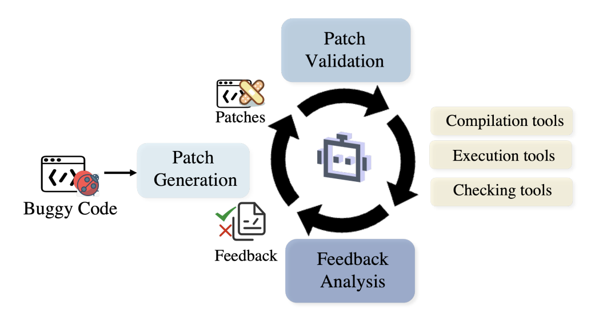

## Software Agents
* Develop software beyond simple demos
* Aim to discover and fix bugs, design tests, and define requirements

<figure style="text-align: center;">
    
    <figcaption style="text-align: center;">引用：https://arxiv.org/abs/2409.02977</figcaption>
</figure>

#### Papers
* ⚖️ [Oct 2023] **"SWE-bench: Can Language Models Resolve Real-World GitHub Issues?"** [[paper](https://arxiv.org/abs/2310.06770)]
* [Feb 2024] **"OpenCodeInterpreter: Integrating Code Generation with Execution and Refinement"** [[paper](https://arxiv.org/abs/2402.14658)]
* [Mar 2024] **"MAGIS: LLM-Based Multi-Agent Framework for GitHub Issue Resolution"** [[paper](https://arxiv.org/abs/2403.17927)]
* [Mar 2024] **"RepairAgent: An Autonomous, LLM-Based Agent for Program Repair"** [[paper](https://arxiv.org/abs/2403.17134)]
* [Apr 2024] **"AutoCodeRover: Autonomous Program Improvement"** [[paper](https://arxiv.org/abs/2404.05427)]
* ⚖️ [Apr 2024] **"Autonomous Evaluation and Refinement of Digital Agents"** [[paper](https://arxiv.org/abs/2404.06474)]
* [May 2024] **"SWE-Agent: Agent-Computer Interfaces Enable Automated Software Engineering"** [[paper](https://arxiv.org/abs/2405.15793)]
* [May 2024] **"MARE: Multi-Agents Collaboration Framework for Requirements Engineering"** [[paper](https://arxiv.org/abs/2405.03256)]
* [Jul 2024] **"OpenHands: An Open Platform for AI Software Developers as Generalist Agents"** [[paper](https://arxiv.org/abs/2407.16741)]
* [Aug 2024] **"Diversity Empowers Intelligence: Integrating Expertise of Software Engineering Agents"** [[paper](https://arxiv.org/abs/2408.07060)]
* 📖 [Aug 2024] **"From LLMs to LLM-based Agents for Software Engineering: A Survey of Current, Challenges and Future"** [[paper](https://arxiv.org/abs/2408.02479)]
* 📖 [Sep 2024] **"Agents in Software Engineering: Survey, Landscape, and Vision"** [[paper](https://arxiv.org/abs/2409.09030)]
* 🔥 📖 [Sep 2024] **"Large Language Model-Based Agents for Software Engineering: A Survey"** [[paper](https://arxiv.org/abs/2409.02977)]
* [Oct 2024] **"HyperAgent: Generalist Software Engineering Agents to Solve Coding Tasks at Scale"** [[paper](https://arxiv.org/abs/2409.16299)]
* ⚖️ [Oct 2024] **"SWE-Bench+: Enhanced Coding Benchmark for LLMs"** [[paper](https://arxiv.org/abs/2410.06992)]
* [Nov 2024] **"Lingma SWE-GPT: An Open Development-Process-Centric Language Model for Automated Software Improvement"** [[paper](https://arxiv.org/abs/2411.00622)]
* [Nov 2024] **"Human-In-the-Loop Software Development Agents"** [[paper](https://arxiv.org/abs/2411.12924)]
* 📖 [Nov 2024] **"A Comprehensive Survey of AI-Driven Advancements and Techniques in Automated Program Repair and Code Generation"** [[paper](https://arxiv.org/abs/2411.07586)]
* 📖 [Nov 2024] **"An Empirical Study on LLM-based Agents for Automated Bug Fixing"** [[paper](https://arxiv.org/abs/2411.10213)]
* [Dec 2024] **"Training Software Engineering Agents and Verifiers with SWE-Gym"** [[paper](https://arxiv.org/abs/2412.21139)]
* [Jan 2025] **"SWE-Fixer: Training Open-Source LLMs for Effective and Efficient GitHub Issue Resolution"** [[paper](https://arxiv.org/abs/2501.05040)]
* [Jan 2025] **"Towards Advancing Code Generation with Large Language Models: A Research Roadmap"** [[paper](https://arxiv.org/abs/2501.11354)]
* [Mar 2025] **"Knowledge-Based Multi-Agent Framework for Automated Software Architecture Design"** [[paper](https://arxiv.org/abs/2503.20536)]
* 📖 [Mar 2025] **"Challenges and Paths Towards AI for Software Engineering"** [[paper](https://arxiv.org/abs/2503.22625)]
* [Apr 2025] **"DocAgent: A Multi-Agent System for Automated Code Documentation Generation"** [[paper](https://arxiv.org/abs/2504.08725)]
* [May 2025] **"Can Agents Fix Agent Issues?"** [[paper](https://arxiv.org/abs/2505.20749)]
* ⚖️ [May 2025] **"SWE-bench Goes Live!"** [[paper](https://www.arxiv.org/abs/2505.23419)]
* [May 2025] **"Vibe Coding vs. Agentic Coding: Fundamentals and Practical Implications of Agentic AI"** [[paper](https://arxiv.org/abs/2505.19443)]
* [Jun 2025] **"Co-Evolving LLM Coder and Unit Tester via Reinforcement Learning"** [[paper](https://arxiv.org/abs/2506.03136)]
* [Jun 2025] **"Understanding Software Engineering Agents Through the Lens of Traceability: An Empirical Study"** [[paper](https://www.arxiv.org/abs/2506.08311)]
* [Jun 2025] **"SWE-Factory: Your Automated Factory for Issue Resolution Training Data and Evaluation Benchmarks"** [[paper](https://arxiv.org/abs/2506.10954v1)]
* [Jun 2025] **"Code Researcher: Deep Research Agent for Large Systems Code and Commit History"** [[paper](https://arxiv.org/abs/2506.11060)]
* [Jun 2025] **"Agent-RLVR: Training Software Engineering Agents via Guidance and Environment Rewards"** [[paper](https://arxiv.org/abs/2506.11425)]
* [Jun 2025] **"ReVeal: Self-Evolving Code Agents via Iterative Generation-Verification"** [[paper](https://arxiv.org/abs/2506.11442)]
* 📖 [Jun 2025] **"How Does LLM Reasoning Work for Code? A Survey and a Call to Action"** [[paper](https://arxiv.org/abs/2506.13932)]
* [Jun 2025] **"Beyond Autocomplete: Designing CopilotLens Towards Transparent and Explainable AI Coding Agents"** [[paper](https://arxiv.org/abs/2506.20062)]