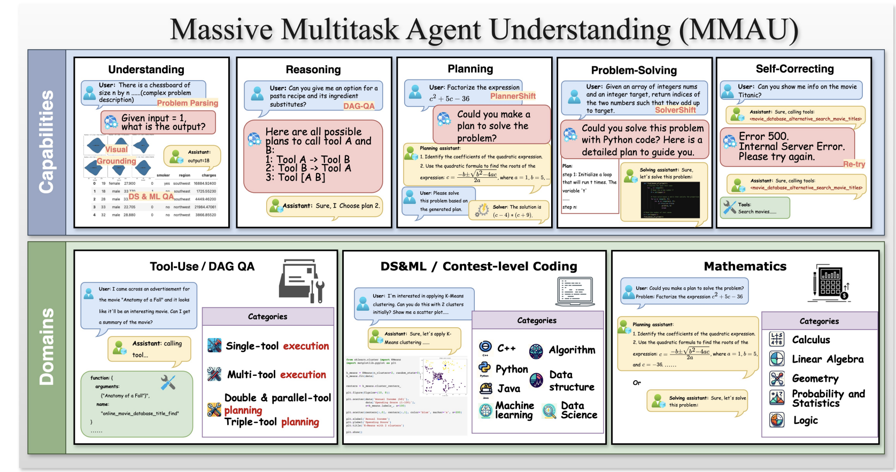

## 評価
エージェントの持つ能力を評価する論文です。
<figure style="text-align: center;">
    
    <figcaption style="text-align: center;">引用：https://arxiv.org/abs/2407.18961</figcaption>
</figure>

#### Papers
* ⚖️ [Aug 2023] **"AgentBench: Evaluating LLMs as Agents"** [[paper](https://arxiv.org/abs/2308.03688)]
* ⚖️ [Oct 2023] **"SmartPlay: A Benchmark for LLMs as Intelligent Agents"** [[paper](https://arxiv.org/abs/2310.01557)]
* ⚖️ [Nov 2023] **"MAgIC: Investigation of Large Language Model Powered Multi-Agent in Cognition, Adaptability, Rationality and Collaboration"** [[paper](https://arxiv.org/abs/2311.08562)]
* ⚖️ [Nov 2023] **"GAIA: A Benchmark for General AI Assistants"** [[paper](https://arxiv.org/abs/2311.12983)]
* ⚖️ [Dec 2023] **"Evaluating Language-Model Agents on Realistic Autonomous Tasks"** [[paper](https://arxiv.org/abs/2312.11671)]
* ⚖️ [Jan 2024] **"AgentBoard: An Analytical Evaluation Board of Multi-turn LLM Agents"** [[paper](https://arxiv.org/abs/2401.13178)]
* ⚖️ [Feb 2024] **"AgentLens: Visual Analysis for Agent Behaviors in LLM-based Autonomous Systems"** [[paper](https://arxiv.org/abs/2402.08995)]
* 📖 [Apr 2024] **"Hallucination of Multimodal Large Language Models: A Survey"** [[paper](https://arxiv.org/abs/2404.18930)]
* ⚖️ [May 2024] **"Exploring Prosocial Irrationality for LLM Agents: A Social Cognition View"** [[paper](https://arxiv.org/abs/2405.14744)]
* ⚖️ [Jun 2024] **"The BiGGen Bench: A Principled Benchmark for Fine-grained Evaluation of Language Models with Language Models"** [[paper](https://arxiv.org/abs/2406.05761)]
* 📖 [Jun 2024] **"A Survey of Useful LLM Evaluation"** [[paper](https://arxiv.org/abs/2406.00936)]
* [Jul 2024] **"AI Agents That Matter"** [[paper](https://arxiv.org/abs/2407.01502)]
* 🔥 ⚖️ [Jul 2024] **"MMAU: A Holistic Benchmark of Agent Capabilities Across Diverse Domains"** [[paper](https://arxiv.org/abs/2407.18961)]
* ⚖️ [Aug 2024] **"VisualAgentBench: Towards Large Multimodal Models as Visual Foundation Agents"** [[paper](https://arxiv.org/abs/2408.06327)]
* 📖 [Aug 2024] **"A Survey on Evaluation of Multimodal Large Language Models"** [[paper](https://arxiv.org/abs/2408.15769)]
* ⚖️ [Sep 2024] **"Evaluation of OpenAI o1: Opportunities and Challenges of AGI"** [[paper](https://arxiv.org/abs/2409.18486)]
* 📖 [Sep 2024] **"The Imperative of Conversation Analysis in the Era of LLMs: A Survey of Tasks, Techniques, and Trends"** [[paper](https://arxiv.org/abs/2409.14195)]
* ⚖️ [Oct 2024] **"BENCHAGENTS: Automated Benchmark Creation with Agent Interaction"** [[paper](https://arxiv.org/abs/2410.22584)]
* [Nov 2024] **"Evaluating World Models with LLM for Decision Making"** [[paper](https://arxiv.org/abs/2411.08794)]
* [Dec 2024] **"MISR: Measuring Instrumental Self-Reasoning in Frontier Models"** [[paper](https://arxiv.org/abs/2412.03904)]
* ⚖️ [Dec 2024] **"RuleArena: A Benchmark for Rule-Guided Reasoning with LLMs in Real-World Scenarios"** [[paper](https://arxiv.org/abs/2412.08972)]