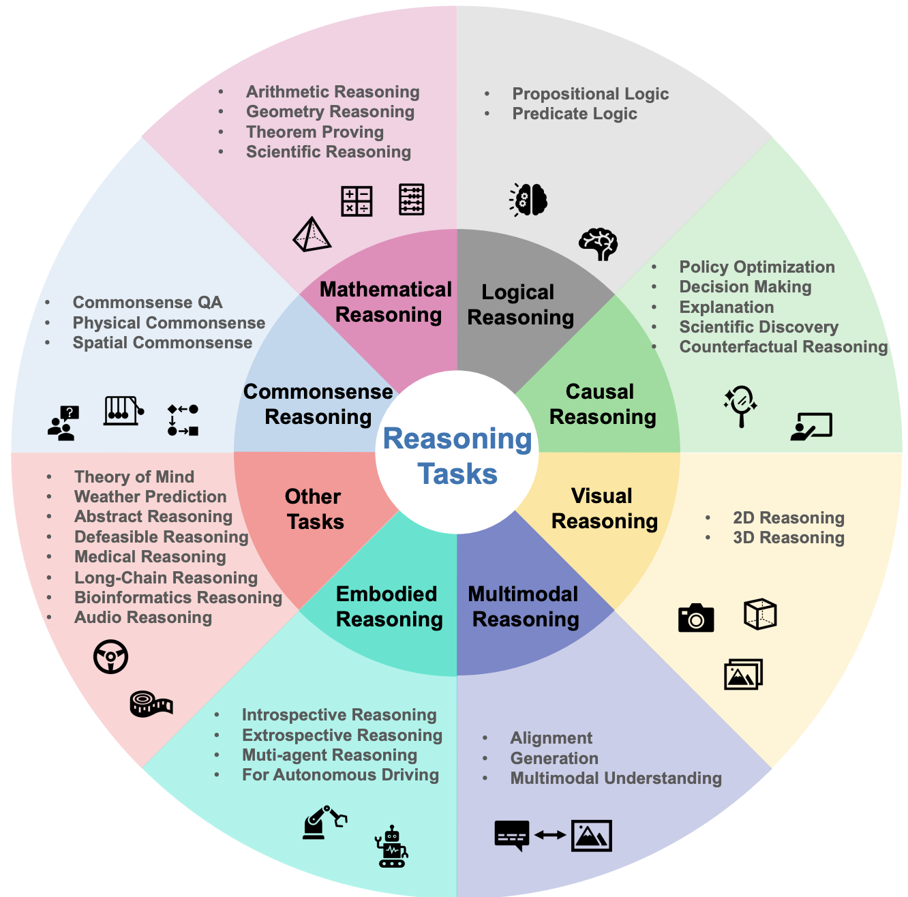

## Reasoning
 These papers discuss llm reasoning.

<figure style="text-align: center;">
    
    <figcaption style="text-align: center;">引用： https://arxiv.org/abs/2312.11562</figcaption>
</figure>

#### Papers
* [Jan 2022] **"Chain-of-Thought Prompting Elicits Reasoning in Large Language Models"** [[paper](https://arxiv.org/abs/2201.11903)]
* [Mar 2022] **"Self-consistency improves chain of thought reasoning in language models"** [[paper](https://arxiv.org/abs/2203.11171)]
* [May 2022] **"Least-to-most prompting enables complex reasoning in large language models"** [[paper](https://arxiv.org/abs/2205.10625)]
* [Oct 2022] **"ReAct: Synergizing Reasoning and Acting in Language Models"** [[paper](https://arxiv.org/abs/2210.03629)]
* [May 2023] **"Tree of thoughts: Deliberate problem solving with large language models"** [[paper](https://arxiv.org/abs/2305.10601)]
* [Aug 2023] **"ExpeL: LLM Agents Are Experiential Learners"** [[paper](https://arxiv.org/abs/2308.10144)]
* [Oct 2023] **"Language Agent Tree Search Unifies Reasoning Acting and Planning in Language Models"** [[paper](https://arxiv.org/abs/2310.04406)]
* [Dec 2023] **"Language Models, Agent Models, and World Models: The LAW for Machine Reasoning and Planning"** [[paper](https://arxiv.org/abs/2312.05230)]
* [Jan 2024] **"From LLM to Conversational Agent: A Memory Enhanced Architecture with Fine-Tuning of Large Language Models."** [[paper](https://arxiv.org/abs/2401.02777)]
* [Jan 2024] **"AutoAct: Automatic Agent Learning from Scratch for QA via Self-Planning"** [[paper](https://arxiv.org/abs/2401.05268)]
* 📖 [Jan 2024] **"A Survey of Reasoning with Foundation Models"** [[paper](https://arxiv.org/abs/2312.11562)]
* 📖 [Jan 2024] **"Exploring the Reasoning Abilities of Multimodal Large Language Models (MLLMs): A Comprehensive Survey on Emerging Trends in Multimodal Reasoning"** [[paper](https://arxiv.org/abs/2401.06805)]
* [Feb 2024] **"Self-Discover: Large Language Models Self-Compose Reasoning Structures"** [[paper](https://arxiv.org/abs/2402.03620)]
* [Feb 2024] **"Uncertainty of Thoughts: Uncertainty-Aware Planning Enhances Information Seeking in Large Language Models"** [[paper](https://arxiv.org/abs/2402.03271)]
* [Mar 2024] **"AutoGuide: Automated Generation and Selection of State-Aware Guidelines for Large Language Model Agents"** [[paper](https://arxiv.org/abs/2403.08978)]
* [Apr 2024] **"Toward Self-Improvement of LLMs via Imagination, Searching, and Criticizing"** [[paper](https://arxiv.org/abs/2404.12253)]
* [Apr 2024] **"Mind's Eye of LLMs: Visualization-of-Thought: Elicits Spatial Reasoning in Large Language Models"** [[paper](https://arxiv.org/abs/2404.03622)]
* [Apr 2024] **"Can Small Language Models Help Large Language Models Reason Better?: LM-Guided Chain-of-Thought"** [[paper](https://arxiv.org/abs/2404.03414)]
* [Apr 2024] **"Graph of Thoughts: Solving Elaborate Problems with Large Language Models"** [[paper](https://arxiv.org/abs/2308.09687)]
* 📖 [Apr 2024] **"Beyond Chain-of-Thought: A Survey of Chain-of-X Paradigms for LLMs"** [[paper](https://arxiv.org/abs/2404.15676)]
* [Jun 2024] **"Test of Time: A Benchmark for Evaluating LLMs on Temporal Reasoning"** [[paper](https://arxiv.org/abs/2406.09170)]
* [Jun 2024] **"Faithful Logical Reasoning via Symbolic Chain-of-Thought"** [[paper](https://arxiv.org/abs/2405.18357)]
* [Jun 2024] **"Grokked Transformers are Implicit Reasoners: A Mechanistic Journey to the Edge of Generalization"** [[paper](https://arxiv.org/abs/2405.15071)]
* [Jun 2024] **"From Explicit CoT to Implicit CoT: Learning to Internalize CoT Step by Step"** [[paper](https://arxiv.org/abs/2405.14838)]
* [Aug 2024] **"Mutual Reasoning Makes Smaller LLMs Stronger Problem-Solvers"** [[paper](https://arxiv.org/abs/2408.06195)]
* [Aug 2024] **"To Code, or Not To Code? Exploring Impact of Code in Pre-training"** [[paper](https://arxiv.org/abs/2408.10914)]
* ⚖️ [Sep 2024] **"LOGICGAME: Benchmarking Rule-Based Reasoning Abilities of Large Language Models"** [[paper](https://arxiv.org/abs/2408.15778)]
* 🔥 [Sep 2024] **"To CoT or not to CoT? Chain-of-thought helps mainly on math and symbolic reasoning"** [[paper](https://arxiv.org/abs/2409.12183)]
* [Sep 2024] **"Iteration of Thought: Leveraging Inner Dialogue for Autonomous Large Language Model Reasoning"** [[paper](https://arxiv.org/abs/2409.12618)]
* [Sep 2024] **"Improving LLM Reasoning with Multi-Agent Tree-of-Thought Validator Agent"** [[paper](https://arxiv.org/abs/2409.11527)]
* [Sep 2024] **"MAgICoRe: Multi-Agent, Iterative, Coarse-to-Fine Refinement for Reasoning"** [[paper](https://arxiv.org/abs/2409.12147)]
* [Oct 2024] **"Inference Scaling for Long-Context Retrieval Augmented Generation"** [[paper](https://arxiv.org/abs/2410.04343)]
* [Oct 2024] **"Steering Large Language Models between Code Execution and Textual Reasoning"** [[paper](https://arxiv.org/abs/2410.03524)]
* ⚖️ [Oct 2024] **"MARPLE: A Benchmark for Long-Horizon Inference"** [[paper](https://arxiv.org/abs/2410.01926)]
* [Nov 2024] **"Imagining and building wise machines: The centrality of AI metacognition"** [[paper](https://arxiv.org/abs/2411.02478)]
* [Nov 2024] **"LLaVA-CoT: Let Vision Language Models Reason Step-by-Step"** [[paper](https://arxiv.org/abs/2411.10440)]
* [Jan 2025] **"Towards System 2 Reasoning in LLMs: Learning How to Think With Meta Chain-of-Thought"** [[paper](https://arxiv.org/abs/2501.04682)]
* 📖 [Jan 2025] **"Test-time Computing: from System-1 Thinking to System-2 Thinking"** [[paper](https://arxiv.org/abs/2501.02497)]
* 📖 [Feb 2025] **"Code to Think, Think to Code: A Survey on Code-Enhanced Reasoning and Reasoning-Driven Code Intelligence in LLMs"** [[paper](https://arxiv.org/abs/2502.19411)]
* [Feb 2025] **"The Relationship Between Reasoning and Performance in Large Language Models -- o3 (mini) Thinks Harder, Not Longer"** [[paper](https://arxiv.org/abs/2502.15631)]
* [Mar 2025] **"Large Reasoning Models in Agent Scenarios: Exploring the Necessity of Reasoning Capabilities"** [[paper](https://arxiv.org/abs/2503.11074)]
* 📖 [Mar 2025] **"What, How, Where, and How Well? A Survey on Test-Time Scaling in Large Language Models"** [[paper](https://arxiv.org/abs/2503.24235)]
* 📖 [Apr 2025] **"Inference-Time Scaling for Complex Tasks: Where We Stand and What Lies Ahead"** [[paper](https://arxiv.org/abs/2504.00294v1)]
* [Apr 2025] **"Dual Engines of Thoughts: A Depth-Breadth Integration Framework for Open-Ended Analysis"** [[paper](https://arxiv.org/abs/2504.07872)]
* [Apr 2025] **"Inference-Time Scaling for Generalist Reward Modeling"** [[paper](https://arxiv.org/abs/2504.02495)]
* [Apr 2025] **"Adaptive Rectification Sampling for Test-Time Compute Scaling"** [[paper](https://arxiv.org/abs/2504.01317)]
* 📖 [Apr 2025] **"DeepSeek-R1 Thoughtology: Let’s <think> about LLM reasoning"** [[paper](https://arxiv.org/abs/2504.07128)]
* [Apr 2025] **"Reasoning Models Can Be Effective Without Thinking"** [[paper](https://arxiv.org/abs/2504.09858)]
* [Apr 2025] **"SQL-R1: Training Natural Language to SQL Reasoning Model By Reinforcement Learning"** [[paper](https://arxiv.org/abs/2504.08600)]
* [Apr 2025] **"Think Deep, Think Fast: Investigating Efficiency of Verifier-free Inference-time-scaling Methods"** [[paper](https://arxiv.org/abs/2504.14047)]