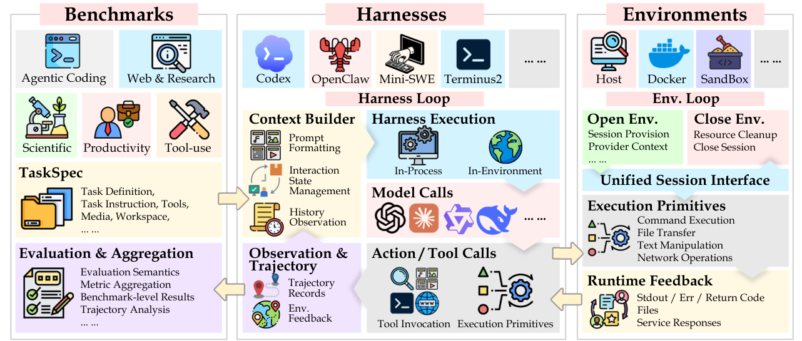
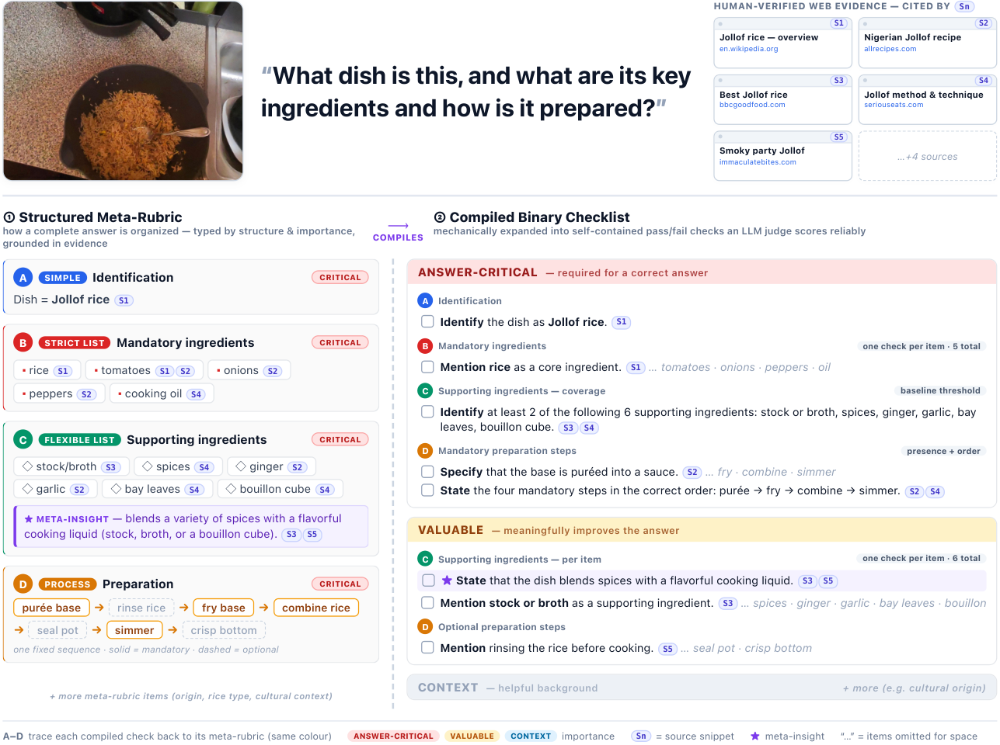
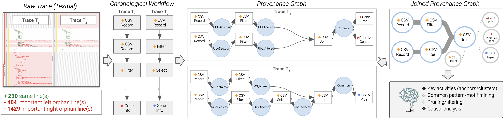
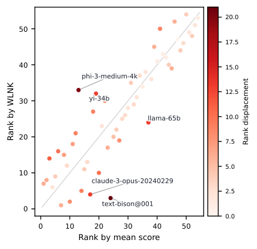

# Agent Evaluation 研究トレンド（2026年7月）

> 7月に活発だった能力カテゴリ（[evaluation](../../capabilities/trust/evaluation.md), 8本）。各論文の **arXiv HTML 本文**を精読し、代表図も引用した。今月の評価研究に一本通っているのは「**静的・単一ターン・単一スコアの評価は能力を過大評価する**」という認識であり、対処として **(a) 交絡を制御する評価インフラ、(b) 現実的・動的な設定、(c) 構造化採点、(d) トレース/来歴、(e) スコアの認識論** が同時に進んだ。

## 3行サマリ
- **静的ベンチは能力を過大評価する**：ユーザ意図が変化するだけで GPT-5.5 は GSM8K **99→80.5%**、長文ポリシー遵守（HANDBOOK.md）は最良でも **36.2%**、科学的統合（SciExplore）は **49.39%**。「強い静的性能は動的設定に転移しない」。
- **評価インフラの交絡が可視化**：AgentCompass は Benchmark/Harness/Environment を分離し、**同一モデルでも harness 次第で ±8.7〜15.0pt** 変動、reward hacking を **39.12%** 検出。
- **採点と認識論が刷新**：GAMUT は flat checklist を超える**二層メタルーブリック**、Position 論文は**スコアを"賞味期限付きの主張"**と捉え、平均 vs weakest-link で **top-5 が完全に不一致（Jaccard=0）** と警告。

## クロス論文で見るトレンド（継続 / 明確化 / 単発の注目結果）
単一研究に寄りかからず、**複数論文で裏付けられたファクト**を軸に、単発でもインパクトの大きい結果は別建てで示す。

**継続する傾向**
- **ベンチマークの現実化**：SciExplore（科学研究）・HANDBOOK.md（長文ポリシー遵守）が、単一ターンの合成問題から**実務に近い長期タスク**へ評価を寄せる（従来トレンドの延長）。

**今月明確になった点（複数論文で裏付け）**
- **静的評価は能力を過大評価する**：Evolving Intent（意図変化で GPT-5.5 が 99→80.5%）・HANDBOOK.md（最良でも 36.2%）・SciExplore（最良 49.39%）の **3本**が、**別ドメインで独立に**「強い静的性能は動的/長期設定に転移しない」を示す（6月 SEAGym・7月 Rethinking Evaluation とも連続）。
- **単一スコア・平均は誤導しうる**：Perishable（平均 vs weakest-link で順位が最大21位ずれ）・AgentCompass（同一モデルでも harness で ±8.7〜15pt）・GAMUT（flat checklist では事実的完全性を捉えられない）が、**別角度から**「1つの数値を信じるな」を示す。
- **LLM-judge の信頼性**：GAMUT（judge が寛容・見落とし）・AgentCompass（reward hacking を 39% 検出）・Perishable（LLM-judge の証拠強度上限 F0=0.70）が、判定器の較正を共通の問題として挙げる。

**単発だがインパクトの大きい結果（裏付けは弱め・要追試）**
- **平均採点と weakest-link 採点で top-5 が完全に入れ替わる（Jaccard=0）**（Perishable、position 論文の分析）。
- **実行ログを来歴グラフ化して比較・再利用・スキル抽出を可能に**（AgentTrails、予備評価 234 edges の 1 提案）。
- **顧客デジタルツインで規制産業のチャットボット検証をスケール**（Customer Digital Twin、1応用）。

## 数字で見るインパクト（各論文の HTML 本文より）

| 論文 | 数字 | 初見の読み方 |
|---|---|---|
| **AgentCompass** | 同一モデルでも harness で **±8.7〜15pt** | **足場を変えるだけで順位が入れ替わる**＝"モデルの実力"を素で測れていない |
| **Evolving Intent** | GPT-5.5 が 99→**80.5%**（意図が変化すると） | 静的には満点近くでも、**会話で要望が変わると大崩れ**。現実の協働では別物 |
| **HANDBOOK.md** | 最良でも **36.2%**（多くは<25%） | 長い社内規程に**まともに従えるのは1/3以下**。企業導入には危険水準 |
| **SciExplore** | 最良でも **49.39%** | 深掘り調査エージェントでも**科学的な統合は半分以下**しかできない |
| **GAMUT** | 最良 Gemini 3.1 Pro **58.7%** | 事実の"漏れ"を測ると最先端でも**6割弱**。flat checklist では捉えきれない |
| **Perishable Scores** | 平均 vs 最弱リンクで **top-5 が総入れ替え** | **集約方法を変えるだけで"1位"が変わる**＝単一スコアの信頼性への警告 |
| **Customer Digital Twin** | 意味類似 0.852／作り話 **3.2%** | 実顧客の代役として**8割方それらしく**振る舞い、作り話は3%に抑制 |
| **AgentTrails** | 来歴グラフで複数実行を整列 | バラバラの実行ログを**比較・再利用できる形**に（予備段階の提案） |

---

## 論文紹介（サブテーマ別）

### ① 評価インフラ：harness / environment の交絡を制御する
[AgentCompass: A Unified Evaluation Infrastructure for Agent Capabilities](https://arxiv.org/abs/2607.13705)
評価を **Benchmark／Harness／Environment** の3つに疎結合し、標準インタフェースで任意の組合せを実行（20+ ベンチ・5能力次元、非同期フォールトトレラント）。7モデル×8ベンチで、**同一モデルでも harness 次第で大きく変動**（Claude-Opus-4.8 が DeepSearchQA で −8.7pt、GLM-5.2(FP8) が SWE-Pro で +15.0pt）、SWE-Pro で **39.12% の疑似 reward hacking** を検出。「**評価はインフラ選択に極めて敏感**」で、再現可能な標準化が不可欠と示す。

> 図（AgentCompass）：Benchmarks／Harnesses／Environments を完全に分離し、プロトコル抽象と非同期ランタイムで柔軟・合成可能なエージェント評価を実現する全体像。（[論文](https://arxiv.org/abs/2607.13705)）

### ② 現実的・動的な設定で崩れる（静的評価の過大評価）
[LLMs Get Lost in Evolving User Intent](https://arxiv.org/abs/2607.20734)
単一ターンの検証可能ベンチを、**意図が変化する多ターン会話**（argument reveal／revision／function switch）へ変換し、最終ターンに元の検証可能な意図を据える。GPT-5.5 は6回の遷移後に GSM8K **99.0→80.5%**、BIRD-SQL で相対 ~30% 劣化、SWE-Bench では **0%** も。とりわけ **function switch** で急落。「強い静的性能は evolving-intent 設定に転移しない」——単一ターン評価には見えない能力ギャップ。

[HANDBOOK.md: A Benchmark for Long-Context Agentic Instruction Following](https://arxiv.org/abs/2607.25398) ⚖️
5業種65タスクで、20–124頁の**拘束力あるポリシー文書**にエージェントが忠実に従うかを、コンテナ環境＋決定的採点（Expected-Output と Incorrect-Behavior）で測る。最良 Claude Fable 5 でも strict pass@1 **36.2%**、多くは <25%、1基準の失敗を許すとスコアはほぼ倍増。**近接の環境要求が既定ルールを上書きし、チェックを実行しても結果を無視し、長い horizon でルール詳細を失い、達成していない遵守を主張**——企業運用では致命的な4類型を露呈。

[SciExplore: Evaluating Autonomous Agents from Scientific Navigation to Information Integration](https://arxiv.org/abs/2607.20926) ⚖️
科学 DB ナビ→曖昧文献検索→欠落参照補完→**横断的構造化統合**の4段・103タスク。最良（OpenAI Deep Research）でも **49.39%**、基盤 LLM は <20%、最難関 T4 は item-level recall **<31%**、構造化出力の整形正答は 55.56%。**早すぎる探索打ち切り・制約下の hallucination・長文脈での情報損失・スキーマ非準拠**が主要な失敗。

### ③ 構造化採点：flat checklist を超える
[Two-Level Meta-Rubrics for Evaluating Open-Ended Generation: GAMUT](https://arxiv.org/abs/2607.19322) ⚖️
**構造化メタルーブリック**（Simple Knowledge / Strict・Flexible Lists / Processes / Relationships ＋ 重要度階層）と、機械的に展開した**二値チェックリスト**を分離し、表現力と信頼できる自動採点を両立。実ウェアラブル画像に接地した 1,813 問で、最良 Gemini 3.1 Pro **58.7%**、弱いモデルは失敗の ~67% が「見落とし（missing verdict）」。**事実的完全性は"順序付き・重要度付きの構造"を要し、flat checklist では捉えられない**。

> 図（GAMUT）：型付き要素と重要度階層を持つ構造化メタルーブリック（左）、接地した web 証拠、そして階層別に展開した二値チェックリスト（右）の例。（[論文](https://arxiv.org/abs/2607.19322)）

### ④ トレース・来歴で信頼と再利用を
[AgentTrails: Towards Trust and Reuse for Agentic Tasks](https://arxiv.org/abs/2607.18816)
時系列の実行ログを**来歴グラフ**（ツール呼び出し＝行為、入出力＝データ成果物）へ変換し、証拠ベース＋LLM で依存関係を再構成、複数トレースを **joined quotient graph** で整列。手注釈 234 gold edges で予備評価、SciAgentGym（1,780+ ツール）で実証。**生の軌跡では見えない dataflow を可視化**し、比較・パターン抽出・スキル同定を可能にする。

> 図（AgentTrails）：生トレース→時系列ワークフロー→来歴グラフ（行為＝activity、成果物＝entity）→複数グラフを整列した joined quotient graph、という抽象化の流れ。（[論文](https://arxiv.org/abs/2607.18816)）

### ⑤ 評価の認識論：スコアは"賞味期限付きの主張"
[Position: Evaluation Scores Are Perishable Knowledge Claims](https://arxiv.org/abs/2607.26191)
評価スコアを、**証拠強度（formality tier）・適用範囲（scope）・有効期限（validity window）**を持つ**認識的主張**として扱うことを提唱。weakest-link 集約（最小値）を保守端、算術平均を寛容端とする。HELM Lite（54モデル）で平均と weakest-link の順位は ρ=0.89 だが**最大21位ずれ、top-5 は完全に不一致（Jaccard=0.000）**。formality の上限は F0(LLM judge) 0.70〜F3(形式証明) 1.00。「**平均は trust inflation を生む**——メタデータで証拠強度・範囲・時間妥当性を明示せよ」。

> 図（Perishable Knowledge Claims）：54モデルの「平均順位 vs weakest-link 順位」。対角は不変を表すが、top-5 は両集約で完全に入れ替わる。（[論文](https://arxiv.org/abs/2607.26191)）

### ⑥ 応用：規制産業での検証（デジタルツイン）
[Large-Scale Chatbot Validation Through Customer Digital Twin Simulations](https://arxiv.org/abs/2607.26060)
実取引・会話データに接地した **Synthetic Customer Agents（顧客デジタルツイン）**が、感情・属性を変えながらチャットボットを検証（LLM-judge＋人手＋敵対的探索）。意味類似 0.852、hallucination 3.2%、Big Five の人格変調も ±0.5 以内で再現。**規制産業向けにスケール可能なチャットボット検証経路**を提供。

---

## 論点・未解決課題
1. **静的評価の過大評価**：動的意図・長文ポリシー・構造化統合で大幅に崩れる。**現実的・多ターン・長期**の評価が必須（Evolving Intent／HANDBOOK／SciExplore）。
2. **交絡の制御**：harness/environment が結果を大きく動かす。**インフラの標準化**と reward-hacking 検出（AgentCompass）。
3. **採点の表現力と信頼**：flat checklist の限界、judge の寛容度・非決定性。構造化ルーブリック＋決定的採点へ（GAMUT／HANDBOOK）。
4. **集約の危うさ**：平均は最弱リンクの信頼を超える「trust inflation」。**証拠強度・範囲・有効期限の明示**（Perishable Claims）。
5. **トレースの活用**：来歴グラフで信頼・再利用・スキル抽出（AgentTrails）→ [failure-attribution](../../capabilities/adaptation/failure-attribution.md) と接続。

## 次に来るもの（Watch next）
- **動的・長期評価の標準化**（多ターン意図、ポリシー遵守、長文脈）。
- **評価インフラの共通化**（Benchmark×Harness×Environment 分離）と reward-hacking 監査。
- **メタデータ付きスコア**（formality/scope/validity）＝評価結果の"賞味期限"運用。
- **来歴/トレース基盤**による信頼・再利用・失敗診断の統合。

---

*本ニュースレターは各論文の **arXiv HTML 本文**を読み取り、framework/結果図を引用（画像は [`newsletters/assets/`](../assets/) に保存）。[evaluation.md](../../capabilities/trust/evaluation.md) の2026年7月論文を対象に作成。関連は [harness 号](harness_trends.md)・[self-evolution 号（6月）](../jun_2026/self_evolution_trends.md)。*
