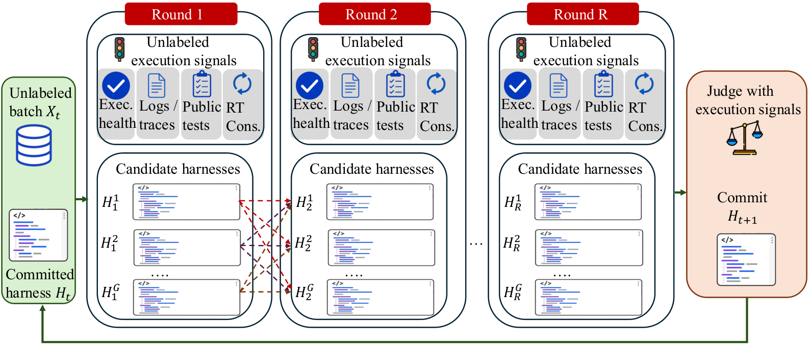
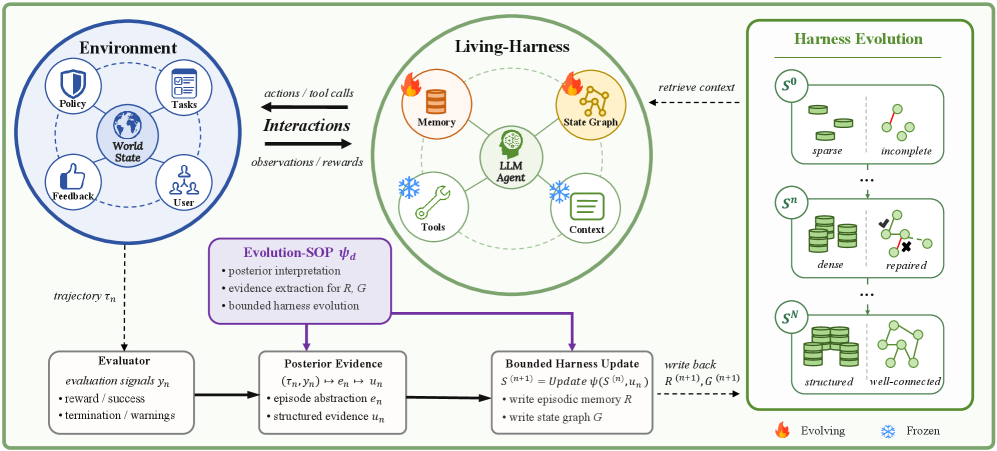
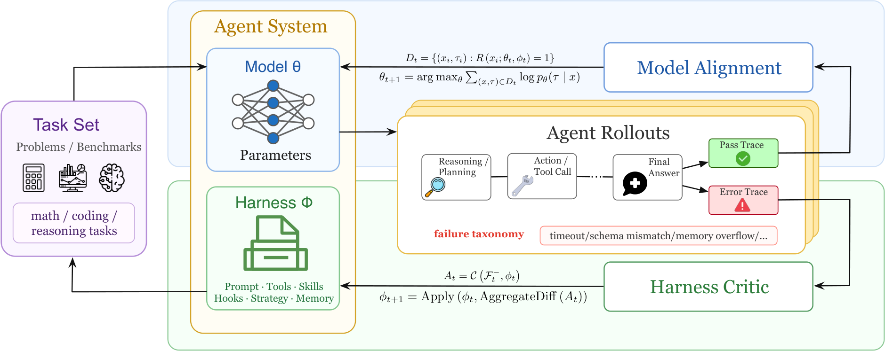
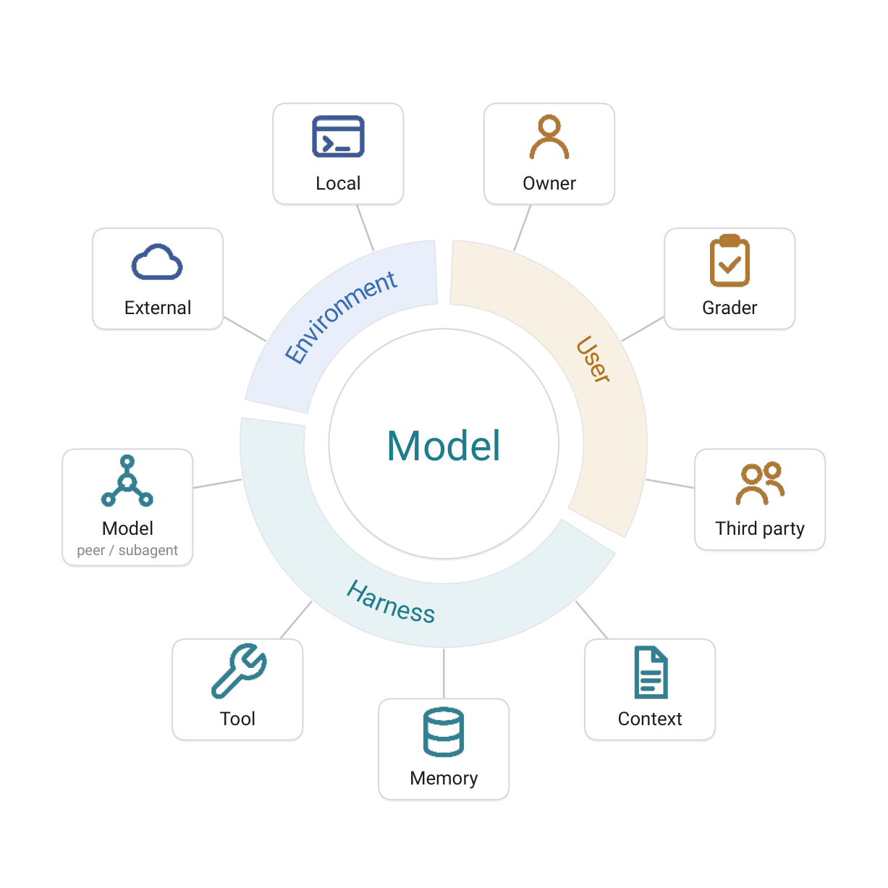

# Agent Harness 研究トレンド（2026年7月）

> 対象：[harness](../../architecture/harness.md) の 2026年7月論文（12本）。各論文の arXiv HTML 本文を精読してまとめた。

## まず、この分野を一言で

AI エージェントの賢さは、**モデル（＝脳）そのもの**だけで決まるわけではない。脳の周りには、道具をどう呼ぶか・どんな手順で進めるか・記憶をどう持つか・失敗したらどうやり直すか、といった**"段取り一式"**がある。この段取りをまとめたものを **ハーネス（harness）** と呼ぶ。

たとえるなら、運転手（モデル）が同じでも、運転席の作りと道の引き方（ハーネス）を変えれば、車はもっと速く安全に走れる。7月の研究が示したのは、**脳を一切訓練し直さなくても、この段取りを作り込むだけで性能は大きく上がる**、ということだ。

その一方で、「その"改善"は本当に効いているのか？」という冷静な問い直しも同時に現れた。今月の Harness 研究は、**「段取りを自動で良くする」熱狂**と、**「良くなったと言えるのか」を厳しく確かめる動き**が同居した1か月だった。

## 今月の3つの流れ

**流れ①：脳を凍結して、"本番中に"段取りだけを直す（複数論文で共通）**
先月から続く主流。モデルの重みは固定したまま、実行の様子（成功・失敗の記録）を見て段取りを書き換える。今月はこれを **正解ラベルすら使わず、実行中に**やる手法が並んだ（TTHE・MemoHarness・Living-Harness）。「性能＝脳＋段取り」という見方が、もう当たり前になった。

**流れ②：「本当に効くのか」への疑い（今月はっきりした論点）**
ただし、盛り上がりに水を差す結果も出た。段取りの自動改善を、**同じ計算量で"ただ何度も試すだけ"の素朴なやり方と公平に比べる**と、勝てないことがある——と Rethinking Evaluation が示した。DataClawEval も、採点役の AI が甘く点を付けてしまう問題を指摘する。**"改善"の多くは、賢くなったのではなく、単に練習したタスクを丸暗記していただけかもしれない**、という警告だ。

**流れ③：運用に耐えるか（新しく前に出てきた視点）**
「速くなった」だけでは足りない。**どこを直せばいいか分かるか**（Harness Handbook）、**失敗は脳と段取りのどちらの責任か**（Model or Harness?）、**段取りを他人に盗まれないか**（Agent Harness Distillation）——といった、実運用で必ずぶつかる問いが研究テーマになり始めた。

> ※以下、数字は各論文の HTML 本文より。単発（1論文のみ）の結果は末尾に「要追試」として分けた。

## 主な結果（数字は"何と比べてどうか"で読む）

| 論文 | 何をした / どうなった | どう受け取るか |
|---|---|---|
| **TTHE** | モデルを訓練せず、SQL 生成の正答率を **12% → 50%** | 脳に一切触れず、周りの段取りだけで**正答が4倍以上**。適応は"本番中・正解なし"で起きる |
| **Co-Harness** | 段取りと脳を交互に育て、平均 **+20pt**、22世代の自動運転で **8.7倍高速化** | 両方を回すと相乗効果。**人が付きっきりでなくても**クラッシュから自力復帰した |
| **Living-Harness** | 対話タスクで **+10pt**、育てた段取りを別モデルへ移すと **0% → 43%** | まったく解けなかったモデルが、良い段取りを"移植"されると4割解けた |
| **MemoHarness** | 精度は市販のコーディング支援を上回り、費用は **$6.89**（相手は $10.28） | **安いのに強い**。過去の経験を使い回して、高精度と低コストを両立 |
| **Better Harnesses** | 小型モデルで大型の **89.7% の性能**を、**コスト 4%** で | 良い段取りを付ければ、**小型が大型の9割を約1/25の値段**で出せる |
| **Rethinking Evaluation** | 見たことのない別タスクでの伸びは **+0.6pt**、素朴な反復に負ける場面も | ほぼ**横ばい**。公平に比べると"自動改善"は幻の可能性——過学習の警告 |
| **DataClawEval** | 最強モデルでも **74.9 / 100**、得意分野で 81、苦手で 62 | まだ**2〜4割は失敗**。しかも万能モデルはなく、得手不得手がはっきり割れる |
| **Agent Harness Distillation** | 他エージェントの段取りを覗いて真似ると **+45pt** | **段取りは"盗める資産"**。守り方（防御）も同時に必要になった |

---

## 論文紹介（テーマ別）

### ① 脳は凍結、段取りは本番中に直す

まず押さえたいのは「**正解ラベルも追加訓練もなしに、実行中の様子だけを手がかりに段取りを直せる**」という点だ。3本が別々のやり方で、これを実現した。

[TTHE: Test-Time Harness Evolution](https://arxiv.org/abs/2607.08124)
なぜ効くのか——エージェントの段取りは「プログラム」なので、実行してみれば健全か（途中でエラーが出ないか、答えが一貫するか）がある程度わかる。TTHE はその**実行の手がかりだけ**を使い、複数の段取り候補を並行して走らせ、良さそうなものを選んで次に引き継ぐ。正解は最後まで見ない。結果、SQL 生成が **12% → 50%**、ソフト修正が **20% → 35%**。ただし弱点も正直に述べる：「**段取りが"正しく動いた"のに、問われた問いには答えていない**」ことがある。良し悪しを見分ける"判定役"の目が甘いのが、次の課題だ。

> 図（TTHE）：正解ラベルのない1バッチの中で、いまの段取りを起点に候補を枝分かれさせ、実行の手がかりだけで選抜していく。（[論文](https://arxiv.org/abs/2607.08124)）

[MemoHarness: Agent Harnesses That Learn from Experience](https://arxiv.org/abs/2607.14159)
段取りを6つの部品（文脈の組み立て方、道具の使い方、など）に分け、**過去の経験を"診断メモ付き"で貯めておく**。新しい問題が来たら、似た経験を引いてその場に合う段取りを作る——追加学習もフィードバックも不要。精度で市販のコーディング支援を上回りつつ、費用は **$6.89**（相手は $10.28）と安い。経験の"使い回し"が効いている。ただし評価タスクが18問と少なく、検証は今後の課題と自認する。

[Living-Harness Is an Interactive-Agent Evolver](https://arxiv.org/abs/2607.26598)
対話タスク向け。過去のやり取りから「こういう状況ではこう対処／こう直す」というメモと、状態の遷移図を育てる。おかしな更新を弾く**関門（ゲート）**を通して安全に積み上げる。対話成功率が **+10pt**。とりわけ示唆的なのは、育てた段取りを別のモデルに移すと、**まったく解けなかったモデル（0%）が43%解けた**こと——良い段取りは"移植"できる。

> 図（Living-Harness）：各回のやり取りと評価から"事後の証拠"を作り、記憶と状態遷移図を更新する。道具とベース文脈は凍結したまま。（[論文](https://arxiv.org/abs/2607.26598)）

### ② 脳も一緒に育てる／小型で大型に迫る

[Co-Harness: Co-Evolving Harnesses and Model Weights for LLM Agents](https://arxiv.org/abs/2607.22688)
ここまでは「脳は凍結」だったが、Co-Harness は**脳と段取りを交互に育てる**。まず失敗の記録から段取りの欠陥を直し、次にその良くなった段取りが生む"きれいな記録"で脳を微調整する——この往復で少しずつ良くなる。平均 **+20pt**、22世代の自動運転でクラッシュからの自力復帰と **8.7倍の高速化**まで達成。ただし著者は「①段取り改善が記録の質を上げ、②脳がそれを取り込み、③強くなった脳が新たな改善余地を開く、の3条件が揃うときだけ複利で効く」と釘を刺す。脳の実力が頭打ちなら止まる。

> 図（Co-Harness）：失敗から段取りを直すループと、良い段取りが生む記録で脳を微調整するループの二重構造。（[論文](https://arxiv.org/abs/2607.22688)）

[Better Harnesses, Smaller Models](https://arxiv.org/abs/2607.08938)
「良い段取りは、脳の弱さをどこまで肩代わりできるか」を正面から測った。小型モデルの失敗を分析して段取りを自動で調整すると、**大型モデルの 89.7% の性能を、コスト 4%（約1/25）** で出せた。ただし万能ではない：**手順が毎回変わる多様なタスクほど効きにくく**（相関 −0.96）、「段取りは難しさを吸収できるが、脳に無い中核能力までは代われない」と結論する。

### ③ "本当に効くのか"を冷静に確かめる

[Rethinking the Evaluation of Harness Evolution for Agents](https://arxiv.org/abs/2607.12227)
今月いちばんの"冷や水"。段取りの自動改善を、**同じ計算量**で、(a) ただ何度も答えを引き直す、(b) 前の答えを少しずつ直す、といった**素朴な方法と公平に比べた**。さらに、練習に使ったのと同じ問題ではなく**見たことのない問題**で汎化を測った。結果、素朴な反復（72.3%）が自動改善（67.4%）を上回る場面すらあり、**見たことのない問題での伸びはわずか +0.6pt**。「今の自動改善は深刻な過学習で、公平に比べれば単なる"数打ち"に負ける」。派手な数字を割り引いて読む必要がある、という警告だ。

### ④ 運用に耐えるか——読める・直せる・誰の責任か・盗まれないか

[Harness Handbook](https://arxiv.org/abs/2607.13285)
段取りを自動で直すには、まず「**どこを直せばいいか**」が分からないといけない。Harness Handbook は、コードを「機能の振る舞い」の地図に変えて、直すべき箇所へ案内する。結果、より**少ない計算で良い改修**ができた（プラン勝率 38.3% 対 28.3%、トークン −12.7%）。「正しい直し方を思いつくことより、**影響する箇所を全部見つけることの方が難所**」という指摘は、経験者ほど頷ける。

[From Prompts to Contracts](https://arxiv.org/abs/2607.08028)
企業導入の話。守るべき挙動を"お願い文（プロンプト）"に書くのをやめ、**版管理された部品（出典付きの主張・検証の関門）に移す**。すると、裏のモデルを別製品に差し替えても、コード側の検査は **270回すべて通過**。検証の関門を外すと違反が 30件出た一方、関門があれば**利便性を損なわず**守れた。標語は明快——「**お願い文はガードレールにならない**」。

[Model or Harness? An Interaction-Centric Taxonomy for Localizing Agent Failures](https://arxiv.org/abs/2607.28802)
失敗したとき、悪いのは**脳か段取りか**。これを取り違えると、直す場所を間違える（脳を再訓練すべきなのに段取りをいじる、など）。41種類の失敗を「部品と部品の間のどこで壊れたか」に整理し、責任の所在を割り当てる。AI 判定と人の判定は **κ=0.76**（＝かなり一致）で揃った。診断の共通語を与える提案だ。

> 図（Model or Harness?）：失敗を「部品どうしのつながり（エッジ）」の問題として捉え、どちら側の責任かを割り当てる。（[論文](https://arxiv.org/abs/2607.28802)）

[DataClawEval](https://arxiv.org/abs/2607.28033) ⚖️
実務のデータ処理タスク100問を、**AI 採点ではなく決まった規則で採点**するベンチマーク。最強モデルでも **74.9点**、しかもエンジン（DB）ごとに 81 と 62 のように得手不得手が割れ、万能モデルはいない。重要な副産物として「**AI に採点させると点が甘くなり、ぶれる**」ことを実証し、規則ベース採点の必要を示した（②の警告とも響き合う）。

[Agent Harness Distillation](https://arxiv.org/abs/2607.28147)
段取りが強力な資産なら、それは**盗む対象**にもなる。外から質問を投げて相手の実行構造を推測し、真似た"影武者"を作ると、性能が **+45pt** 跳ねた。段取りは知的財産として抜き取れる、という新しい攻撃面を示し、偽の説明を吐かせて守る防御も提案した。

---

## この号のまとめ（何が確かで、何がまだ怪しいか）

- **確かなこと**：脳を凍結したまま段取りを直すだけで、二桁ポイントの改善は再現性高く出る（①の複数論文）。良い段取りは別モデルへ"移植"できる場合がある（Living-Harness）。
- **今月はっきりした注意**：その"改善"は、公平に比べると素朴な反復に負けることがあり、汎化も弱い（Rethinking Evaluation）。採点を AI に任せると甘くぶれる（DataClawEval）。**数字は"何と・どう比べたか"を確認してから信じる**。
- **単発だが面白い（要追試）**：小型が大型の9割をコスト4%で（Better Harnesses、7タスクの1研究）／段取りは盗める（Distillation、1研究）。

## 次に読みたくなる問い
- 良し悪しを見分ける**"判定役"の精度**をどう上げるか（①の共通の弱点）。
- **公平な比べ方の標準化**（同じ計算量・見たことのない問題・規則ベース採点）。
- いつ脳を、いつ段取りを直すかの**使い分け**（Co-Harness の先）。

---

*本ニュースレターは各論文の arXiv HTML 本文を精読して作成。前月の関連号は [self-evolution（6月）](../jun_2026/self_evolution_trends.md)、近い話題は [evaluation（7月）](evaluation_trends.md)。*
