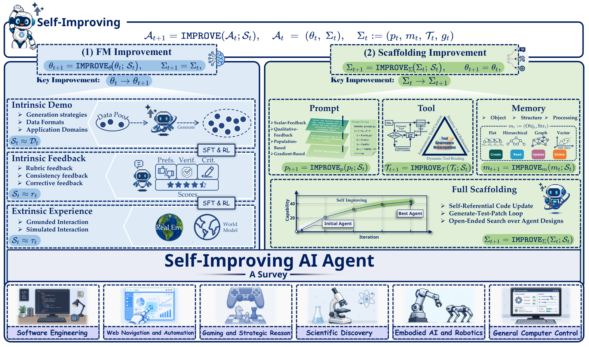
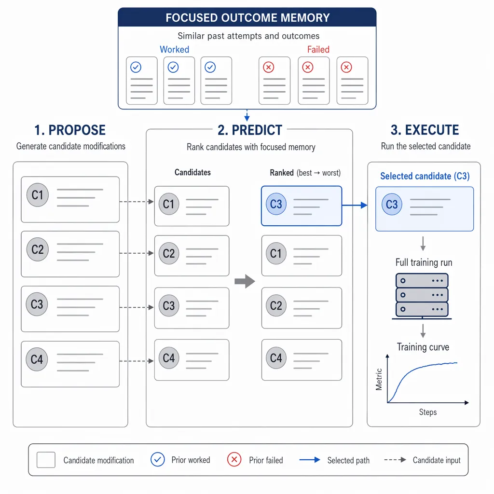
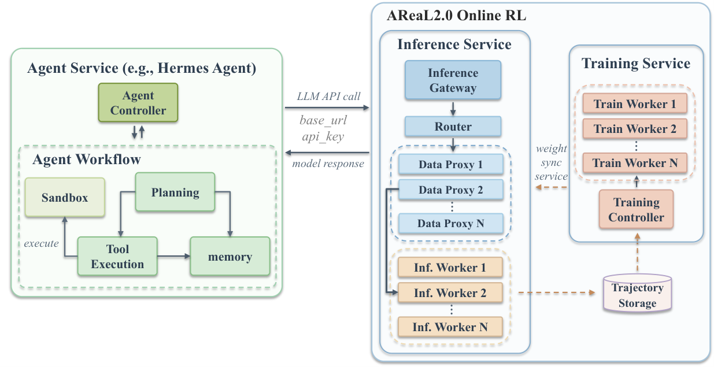
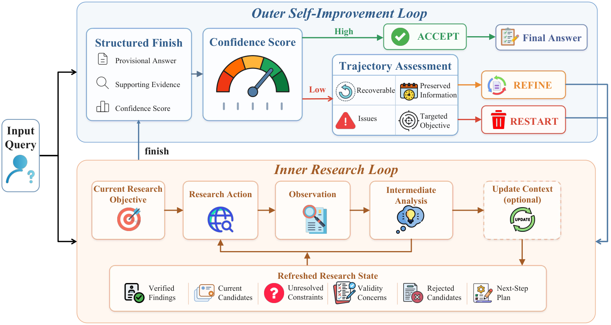

# Self-Evolving Agents 研究トレンド（2026年7月）

> 対象：[self-evolution](../../capabilities/adaptation/self-evolution.md) の 2026年7月論文（7本）。各論文の arXiv HTML 本文を精読してまとめた。

## まず、この分野を一言で

**自己進化（self-evolution）**とは、エージェントが経験から学んで**次の自分を賢くする**ことだ。ここで大事な分かれ道がある——賢くする先が、AI モデルの**中身（脳＝重み）**なのか、それとも脳の周りにある**知識・手順・記憶**なのか。脳を訓練し直すのは高価だが、周りを書き換えるのは安く、他のモデルにも移せる。

6月号では「周りを育てる」やり方が主流になった、と書いた。7月はそれが**さらにはっきり**した。そのうえで、今月は新しい問いが2つ前に出てきた。ひとつは「**では、何を永続的な資産として残すのか**」——答えは「エージェント本体より、共有できる**知識**を育てよ」に傾いた。もうひとつが、もっと厄介な発見だ。

その発見とは——**自己改善のループ自体が、実は信頼できない**、ということである。「改善を見つけること」はできても「それを取りこぼさず定着させること」が苦手で、しかも改善の良し悪しを判断する**内部の"審判"が、回を重ねるほど自信過剰になって外す**。派手な改善数字の裏で、この"当てにならなさ"が定量化された1か月だった。

## 今月の3つの流れ

**流れ①：残すのは"エージェント"でなく"知識"（複数論文で共通）**
Knowledge-Centric は象徴的だ——**エージェントは使い捨てにし、共有の知識ベースの方を育てる**。サーベイも自己改善を「脳（重み）を変える／周りの足場を変える」の2系統に整理し、Evidence-in-the-Loop は本番で「大きなモデルに替える」のではなく「**どこで壊れたかを直す**」。6月の"外在化"が、より明確な設計思想になった。

**流れ②：自己改善ループは信頼できない（今月の新発見）**
2本が別々の角度から、同じ弱点を突いた。Rehearse は「**最適化が進むほど、良し悪しを見分ける審判が自信過剰かつ不正確になる**」現象（著者いわく"確信の崖"）を示し、RSIBench-Data は「**改善を見つけても、その後の探索で 78% は最高点より低いところで終える**」ことを測った。**発見はできるが、維持できない**——これが今月の核心だ。

**流れ③：土台と再帰（新しい軸）**
自己進化を回すには、経験を"学習に使える素材"へ変える**システムの土台**が要る、と Next-Gen Agentic RL は説く。「最大の壁は、強い脳や賢い学習法ではなく、この土台の欠如だ」。また AREX は「**内側で調べ、外側で直す**」二重の再帰で、小さめのモデルでも深掘り調査を高水準にこなした。

> ※数字は各論文の HTML 本文より。単発（1論文のみ）の目を引く結果は末尾に「要追試」として分けた。

## 主な結果（数字は"何と比べてどうか"で読む）

| 論文 | 何をした / どうなった | どう受け取るか |
|---|---|---|
| **Knowledge-Centric** | エージェントでなく知識を育て、**86.7%**（相手70%）を**約1/3の費用**で | **知識を育てる方が、高性能かつ安い**。未知タスクへも大きく波及（13→43%） |
| **Evidence-in-the-Loop** | 大型に替えず"壊れた箇所"を直し、本番 **89.5%**（旧方式79%） | 脳を大きくしなくても、**弱点を直すだけで約10pt改善** |
| **AREX** | 内側=調べる／外側=直す の二重再帰で、合計 **+22.9pt** | **小さめのモデルでも**、深掘り調査を高水準にこなす |
| **Rehearse** | 審判の正確さ 82.8 → 56.9 を **83.5 に回復**、到達も **37〜46% 速く** | 自己改善は進むほど**判断が鈍る**が、過去の似た例だけ見れば回復する |
| **RSIBench-Data** | 改善の発見は58%、だが **78% は最高点より低いところで終える** | **改善を見つけても取りこぼす**＝「発見できるが維持できない」 |
| **Next-Gen Agentic RL** | 提言：壁は**アルゴリズムでなく土台**（経験→学習素材の変換基盤） | 「強い脳・賢い学習より、**経験を活かす土台の欠如**が最大の壁」 |
| **Survey** 📖 | 自己改善を**脳を変える / 足場を変える**の2系統に整理 | この分野の全体像をつかむ地図 |

---

## 論文紹介（テーマ別）

### ① 残すのは"知識"——外在化の到達点

[Self-Improvements in Modern Agentic Systems: A Survey](https://arxiv.org/abs/2607.13104) 📖
まず全体像から。自己改善は大きく2系統に分けられる——**脳（重み）を更新する**か、**周りの足場（指示文・記憶・道具・制御）を更新する**か。前者は強力だが高価、後者は安く柔軟。今月の論文はほぼ後者に寄っている。「速い（その場の）適応」と「遅い（脳の）適応」をどう組み合わせるか、という視点で研究を見渡せる地図だ。

> 図（Survey）：自己改善の2系統。脳（重み）の更新と、周りの足場の更新を、信号の種類ごとに対比する。（[論文](https://arxiv.org/abs/2607.13104)）

[Knowledge-Centric Self-Improvement](https://arxiv.org/abs/2607.19592)
発想の転換が鮮やかだ——**エージェント本体は使い捨てにして、共有の"知識ベース"の方を永続的に育てる**。各エージェントは「これが効いた／これは失敗した」を証拠付きで投稿し、複数のタスクで再現する主張だけが生き残り、凝縮されて次のエージェントに渡る。結果、**86.7%**（相手70%）を**約1/3の費用**で、しかも未知タスクへ **13.3% → 43.3%** と大きく波及。「進歩は、エージェントの複雑さより**使える情報の質**で決まるのかもしれない」。

[Evidence-in-the-Loop: Trace-Driven Optimization for Customer-Service LLM Agents](https://arxiv.org/abs/2607.18039)
本番の顧客対応で、失敗の記録を再生し、「**どこで壊れたか**（検索・並べ替え・最終選択のどこか）」を突き止めて、そこだけ直す。大きなモデルに替えるのではなく、弱点を層ごとに直すやり方で、本番精度が **79% → 89.5%**。「backbone を大きくするより、壊れた箇所を診断して直せ」というメッセージ。

### ② 自己改善ループの"当てにならなさ"

[Rehearse: Stepping Back from the Confidence Cliff in Self-Improving Autoresearch](https://arxiv.org/abs/2607.27687)
今月の目玉のひとつ。自分で改善を繰り返すと、**良し悪しを見分ける審判が、回を重ねるほど自信過剰になり、かえって外す**（"確信の崖"）。Rehearse は、実行前に候補を比べ、**過去の"似た試み"だけを引いて**判断する。すると、放っておけば 82.8 → 56.9 と落ちる審判の正確さが **83.5 に回復**し、同じ成果に **37〜46% 速く**到達した。全履歴でなく"似た例だけ"を見るのが鍵だ。

> 図（Rehearse）：提案→予測（過去の似た例で良し悪しを判断）→実行、というループ。（[論文](https://arxiv.org/abs/2607.27687)）

[RSIBench-Data: Benchmarking Data-Centric Research for Recursive Self-Improvement](https://arxiv.org/abs/2607.25886) ⚖️
「エージェントは、自分の学習データを工夫して自分を良くできるか」を切り出して測った。**最初の一手で改善できたのは58%**——ここまでは良い。ところが、**最高点を過ぎても探索を続けると、78% はより低い点で終える**。つまり**改善を見つけても取りこぼす**。「発見はできるが、維持できない」というギャップを定量化し、診断や最良点の保存が要ると示した（②の Rehearse と響き合う）。

### ③ 土台と再帰

[Next-Generation Agentic Reinforcement Learning Systems](https://arxiv.org/abs/2607.01120)
自己進化を回すには、本番の雑多な経験を「**あとで学習に使える、統治された素材**」に変える仕組みが要る。この論文は、そのための共通規格（イベントの記録形式）と、どこを更新するか（記憶・スキル・段取り・脳）を自動で選ぶ制御層を提案する。核心の主張は挑発的だ——「最大の壁は、より強い LLM や賢い RL ではなく、**経験を学習素材に変える"土台"の欠如**だ」（システム提案で、性能の実測値は示されない）。

> 図（Next-Gen Agentic RL）：本番のエージェントと、オンライン学習をつなぐ土台の構成。（[論文](https://arxiv.org/abs/2607.01120)）

[AREX: Towards a Recursively Self-Improving Agent for Deep Research](https://arxiv.org/abs/2607.21461)
「調べる」と「直す」を二重の再帰にする。**内側のループで証拠を集めて答えを作り、外側のループで制約を検証して足りない調査を指示する**。長い作業のための文脈管理と、要所の行動を重視する学習を組み合わせ、合計 **+22.9pt**。「見つけるより検証する方が易しい」という非対称性を、再帰でうまく使った。小さめのモデルでも深掘り調査を高水準にこなす。

> 図（AREX）：内側=調べる、外側=直す（確信度と経過で受理/修正/やり直しを判断）の二重再帰。（[論文](https://arxiv.org/abs/2607.21461)）

---

## この号のまとめ（何が確かで、何がまだ怪しいか）

- **確かなこと**：残す対象は「エージェント本体」より「**共有できる知識・足場**」に固まった（①の複数論文）。弱点を層ごとに直すのは、脳を大きくするより安く効く（Evidence-in-the-Loop）。
- **今月の新発見**：自己改善ループは**発見はできるが維持できず、内部の審判も回を重ねると鈍る**（Rehearse／RSIBench-Data が別々に指摘）。改善数字は"取りこぼし"込みで読む。
- **単発だが面白い（要追試）**：知識を育てると未知タスクへ大きく波及（Knowledge-Centric、1手法）／二重再帰で+22.9pt（AREX、1手法）／「壁は土台の欠如」（Next-Gen RL、実測なしの提言）。

## 次に読みたくなる問い
- **信頼できる自己改善**——審判の較正、最良点の保存、"似た例だけ"を引く工夫（→ [verification](../../capabilities/adaptation/verification.md)）。
- 育てた**知識をどう標準化し、他モデルへ渡すか**。
- 自己進化を支える**土台とガバナンス**（→ [governance](../../operations/governance.md)）。

---

*本ニュースレターは各論文の arXiv HTML 本文を精読して作成。図は [`newsletters/assets/`](../assets/) に保存。関連は [evaluation（7月）](evaluation_trends.md)・[harness（7月）](harness_trends.md)・[self-evolution（6月）](../jun_2026/self_evolution_trends.md)。*
