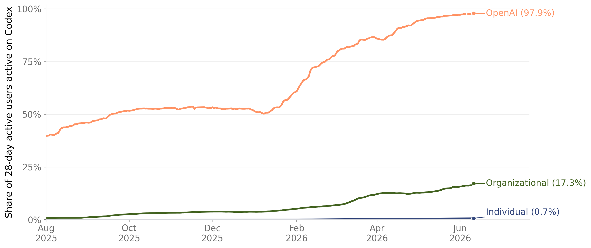
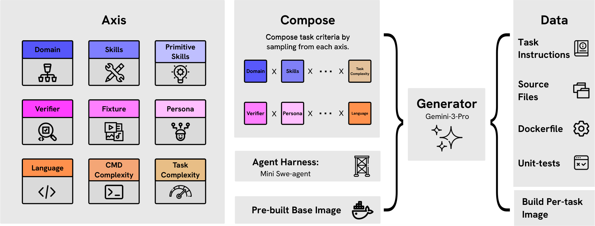
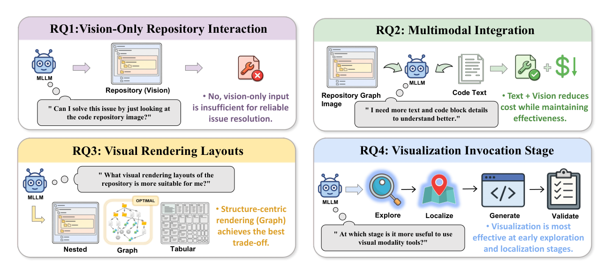

# Coding Agents 研究トレンド（2026年6月）

> 6月に活発だった応用カテゴリ（[coding-agents](../../applications/system/coding-agents.md), 8本）。各論文の **arXiv HTML 本文**（1本は abstract）を精読。今月のコーディングエージェント研究は、**「パラダイム転換と労働の再編」というマクロ**と、**「エージェント自体の能力・効率改善」というミクロ**の二層に分かれ、両者に共通して **長期タスクの信頼性と"検証"がボトルネック**として浮かび上がった。

## 3行サマリ
- **委譲（delegation）へのシフトが数字で可視化**：Codex 利用データでは週次アクティブが半年で **5倍**、8時間超のタスク比率が **2.1%→25.6%**、ユーザの **28.6% が5個以上の並列エージェント**を管理。「会話」から「エージェント群のポートフォリオ運用」へ。
- **ただし"連続実行の崖"が本質課題**：分離タスクで **>80%** の成功率が、連続的な開発では **最大38%** まで崩落（context drift・誤り伝播）。生成コードの **約40% に脆弱性**という報告もあり、**検証・レビューが新たな律速**に。
- **ミクロ改善は RL・自己進化・効率化**：TMax は SWE-bench を 44→53.5%、Socratic-SWE は経験由来スキルで自己進化し 50.4%、SeeRepo/FastContext は文脈を絞って **コスト −26%／トークン −60%**。

## クロス論文で見るトレンド（継続 / 明確化 / 単発の注目結果）
単一研究に寄りかからず、**複数論文で裏付けられたファクト**を軸に、単発でもインパクトの大きい結果は別建てで示す。

**継続する傾向**
- **能力ベンチでの着実な伸長**：TMax（SWE-bench Verified 44→53.5%）と Socratic-SWE（同 50.4%）が、RL／自己進化で SWE-bench・Terminal-Bench のスコアを押し上げる（従来トレンドの延長）。

**今月明確になった点（複数論文で裏付け）**
- **"委譲"へのシフト**：Codex 利用データ（8時間超タスク 2.1→25.6%、5+並列エージェント運用 28.6%）・Agentic Software（Agent-as-a-Service 論）・Skills（"エージェント群のオーケストレーション"を必須能力に）の **3本**が、独立に「会話→委譲」への移行を示す。
- **検証・レビューが新律速**：AI-Native SE（生成物の約40%に脆弱性・採用増でも信頼低下）・Skills（"手動レビューは信頼できる安全装置ではない"）・Agentic Software（連続開発での性能崖・技術的負債）が、**別角度から**「ボトルネックはコード生成でなく検証」を指摘。
- **効率＝文脈を絞ること**：SeeRepo（マルチモーダルで −26% コスト）と FastContext（探索分離で −60% トークン）の **2本**が、文脈の絞り込みをコスト律速の鍵とする。

**単発だがインパクトの大きい結果（裏付けは弱め・要追試）**
- **分離タスク >80% → 連続開発 38% の性能崖**（Agentic Software、単一の観測。ただし"検証が律速"という上の複数論文とは整合的）。
- **OpenAI 社内では Codex が出力トークンの 99.8% を占める**（Codex、1社の内部データ）。
- **経験由来スキルの自己進化で SWE-bench Verified 50.4%**（Socratic-SWE、単一手法・閉世界）。

## 数字で見るインパクト（各論文の本文より）

| 論文 | 数字 | 初見の読み方 |
|---|---|---|
| **Agentic Software** | 単発 **>80% → 連続開発 38%** | 1問なら解けても**長い開発では成功率が半分以下に崩れる**＝実運用の壁 |
| **AI-Native SE**（review） | 生成物の**約40%に脆弱性**／採用 76→84% でも信頼は低下 | 速く書けても**4割に穴**。使う人は増えるのに**信頼はむしろ下がる** |
| **Evidence from Codex** | 8時間超タスク **2.1→25.6%**／**28.6%が5+並列** | 半年で"半日仕事"の委譲が**10倍超**。もはや会話でなく**エージェント群の運用** |
| **TMax** | SWE-bench 44→**53.5%**（10B未満で最高） | 小型モデルでも**データ＋RLの工夫でSWE-benchを約1割底上げ** |
| **Socratic-SWE** | SWE-bench Verified **50.4%**（+7.8） | 自分の失敗から学ぶ自己進化で、**追加人手なしに約8pt改善** |
| **SeeRepo** | multimodal で **コスト −26%**（vision単独は逆効果） | 図"だけ"は逆効果だが、**テキストに図を足すと安くなる**。使い方が肝 |
| **FastContext** | 解決率 **+5.5%**・トークン **−60%** | 探索を分業させると**性能を上げつつ費用を6割減**（※取り下げ論文） |

---

## 論文紹介（サブテーマ別）

### ① パラダイム転換と労働の再編（マクロ）
[Agentic Software: How AI Agents Are Restructuring the Software Paradigm](https://arxiv.org/abs/2606.05608)
ソフトウェアを「Code+Data+Env」から「LLM+Tools+Memory+Planning」へ、Licensed→SaaS→**Agent-as-a-Service (AaaS)** と複雑性の担い手が移ると論じる。Lingma SWE-GPT 72B が SWE-bench Verified で 30.2%（GPT-4o 31.8% に接近）、協調エージェント群で根因特定を **−93%**。だが**分離タスク >80% が連続開発で 38% に崩落**し、context drift・誤り伝播・技術的負債が長期実行の壁だと結論。

[The Rise of AI-Native Software Engineering: Implications for Practice, Education, and the Future Workforce](https://arxiv.org/abs/2606.12986) 📖
48本の査読研究（2016–2026）を統合したレビュー。**Intent・Collaboration・Verification** の3本柱を提示。有界タスクで 55.8% 速度向上・完了 +26% の一方、機微シナリオでは**生成物の約40%に脆弱性**、採用は 76→84% に増えても**信頼はむしろ低下**。「流暢な出力が"できたつもり"の幻想を生む」中で、**意図の明示・批判的評価・責任ある検証という"判断"**が人間の差別化能力になると結論。

[Skills for the future software profession: beyond agentic AI!](https://arxiv.org/abs/2606.21894)
研究者・実務家 30–40名の2回のラウンドテーブルから、将来の SE に必須の3能力を抽出：**(1) 要求を機械検証可能な仕様へ翻訳**、**(2) 専門エージェント群のオーケストレーション**、**(3) 認知的負債（cognitive debt）の管理**。「開発者は AI 生成コードを吟味せず受け入れがちで、**手動レビューは信頼できる安全装置ではない**」とし、V&V が中心的ボトルネックになると指摘。

[The Shift to Agentic AI: Evidence from Codex](https://arxiv.org/abs/2606.26959)
Codex 利用データ（個人／組織／OpenAI 社員）を分類器で分析。週次アクティブが1–6月で **5倍超**、個人ユーザで **8時間超相当タスクが 2.1%→25.6%**、OpenAI ユーザの **28.6% が週5個以上の並列エージェント**を運用、法務職は月間出力トークンが **13倍**に。「相談から委譲へ」の移行に伴い、**委譲・監督・ワークフロー調整を軸にした組織再編**が生産性実現の鍵だと示す（フロンティア環境ゆえ一般化には留保）。

> 図（Evidence from Codex）：ユーザ種別ごとの Codex 利用（対 ChatGPT）の推移。委譲へのシフトが可視化される（[論文](https://arxiv.org/abs/2606.26959)）

### ② エージェント自体の能力・効率改善（ミクロ）
[TMax: A Simple Recipe for Terminal Agents](https://arxiv.org/abs/2606.23321)
9軸の合成サンプリングで **14,600 の RL 環境（Tmax-15k）** を生成し、DPPO＋FP32 LM ヘッド等で長期エージェントタスクを安定学習。Tmax-9B が **Terminal-Bench 2.0 で 27%**（10B 未満の公開モデル最高）、Terminal-Bench Lite 41.9→57.2%、**SWE-bench Verified 44→53.5%（+9.5）**。20ステップ超のマルチターンで学習不安定が残り、「長い学習でさらに伸びる余地」と示唆。

> 図（TMax）：9軸から合成サンプリングして 14,600 の RL 環境（Tmax-15k）を生成するデータパイプライン（[論文](https://arxiv.org/abs/2606.23321)）

[Socratic-SWE: Self-Evolving Coding Agents via Trace-Derived Agent Skills](https://arxiv.org/abs/2606.07412)
解決トレースをカリキュラム設計に還流する閉ループ自己進化。過去軌跡を **Agent Skill Registry**（頻出失敗と有効な修復戦略）へ蒸留し、Generator が実リポジトリに修復タスクを生成、cosine 類似で報酬付け。**SWE-bench Verified 50.40%（+7.80）**、Lite 36.67%、Pro 22.85% を固定36k予算・3反復で達成。ただし固定リポジトリの**閉世界**で、スキルが充実すると後段は新規性が枯れて冗長化する。

[LLM Agents Can See Code Repositories（SeeRepo）](https://arxiv.org/abs/2606.14061)
AST 静的解析で依存グラフ（contains/imports/invokes/inherits）を作り、クエリ中心のサブグラフを **PNG 画像**として与えるマルチモーダル枠組み。**視覚のみ**では精度が 13.6〜34.1pp 悪化しコスト最大 +268% だが、テキストと**併用**すると GPT-5-mini で入力トークン −25%・**コスト −26%**・Pass@1 +0.4。特に fault localization 段で有効（Python 限定で汎化は留保）。

> 図（SeeRepo）：リポジトリ構造の視覚グラフとテキストを併用する SeeRepo の研究設計と主要知見の概観（[論文](https://arxiv.org/abs/2606.14061)）

[FastContext: Training Efficient Repository Explorer for Coding Agents](https://arxiv.org/abs/2606.14066)
リポジトリ探索を解決から分離し、小型モデル（4–30B）が**並列ツール呼び出しで簡潔なファイルパス・行範囲だけを返す**専用探索サブエージェント。Mini-SWE-Agent 統合で解決率 **+5.5%**・**トークン −60%**。探索と問題解決の分離で context 汚染を抑える設計。※**product IP 事由で取り下げ**られており、主張の検証は限定的。

---

## 論点・未解決課題
1. **連続実行の信頼性（"崖"）**：分離タスクの高性能が長期開発で崩落。context drift・誤り伝播・技術的負債の管理が核心（Agentic Software）。
2. **検証・レビューが新律速**：生成物の約40%に脆弱性、手動レビューは当てにならない。**機械検証可能な仕様・自動検証**が要る（AI-Native SE、Skills）。
3. **委譲のスケール運用**：並列エージェントのポートフォリオ管理・監督・調整という**組織/UX 課題**（Evidence from Codex）。→ [agentops](../../operations/agentops.md)・[human-ai](../../operations/human-ai.md) と接続。
4. **効率と文脈**：探索/文脈を絞る（FastContext, SeeRepo）ことがコスト律速の鍵。
5. **自己進化の閉世界問題**：固定リポジトリではスキルが飽和。継続的にデータを更新するオープンエンド化が課題（Socratic-SWE）。

## 次に来るもの（Watch next）
- **長期・連続タスクの評価**（"崖"の定量化）と、状態管理・検証・修復を組み込んだ harness（[LongHorizon-Harness 等](../../architecture/harness.md)）。
- **仕様駆動・自動検証**（spec → machine-checkable）と、セキュアコード生成。
- **委譲の運用基盤**：並列エージェント監督、observability、承認ゲート。
- **効率化の一般化**：多言語・多アーキへ（SeeRepo/FastContext は Python 中心）。

---

*本ニュースレターは各論文の **arXiv HTML 本文**（FastContext のみ abstract）を読み取り、[coding-agents.md](../../applications/system/coding-agents.md) の2026年6月論文を対象に作成。*
