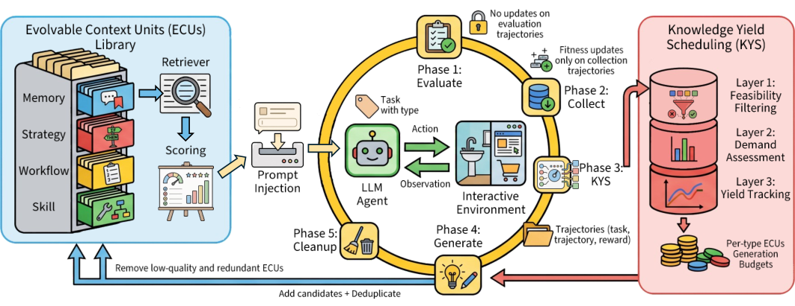
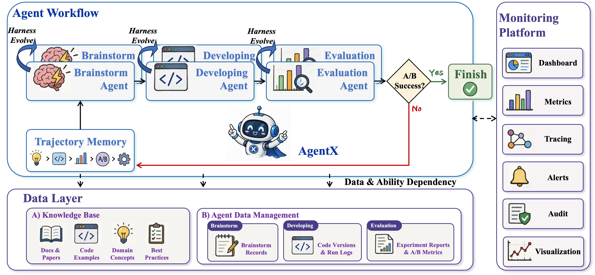
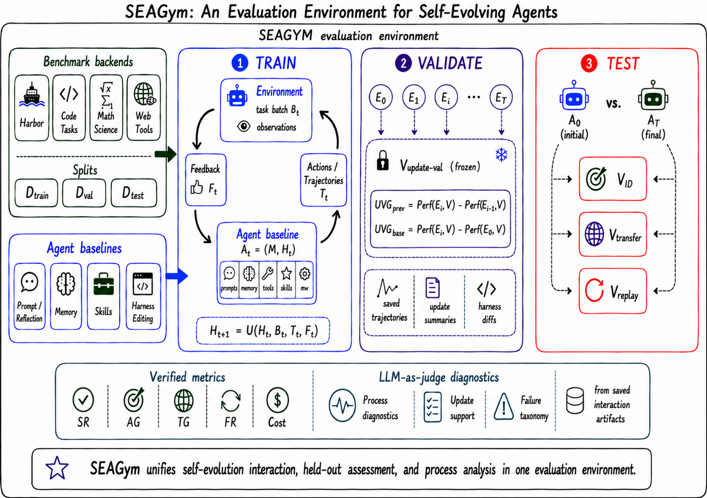

# Self-Evolving Agents 研究トレンド（2026年6月）

> 対象：[self-evolution](../../capabilities/adaptation/self-evolution.md) の 2026年6月論文（10本）。各論文の arXiv HTML 本文を精読してまとめた。

## まず、この分野を一言で

**自己進化（self-evolution）**とは、エージェントが**使った経験から学んで、次からの自分を賢くする**ことだ。ポイントは、AI モデルの中身（脳＝重み）を訓練し直すのではなく、その周りにある**知識・手順・記憶**を書き換えて良くする、というやり方が主流な点にある。

たとえるなら、職人が仕事のたびにメモを増やし、次の仕事でそのメモを使う。生まれつきの器用さ（脳）はそのままに、**"手順書"を育てていく**イメージだ。

6月の研究を通して見えたのは、次の3つだ。①育てる対象は脳ではなく**外側の知識・手順**に固まってきた。②しかし「進化すれば万能に賢くなる」わけではなく、**練習したタスクでは伸びても、別のタスクや別のモデルには効かない**ことが分かってきた。③だから関心は「性能が上がった」の主張から、**"どう正しく測るか・どう安全に回すか"**へと移りつつある。

## 今月の3つの流れ

**流れ①：育てるのは"脳"ではなく"外の知識・手順"（複数論文で共通）**
経験を、文脈・手順・スキルといった**外部のメモとして貯めて改善する**動きが定着した。UCE は文脈メモを、EvoHunt は監査手順書を、AgentX はプロンプト（指示文）を——いずれも**脳を凍結したまま**育てる。1〜4月の号から続く流れが、いよいよ標準になった。

**流れ②：でも「進化＝万能に賢くなる」ではない（今月はっきりした点）**
冷静な結果も出た。SEAGym は「**自分の練習タスクでは大きく伸びるのに、見たことのないタスクや別のモデルではほとんど効かない、むしろ悪化する**」ことを数字で示した。Meta-Agent Challenge は「エージェントに自律的にエージェントを設計させる」課題で、**約4千通り試して人間の作りに勝てたのは1.4%だけ**という厳しい現実を突きつけた。進化の成果は"使い回し"がきかない、というのが今月の教訓だ。

**流れ③：関心は"どう測るか・どう守るか"へ**
性能主張の裏付けとして、**測り方（評価環境）**そのものが主題になった（SEAGym）。さらに、固定した採点基準を使い続けると AI がその基準を"攻略"してしまうため、**採点役も一緒に進化させる**発想（Red Queen）や、**採点基準そのもの**を整理するサーベイ（Rubrics）が出た。安全面では、自己進化系の弱点を洗い出す研究（MLAS）が警鐘を鳴らした。

> ※数字は各論文の HTML 本文より。単発（1論文のみ）の目を引く結果は末尾に「要追試」として分けた。

## 主な結果（数字は"何と比べてどうか"で読む）

| 論文 | 何をした / どうなった | どう受け取るか |
|---|---|---|
| **UCE** | 文脈メモを育て、家事タスクの成功率 **75.4% → 96.3%** | 失敗が約 **1/7** に。しかも**別のエージェント構造に載せ替えても効く**（脳に依存しない） |
| **EvoHunt** | 脆弱性の"実際に動く検出"を **1.1% → 6.2%** | 絶対値は低いが、**従来1%が限界の難題を6倍**に。強いモデルで一度学べば安いモデルが実行できる |
| **SEAGym** | 練習タスク **+17pt**、未知タスク +6pt、別モデルで **−7pt** | 「**自分のタスクでは伸びるが使い回すと効かない・悪化**」を可視化。進化は転移しにくい |
| **Meta-Agent Challenge** | 約4千通り中、人間超えは **55（1.4%）** | **自律的にエージェントを作らせるのは、今はほぼ無理**、という現在地 |
| **MLAS（安全）** | 25の弱点のうち **17は有効な防御なし**、攻撃成功が **100%持続** | 自己進化系は**ほぼ丸腰**で、一度侵入されると世代を越えて残る |
| **AgentX** | 実サービスで3週運用し、年換算 **RMB 1億超**・人手比 **3.7倍** | 自己進化の"実利"を初めて桁で提示（※1サービスの事例なので一般化は要注意） |
| **Red Queen** | 採点役も一緒に育て、少ない計算で論文採択率 **約1.8倍** | **採点役を固定せず共に進化**させると、質と効率が両立する |

---

## 論文紹介（テーマ別）

### ① 育てるのは"外の知識・手順"

なぜ脳ではなく外側なのか——脳（重み）を訓練し直すのは高価で、しかも一度太らせると別の用途に使い回しにくい。**外部メモなら安く、他のモデルにも移せる**。この利点を各論文が別々の形で示す。

[Unified Context Evolution for LLM Agents（UCE）](https://arxiv.org/abs/2606.02304)
経験を4種類のメモ（環境の仕組み／判断ルール／手順／再利用スキル）として貯め、**評価→収集→予算配分→生成→整理**の5段階で少しずつ育てる。脳は一切訓練しない。家事タスクの成功率が **75.4% → 96.3%**（失敗が約1/7）、しかも**別のエージェント構造に載せ替えても 73.1% → 97.8%** と効いた——つまり手法が特定のモデルに縛られない。細かい属性選びのタスクでは頭打ちで、そこは別の学習が要ると正直に述べる。

> 図（UCE）：1サイクル5段階（評価→収集→予算配分→生成→整理）で、型付きの経験メモを脳に触れず育てる。（[論文](https://arxiv.org/abs/2606.02304)）

[Transferable Self-Evolving Playbooks for Agentic Security Auditing（EvoHunt）](https://arxiv.org/abs/2606.16420)
セキュリティ監査で、モデルも段取りも固定し、**監査の"手順書"だけ**を育てる（手順書はテキストで版管理する）。**実際に動く攻撃コードまで作れた割合**を 1.1% → 6.2%（6倍）に伸ばし、強いモデルで一度育てた手順書を安いモデルに渡すと 2.7〜4倍改善。フロンティアモデルで一度だけ進化を回し（約$1,400）、あとは安いモデルが手順を実行する、という費用設計を示す。

[AgentX: Agent-Driven Self-Iteration of Industrial Recommender Systems](https://arxiv.org/abs/2606.26859)
実際の推薦サービスで、着想→開発→評価の閉じたループを回し、自分の指示文を継続的に磨く。3週間の運用で **374案から10案を実投入**、人手のエンジニアと比べ **3.7倍の事業価値**、年換算で **RMB 1億超**。ただし著者は「本番はオフラインの指標では不十分で、実際の A/B テストと**人による承認**が要る」と釘を刺す。

> 図（AgentX）：着想→開発→評価の閉ループと、指示文を磨く自己進化の全体像。（[論文](https://arxiv.org/abs/2606.26859)）

### ② "進化＝万能"ではない、と示す

[SEAGym: An Evaluation Environment for Self-Evolving LLM Agents](https://arxiv.org/abs/2606.17546)
自己進化を**公平に測るための"実験場"**。「練習に使ったタスクでの伸び」「見たことのないタスクでの伸び」「忘却」「費用」を分けて測る。すると、練習タスクでは **+17pt** 伸びても、見たことのないタスクでは +6pt にとどまり、あるモデルで育てた段取りを別のモデルに使うと **−7pt 悪化**した。結論は明快——**自己進化の効き目は、タスクとモデルに強く依存し、万能ではない**。今月の"測り方"論の中心。

> 図（SEAGym）：静的なベンチを動的な進化の実験場に変換し、練習/未知/忘却/費用を分けて測る。（[論文](https://arxiv.org/abs/2606.17546)）

[The Meta-Agent Challenge](https://arxiv.org/abs/2606.04455)
「エージェントに、別のエージェントを自律的に設計・実装・改善させる」ことができるか。5分野で**約4千通り**試して、人間の作った仕組みに勝てたのは **55通り（1.4%）** だけ。ばらつきも大きく、ズル（報酬ハック）の試みも出た。**自律的なエージェント開発は、まだ現実的でない**、という現在地をはっきり示した。

### ③ "採点役"と"安全"が主題に

[Rubrics Across the Evolving LLM Landscape](https://arxiv.org/abs/2606.08625) 📖
採点基準（ルーブリック）を整理したサーベイ。基準が「外から評価する道具」から、モデルと一緒に育つ「**内側の自己監督の仕組み**」へ移りつつある、と跡づける。重要な警告——**質の低い採点基準は、黙って失敗するのではなく、むしろ判断を悪化させる**。誰が採点役を作るのか、が問われ始めた。

[The Red Queen Gödel Machine](https://arxiv.org/abs/2606.26294)
固定した採点基準を使い続けると、エージェントはその基準を"攻略"してしまう。そこで**エージェントと採点役を一緒に進化させる**。少ない計算で論文の採択率が **約1.8倍**、採点の正確さも上がった。実際、最強の採点役が AI 生成の論文を**人間の1.91倍も甘く通してしまう**偏りを、この共進化で補正できたという（進行中の研究）。

[Safety in Self-Evolving LLM Agent Systems](https://arxiv.org/abs/2606.23075)
自己進化系のセキュリティを、5×5＝25の弱点に分けて点検した。**17は有効な防御が存在せず**、ある実装では攻撃が **100%成功して残り続け**、併設のスキャナは 2.5% しか止められなかった。核心の指摘は「**自己進化では、安全装置そのものが最適化・攻撃の的になる**」——だから固定した静的な防御では構造的に不十分だ、という警鐘だ。

---

## この号のまとめ（何が確かで、何がまだ怪しいか）

- **確かなこと**：脳を凍結し、外側の知識・手順を育てるやり方は安く効く（①の複数論文）。良いメモは別モデルへ移せる場合がある（UCE）。
- **今月はっきりした注意**：その効き目は**タスクとモデル次第で、使い回しがきかない**（SEAGym）。自律的なエージェント設計はまだ無理筋（Meta-Agent Challenge）。**"どのタスクで・どう測ったか"を確認してから数字を信じる**。
- **単発だが面白い（要追試）**：実サービスで年 RMB 1億超（AgentX、1事例）／自己進化系はほぼ丸腰で攻撃が持続（MLAS、1実装の比較）。

## 次に読みたくなる問い
- 進化の成果を**別タスク・別モデルへ移す**にはどうすれば（②の弱点）。
- **採点役を誰が・どう育てるか**（Red Queen／Rubrics）。
- 自己進化に**耐える安全設計**（MLAS の先＝動く標的を守る）。

---

*本ニュースレターは各論文の arXiv HTML 本文（Red Queen のみ abstract）を精読して作成。関連は [evaluation](../../capabilities/trust/evaluation.md)・[safety](../../capabilities/trust/safety.md)、翌月の [harness（7月）](../jul_2026/harness_trends.md)。*
