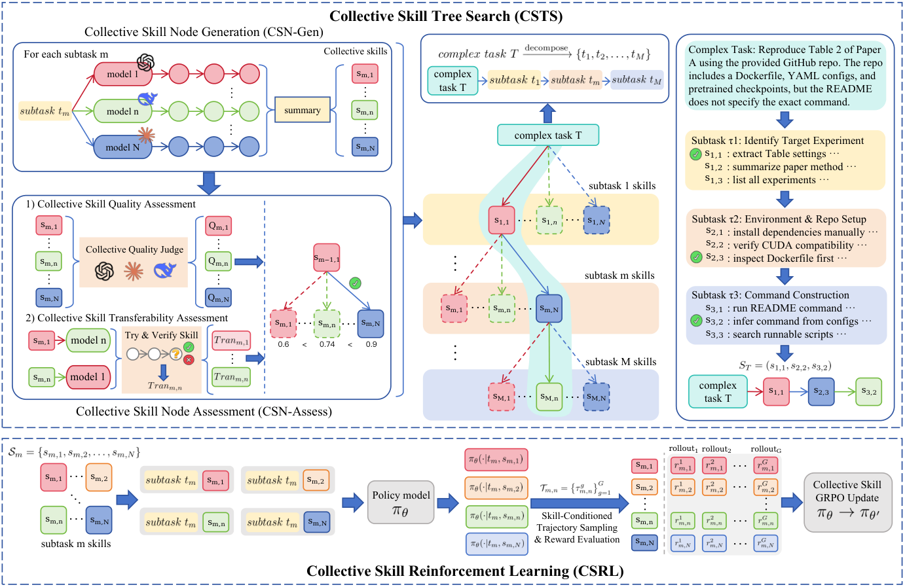
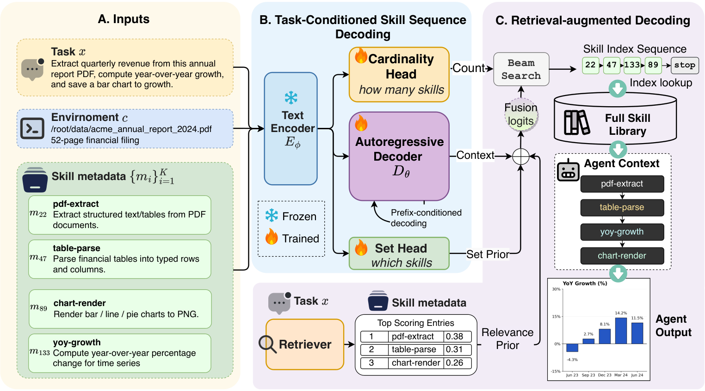
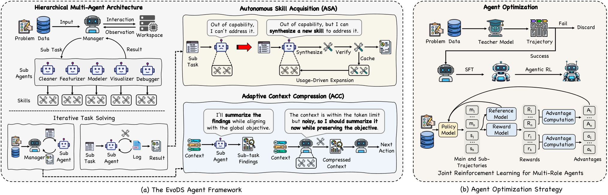

# Skills 研究トレンド（2026年6月）

> 対象：[skills](../../capabilities/action/skills.md) の 2026年6月論文（7本）。各論文の arXiv HTML 本文を精読してまとめた。

## まず、この分野を一言で

**スキル（skill）**とは、エージェントが繰り返し使える**"技"＝手順のまとまり**のことだ。「電卓を1回叩く」ような単発の道具呼び出しより一段上で、「こういう場面では、こう調べて、こう組み立てる」という**再利用できるやり方**を指す。

人間でいえば、料理人が持つ**"得意料理のレシピ集"**に近い。同じ腕（脳）でも、良いレシピ集を持っていれば手早く確実に作れる。しかもレシピは**書き足せる**し、**他の料理人にも渡せる**。

6月の研究が示したのは、まさにこの「書き足す（獲得）」「渡す（転移）」「良し悪しを見分ける（検証）」の3点がそれぞれ具体化した、ということだ。

## 今月の3つの流れ

**流れ①：スキルの"仕入れ先"が増えた（複数論文で共通）**
どこからスキルを作るか、が多様になった。**過去の失敗の記録**から（SkillAdaptor）、**Web の文書やコード**から（OpenSkill）、**研究者の実験ノート**から（Notes2Skills）、**複数モデルの合議**から（OpenClaw-Skill）——4本が別々の"仕入れ先"を開拓した。

**流れ②：別のモデルでも使える"技"を目指す（今月はっきりした狙い）**
作ったスキルが、あるモデルでしか動かないなら価値は半減する。今月は**モデルを跨いで使えること（転移）**を明確に狙う研究が並んだ。OpenSkill は弱いモデルにも効き、OpenClaw-Skill は"他モデルでも通じるか"を採点基準に組み込み、SkillComposer は本番でも崩れにくいことを示した。

**流れ③：正解を見ずに"技の良し悪し"を測る（共通の難所）**
本番では正解が手元にない。それでもスキルが良いか悪いかを判断しなければならない。OpenSkill は**正解を見ずに使える"仮設テスト"**を作り、Notes2Skills は**「たぶん」を「確定」に取り違えない**仕組みを、SkillAdaptor は**もう一度実行して良くなったか確かめる**関門を用意した。

> ※数字は各論文の HTML 本文より。単発（1論文のみ）の目を引く結果は末尾に「要追試」として分けた。

## 主な結果（数字は"何と比べてどうか"で読む）

| 論文 | 何をした / どうなった | どう受け取るか |
|---|---|---|
| **SkillAdaptor** | 脳を訓練せず、失敗の記録からスキルを直して各ベンチ **+1.7〜1.8** | 派手ではないが、**訓練ゼロで直せる**のが利点 |
| **OpenSkill** | **正解を見ずに** Web から学び、従来比 **+8.9pt**、他モデルへ 5.5〜14.8% | 答えを教わらなくても伸び、しかも**他モデルにも効く** |
| **Notes2Skills** | 実験ノートの指示を **確信度そのままに保存**（149件で完全一致） | 「たぶん」を「確定」に**取り違えない**——科学用途で必須の慎重さ |
| **OpenClaw-Skill** | 複数モデルの合議でスキルを作り、**34.5 → 44.9** | 1つのモデルの偏りを避け、**合議で作ると約1割上** |
| **SkillComposer** | わずか **3.9M** の小型器がスキル選択を担当、本番の崩れは **11pt**（大型学習は27.5pt） | **小さくて安いのに、大型の学習より崩れにくい** |
| **EvoDS** | データ分析で **279スキルを69%再利用**、文脈溢れの事故を **ゼロ** に | 覚えた技を7割使い回し、長い処理での**途中失敗をなくした** |

---

## 論文紹介（テーマ別）

### ① スキルをどこから仕入れるか

[SkillAdaptor: Self-Adapting Skills for LLM Agents from Trajectories](https://arxiv.org/abs/2606.01311)
なぜ効くのか——失敗したとき、闇雲に全部やり直すより「**どのスキルが原因か**」を突き止めて、そこだけ直す方が速い。SkillAdaptor は失敗の記録から原因スキルを特定し、直すか新しく作るかを選び、**もう一度実行して良くなった時だけ採用**する。脳は訓練しない。地味だが「訓練ゼロで直せる」点が実務的で、[failure-attribution](../../capabilities/adaptation/failure-attribution.md)（失敗の原因特定）の流れとも重なる。

[OpenSkill: Open-World Self-Evolution for LLM Agents](https://arxiv.org/abs/2606.06741)
本番で困るのは「正解が手元にない」ことだ。OpenSkill は**Web の文書やコード**から知識を集めてスキルを作り、さらに**正解を見ずに使える"仮設テスト"**を自分で用意して、それでスキルを磨く。答えを教わらないのに従来比 **+8.9pt**、他のモデルにも 5.5〜14.8% 効いた。仮設テストは正解と 60.7% 一致（正解未参照）。ただし Web が古いと質が落ちる、と限界も述べる。

> 図（OpenSkill）：Web から知識を集めてスキルを作り、正解を見ずに使える仮設テストで磨く。本番の正解は最後まで隔離する。（[論文](https://arxiv.org/abs/2606.06741)）

[Notes2Skills: From Lab Notebooks to Certainty-Aware Scientific Agent Skills](https://arxiv.org/abs/2606.11897)
科学の現場では、ノートの「**たぶんこうだ**」を「**確定でこうだ**」に取り違えると危険だ。Notes2Skills は実験ノートの各指示を「事実／判断／提案」に分け、**確信度を保ったまま**スキルに変換する。149件の指示を確信度そのままに保存し、「曖昧なメモが確定行動に化ける」事故を回避した。ナノポア計測という特定分野での実証で、汎化はこれからだ。

[OpenClaw-Skill: Collective Skill Tree Search for Agentic LLMs](https://arxiv.org/abs/2606.16774)
1つのモデルだけでスキルを作ると、そのモデルの癖が出る。OpenClaw-Skill は**複数モデルに同じ課題を解かせ**、出てきた多様なやり方からスキルを合議で選ぶ。しかも「他のモデルでも通じるか」を採点基準に入れる。結果、**34.5 → 44.9**（約1割上）。単一モデル製より偏りが少なく、他モデルへも渡りやすいスキルになる。

> 図（OpenClaw-Skill）：課題を小課題に分け、複数モデルの合議でスキルを反復構築していく。（[論文](https://arxiv.org/abs/2606.16774)）

### ② 小さく・安く・崩れにくく選ぶ

[Generative Skill Composition for LLM Agents（SkillComposer）](https://arxiv.org/abs/2606.32025)
スキルが増えると、今度は「**どのスキルを・どの順で使うか**」の選択が難しくなる。SkillComposer はこれを、**わずか 3.9M パラメータの小さな専用器**に任せる。巨大なモデルを訓練し直すやり方に比べ、本番タスクでの崩れが 11pt（相手は 27.5pt）と**頑健**で、学習コストは **154分の1**。「大きいほど良い」とは限らない好例だ。長い手順（3つ以上のスキル連鎖）で少なめに予測しがちなのが伸びしろ。

> 図（SkillComposer）：課題とスキル一覧を読み、可変長・順序付きのスキル列を小型の専用器で予測する。（[論文](https://arxiv.org/abs/2606.32025)）

### ③ 応用：データ分析での自己進化

[EvoDS: Self-Evolving Autonomous Data Science Agent](https://arxiv.org/abs/2606.03841)
データ分析を役割分担（掃除・特徴量・モデル化・可視化）で進め、**使えるスキルを自分で貯めて再利用**し、長くなりすぎた文脈は**賢く圧縮**する。結果、既存の強い比較対象より **+28.9%**、**279 個のスキルを 69% 再利用**し、そして——長い処理でありがちな「文脈が溢れて途中で落ちる」事故を **ゼロ**にした。専門知識が要る科学タスクでは、まだ差が残る。

> 図（EvoDS）：役割分担のマルチエージェントに、自律的なスキル獲得と適応的な文脈圧縮を組み合わせる。（[論文](https://arxiv.org/abs/2606.03841)）

---

## この号のまとめ（何が確かで、何がまだ怪しいか）

- **確かなこと**：スキルの"仕入れ先"は多様化し（①の4本）、脳を訓練せず・他モデルにも効く方向が広がった（OpenSkill 等）。
- **今月はっきりした狙い**：**正解を見ずに良し悪しを測る**のが共通の難所。仮設テストや確信度の保存で各論文が挑んでいる。
- **単発だが面白い（要追試）**：3.9M の小型器が大型の学習より頑健にスキルを選ぶ（SkillComposer、1手法）／279スキルを再利用し途中失敗ゼロ（EvoDS、1システム）。

## 次に読みたくなる問い
- **正解なしの検証器**をどこまで正確にできるか（③の核心）→ [verification](../../capabilities/adaptation/verification.md)。
- 作ったスキルの**他モデルへの移りやすさ**をどう保証するか。
- 長い手順の**スキル連鎖**をどう扱うか（SkillComposer の弱点）。

---

*本ニュースレターは各論文の arXiv HTML 本文を精読して作成。図は [`newsletters/assets/`](../assets/) に保存。関連は [self-evolution（6月）](self_evolution_trends.md)・[tool-use](../../capabilities/action/tool-use.md)。*
